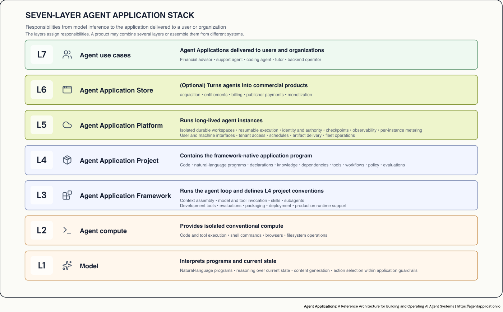

# Agent Applications

[agentapplication.io](https://agentapplication.io) publishes a vendor-neutral
reference architecture for building and operating AI agent systems. Current
paper: [Working Draft 0.9.1](https://agentapplication.io/paper), August 2026.

[Overview](https://agentapplication.io)
· [Paper](https://agentapplication.io/paper)
· [Hello World](https://agentapplication.io/examples/hello-world)
· [Review](https://agentapplication.io/review)
· [Plain text](https://agentapplication.io/llms-full.txt)

ChatGPT and Claude use agent widgets. An
[OpenClaw](https://docs.openclaw.ai/concepts/main-session) agent may appear as a
WhatsApp or Telegram contact. [GitHub Copilot's coding
agent](https://docs.github.com/en/copilot/how-tos/use-copilot-agents/cloud-agent/use-cloud-agent-on-github)
and [Cursor Cloud Agents](https://cursor.com/docs/cloud-agent) can start from an
issue or pull request and return their work there. A [Microsoft Copilot Studio
autonomous
agent](https://learn.microsoft.com/en-us/microsoft-copilot-studio/authoring-triggers-about)
can wake in response to a business event without presenting a conversational
interface at all.

These systems have different interfaces and jobs. Each gives a tool-using agent
a continuing scope of work. Later messages or events return to that work, and
the results remain after a run ends.

This paper calls that shape an **Agent Application**.

## Four properties

The definition does not depend on the user interface.

| Defining property | What it looks like |
|---|---|
| Persistent agent instance | A new message or event returns to the same agent, privacy domain, and ongoing work |
| Agent-directed control flow | The agent reasons about the current state and chooses its next action rather than following a fully predetermined workflow |
| Durable computational workspace | Files, instructions, memory, code, and other working state remain available to later runs |
| Durable work | Artifacts, workspace state, external records, or continuing processes outlive the event that created them |

A chat interface does not make a system an Agent Application. See [what falls
outside the category](https://agentapplication.io/paper#6-recognizing-an-agent-application).

## After desktop, web, and mobile

| Computing era | Application model | Characteristic stack |
|---|---|---|
| Personal computing | Desktop application | Native code, operating systems, GUI toolkits, local files, installers |
| Internet computing | Web application | HTTP, browsers, servers, databases, cloud infrastructure |
| Mobile computing | Mobile application | Mobile SDKs, touch interfaces, sensors, app stores, device identity |
| Agent computing | Agent Application | Models and conventional compute, harnesses / Agent Application frameworks, native projects, Agent Application Platforms, durable instances and workspaces |

## Products that already have this shape

| Product | Privacy domain | Durable work |
|---|---|---|
| [ChatGPT](https://help.openai.com/en/articles/20001275-chatgpt-work-and-codex) | A user or project | Project files, instructions, memory, scheduled work, and finished documents or sites |
| [Claude Cowork](https://support.claude.com/en/articles/14116274-organize-your-tasks-with-projects-in-claude-cowork) | A Cowork project | Local files, project memory, scheduled tasks, and persistent artifacts |
| [Lovable](https://docs.lovable.dev/features/agent-mode) | A software project | Source code, project instructions, assets, deployment state, and change history |
| [Replit Agent](https://docs.replit.com/features/version-control/checkpoints-and-rollbacks) | A software project | Code, installed packages, databases, agent memory, and restorable checkpoints |
| [OpenClaw](https://docs.openclaw.ai/start/openclaw) | An OpenClaw agent | Workspace files, memory, skills, schedules, and tool-created results |
| [Lightfield](https://docs.lightfield.app/) | A company | Versioned customer context, customer relationship management (CRM) records, generated analysis, and scheduled automations |
| [Manus Cloud Computer](https://help.manus.im/en/articles/15392111-what-is-the-cloud-computer) | A persistent cloud computer | Files, installed tools, databases, bots, and running processes |

If a product belongs in this table, or does not, [open a
discussion](https://github.com/agentapplication/agentapplication/discussions)
or send a pull request with a source.

## The stack



The layers describe responsibilities, not seven products that a team must buy.
One provider may combine several layers, and an application may assemble them
from different systems.

An **Agent Application Framework** is a harness that also supplies a coherent
project structure, development tools, evaluations, packaging, deployment, and
production runtime support. An **Agent Application Platform** turns a tested
project into an immutable release, provisions long-lived instances with durable
workspaces, and enforces identity, permissions, spending limits, network
destinations, and approvals. An **Agent Application Store** is a catalog and
commerce service through which people find, acquire, and pay for Agent
Applications.

[MCP](https://modelcontextprotocol.io/), [Agent
Skills](https://agentskills.io/specification), [Agent
Plugins](https://agent-plugins.org/specification), and
[A2A](https://a2a-protocol.org/latest/specification/) already cover some
boundaries. Each framework keeps its own project and release formats.

## Instances diverge

Long-lived instances accumulate different facts, artifacts, generated code, and
unfinished work. If they can also add or edit natural-language instructions,
they diverge in program as well as state. Operators then manage a fleet whose
members no longer share one program: rollout, audit, and policy have to follow
each instance's local program and state, not only the shared release.

The [Hello World](https://agentapplication.io/examples/hello-world) example is
the smallest complete case: a notebook agent saves a note, suspends, and uses
that note to update a briefing on a later run. The files are in
[`examples/durable-notebook/`](examples/durable-notebook).

## Read the work

- The [overview](https://agentapplication.io) is the short public argument.
- The [paper](https://agentapplication.io/paper) is the full argument, category
  definition, and architecture.
- [About this paper](https://agentapplication.io/about) explains the audience,
  scope, and status of the work.
- [Review the draft](https://agentapplication.io/review) lists the questions
  the draft most needs help answering.

Application developers, framework authors, platform operators, buyers, and
standards contributors have [guided reading
paths](https://agentapplication.io/paper#guided-reading-paths).

## Contribute

The paper is a working draft. The most useful first contribution is a product
that the definition wrongly includes or excludes, with a link to how that
product actually works. Counterexamples, prior art, and implementation
experience are also welcome.

Open threads:

- [Which current products are Agent Applications?](https://github.com/agentapplication/agentapplication/discussions/1)
- [Is Dependabot an Agent Application?](https://github.com/agentapplication/agentapplication/discussions/2)
- [Map a harness to the capability model](https://github.com/agentapplication/agentapplication/discussions/5)

Use [Discussions](https://github.com/agentapplication/agentapplication/discussions)
for other proposals, architecture questions, boundary cases, and prior art.
Open an [issue](https://github.com/agentapplication/agentapplication/issues)
for a concrete error, missing source, or broken page. Send a
[pull request](https://github.com/agentapplication/agentapplication/pulls) for a
focused correction, example, or documentation improvement.

Read [`CONTRIBUTING.md`](CONTRIBUTING.md) before preparing a pull request. You
can also send review notes to
[amol@agentapplication.io](mailto:amol@agentapplication.io?subject=Agent%20Applications%20paper%20review).

The Mintlify site lives in [`docs/`](docs/). Repository layout follows the same
broad pattern as [Agent Skills](https://github.com/agentskills/agentskills):
project and contribution material at the root, with the published documentation
kept in its own directory.

## Cite

```bibtex
@misc{kelkar2026agentapplications,
  title  = {Agent Applications: A Reference Architecture for Building and Operating AI Agent Systems},
  author = {Amol Kelkar},
  year   = {2026},
  url    = {https://agentapplication.io/paper}
}
```

## Local development

Install the [Mintlify CLI](https://www.mintlify.com/docs/installation), then run:

```sh
npm run dev
```

To validate the site without starting the preview server:

```sh
npm run generate:llms
npm run validate
npm run check-links
```

## License

This repository is licensed under the [MIT License](LICENSE).
