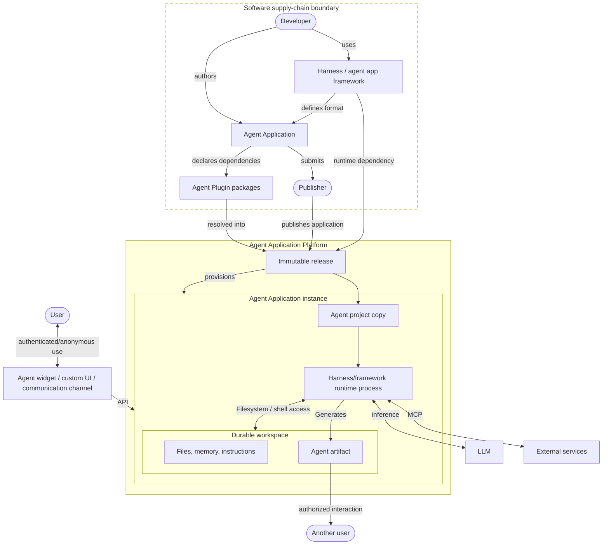

**Working Draft 0.8 · August 2026 · Amol Kelkar** · [Plain text](https://agentapplication.io/llms-full.txt)

Correspondence: [amol@agentapplication.io](mailto:amol@agentapplication.io)

---

## Abstract

ChatGPT, Claude, Gemini, Lovable, Replit Agent, OpenClaw, Lightfield, and Manus belong to an emerging class of AI products. They converse with users, use tools, retain context across sessions, and accumulate work over time. The application sets the guardrails, while the agent inspects the current state and selects the next action. Terms such as chatbot, copilot, and agent harness describe parts of these products. We call the whole product an Agent Application.

An Agent Application uses one or more persistent, tool-using AI agents to produce or maintain durable results. A user request, external event, or schedule can start the work. Once started, an agent evaluates the current state, selects intermediate steps, and uses tools to carry them out. Examples include a life coach that supports one person for years, a virtual marketing employee that works across a team's campaigns, and a SaaS assistant that guides a customer from onboarding to a mature program.

For personal use cases, each user receives a separate instance of the Agent Application. Team and enterprise applications may instead assign an instance to a team, customer, project, ticket, or another long-lived ownership and privacy boundary. Each instance runs in an isolated virtual machine or equivalent environment. It maintains its own history and logical workspace, including knowledge, artifacts, instructions, and unfinished work. Compute may stop and restart, but the identity and state of the instance persist. The instance becomes more useful over time because it preserves completed work, resumes unfinished responsibilities, and adapts to its owner.

Developers build Agent Applications with Agent Application frameworks, just as they build web applications with web application frameworks. Today's agent harnesses are early versions of these frameworks. As they mature, they will cover application formats, coding conventions, development tools, evaluations, connections to external systems, audit trails, and alerting. Developers deploy a tested project to an Agent Application Platform. The platform packages the project as an immutable release, creates and operates long-lived instances from that release, and provides fleet management, cost management, authentication, authorization, and monetization support.

Once created, each Agent Application instance accumulates different knowledge, artifacts, instructions, and unfinished work. Traditional software follows the program that was deployed. An Agent Application instance can also incorporate local natural-language instructions that change its behavior. Some systems let agents revise their own procedures or incorporate revisions prepared by other agents. These instances diverge in program as well as state. A publisher updating such a fleet must reconcile the update with the program and state of every instance, preserve local work, and test the result against that instance's state. Token consumption can also vary widely from one instance to another, which makes per-instance cost management important. The industry has not yet settled how to price or monetize these applications.

Standards already cover a few components of Agent Applications. MCP connects
agents to tools. Agent Skills package reusable instructions, and Agent Plugins
package skills and MCP server configurations so compatible clients can load
them. A2A supports communication among independent agents and agentic
applications. Important gaps remain around complete projects, dependency
resolution, artifacts, identity and authority, workspace portability, releases,
updates, and the application-instance lifecycle.

This paper defines the Agent Application and describes the architecture required to build and operate one. It maps existing standards to that architecture and identifies the interfaces that still need common contracts. With those contracts in place, developers could reuse components and domain expertise across applications, build customer relationships, and earn revenue from a portfolio. Distributors could run shared infrastructure and catalogs instead of rebuilding the stack for every application. Users would keep the context, knowledge, artifacts, and completed work that accumulate through long-lived agents. This could turn agentic computing from a small set of vertically integrated products into a broad software industry.

---

*Figure 1. The Agent Application lifecycle.*



---

# Part I: Recognizing the category

## 1. What is an Agent Application?

ChatGPT and Claude look quite different from Lovable or Lightfield. The first two
are general assistants. Lovable builds software, while Lightfield works with
customer data. Underneath those differences, each product lets an agent return
to the same body of work across multiple sessions. *Chatbot*, *copilot*, and
*workflow* each describe one aspect of these products, but none names the whole
application.

An **Agent Application** uses one or more persistent, tool-using AI agents to
produce or maintain durable results. A request, schedule, or outside event can
start the work. The application sets the available tools, permissions, policies,
and other guardrails. Within those limits, the agent inspects the current state
and chooses what to do next. Its work can continue across sessions, and the
results outlive the model call that produced them.

Consider a Life Coach Agent that works with Maya. On Monday, Maya asks it to help
her prepare for a career change. It reads her goals, prior reflections, and
existing commitments, then updates her plan and asks before adding two check-ins
to her calendar. On Friday, Maya returns with an update after an interview. Six
months later, the agent can show which facts informed its advice, which actions
Maya approved, and how her plan changed.

Carrying Maya's work from Monday to Friday, then explaining it six months later,
requires more than a model response or transcript. The application routes each
event back to Maya's agent instance. Its workspace preserves the files, memory,
and unfinished analysis needed to resume. An agent harness runs the reasoning
loop, while tools connect the agent to her calendar, notes, documents, and
messages.

Compute can stop when Maya's instance is idle, but the instance and its work
remain. Delegated credentials let it act when a later request or schedule wakes
it. Policy can require approval for consequential actions, and an audit record
preserves how it produced each artifact. New releases can improve the
application without discarding Maya's accumulated work.

---

## 2. From web and mobile applications to Agent Applications

The term *web application* became useful when a web page was no longer enough to
describe what ran in the browser. Gmail and Google Docs were complete software
products delivered through a URL. Their interfaces ran in the browser, their
logic and data were split between client and server, and the developer could
update the product without reinstalling software on every computer. The browser
became a runtime and the web server became a distribution channel.

The term *mobile application* captured a different shift. Software was designed
for a phone or tablet, installed through an app store, and integrated with the
device's operating system. Google Maps could use location; Instagram could use
the camera; Uber could combine both with notifications and a persistent device
identity. A mobile app was more than a web application on a smaller screen. It
had a new runtime, new capabilities, and a new distribution model.

Agent software changes the operating relationship. Web and mobile applications
still assume that a person navigates the interface and chooses each operation.
Here, the person states the goal and the agent performs the intermediate work.

| Computing era | Application model | Characteristic stack |
|---|---|---|
| Personal computing | Desktop application | Native code, operating systems, GUI toolkits, local files, installers |
| Internet computing | Web application | HTTP, browsers, servers, databases, cloud infrastructure |
| Mobile computing | Mobile application | Mobile SDKs, touch interfaces, sensors, app stores, device identity |
| Agent computing | Agent Application | Models and conventional compute, Agent Application frameworks, native projects, Agent Application Platforms, durable instances and workspaces |

New application models initially resemble the software that came before them.
Early commercial websites reproduced brochures and catalogs. Many early mobile
apps were companion versions of desktop or web products. The first wave of AI
products has centered on chat and copilots.

HTTP, HTML, and browsers existed before developers had a mature web application
stack. Mobile operating systems, sensors, and app stores also came before the
modern mobile app. Agent software is following the same sequence: the basic
pieces exist, and frameworks are starting to assemble them into a repeatable way
to build applications.

---

## 3. The Agent Application stack

| Layer | Responsibility |
|---|---|
| Model and conventional compute | The model interprets natural-language programs and chooses actions. Conventional processors execute code, tools, and filesystem operations. |
| Agent harness and application framework | A harness assembles context, invokes models and tools, and runs the agent loop. As it accumulates project structure, development tools, evaluations, packaging, deployment, and production runtime capabilities, it evolves into a full Agent Application framework. |
| Agent project and release | A native project directory contains the developer-authored program, configuration, knowledge setup, dependencies, and evaluations. Publishing fixes that source, the resolved dependency graph, and tested runtime requirements in an immutable release. |
| Agent Application Platform | Packages releases, provisions instances, attaches workspaces and authority, runs sessions, manages fleets and costs, and supports distribution and monetization. |
| Agent instance | A long-lived copy created for one privacy domain such as a user, a team or a ticket. It accumulates its own workspace, history, authority, artifacts, and local program changes. |
| Product surfaces | Agent widgets, APIs, communication channels, and artifact sharing expose the running instances to users and other software. |

An artifact can be shared outside its instance under its own access policy.
That access does not open the workspace that produced it.

The early web produced many frameworks with different ideas about routes,
templates, data access, configuration, and deployment. A smaller set grew into
complete application frameworks. A Next.js application follows Next.js
conventions; a Rails application follows Rails conventions. Both are first class
web application frameworks.

Claude Code, Codex CLI, Goose, OpenCode, the OpenAI Agents SDK, and LangGraph are
agent harnesses. They run the agent loop and define parts of the development
experience. A harness becomes a full Agent Application framework as it takes
responsibility for project structure, local development, debugging, evaluations,
packaging, deployment, and the production runtime.

The harness or framework choice shapes the application. Each carries opinions
about models, context management, tools, permissions, delegation, checkpointing,
and debugging. Those choices affect portability, reliability, and task cost.
Directory conventions are part of the programming model. An Agent Application
Platform can support several frameworks by running their native projects and
standardizing the boundaries between layers. It does not need to force every
application into one generic directory structure.

Several boundaries in the stack already have working protocols or products.

| Primitive | What it provides |
|---|---|
| Tool protocol | The [Model Context Protocol](https://modelcontextprotocol.io/specification/2025-11-25/basic) gives agents a common way to discover and call outside capabilities, and to authenticate to protected MCP servers. |
| Natural-language programs | [Agent Skills](https://agentskills.io/specification) and related formats package procedural instructions so a harness can load and execute them. |
| Component packages | [Agent Plugins](https://agent-plugins.org/specification) provides a portable package for Agent Skills and MCP server configurations, with namespaced client extensions. |
| Agent-to-agent protocol | [A2A](https://a2a-protocol.org/latest/specification/) gives independent agents a common way to advertise capabilities, exchange messages and task artifacts, and manage collaborative work. |
| Sandboxed compute | Vercel Sandbox, E2B, containers, and microVMs let agents run code, install dependencies, and manipulate files. |
| Agent harness | Claude Code, Codex CLI, Goose, OpenCode, Deepagents and related systems assemble context and tools into a working agent runtime. |
| Agent event protocol | AG-UI carries messages, run status, tool calls, state changes, and other typed events between an agent backend and its frontend. |
| Agent widget | ChatKit, CopilotKit, AI SDK Elements, and similar frontends combine sessions, multimodal input, runtime events, tool rendering, artifacts, and generated UI. |

The boundaries between harnesses, frameworks, and platforms are still moving.
Claude Code and Codex define project conventions and local development. Vercel
Eve adds a prescribed layout, durable execution, sandboxes, approvals,
evaluations, tracing, and delivery across several channels. Karta.sh and Amazon
Bedrock AgentCore provide parts of the production layer.

---

## 4. From human-operated to agent-operated software

Conventional applications assume a person is the operator. The software exposes
menus, screens, forms, and APIs. The person decides what to do, navigates, supplies
inputs, reads outputs, and sequences the operations. Automation can execute
predefined steps, but somebody still has to express the process in advance.

An Agent Application divides control differently. Developers and operators set
the guardrails: available tools, permissions, budgets, policies, triggers, and
approval rules. When a user request, schedule, or outside event starts a run, the
agent reads the current state and selects the next action. It can plan, define workflows, invoke
tools, create and revise artifacts, delegate work, and continue until it reaches an outcome
or a boundary that requires outside input.

Human oversight is one policy choice, not part of the definition. A life coach
may ask before changing a calendar. A backend operations agent may process a
low-risk record without waiting for anyone. In both cases, code defines the
allowed space and the agent chooses a path through it.

| Conventional application | Agent Application |
|---|---|
| A person or fixed workflow selects each operation | The agent selects actions within application guardrails |
| The user or developer specifies the steps | A request, event, or schedule supplies the goal and current state |
| Application behavior changes through releases | Instance behavior also reflects its accumulated workspace and approved local changes |
| State is mostly data | State includes data, memory, programs, tools, and lineage |
| Deployment creates equivalent copies | Instantiation creates diverging descendants |

An agent does not need a particular interface. The same agent may appear as a
full-screen conversation, a copilot inside another product, a phone number, or a
backend worker.

---

## 5. Where people encounter AI agents

### 5.1 The agent widget

The **agent widget** is the most common user interface for Agent Applications.
It fills the main window in ChatGPT, Claude, and Gemini. Lovable and Replit place
it beside the project under construction. Other products open it as a sidebar,
panel, or popup. Here, *widget* means a reusable interface component; it may
occupy any amount of screen space.

The text box is only one part of the widget.

| Area | What the widget does |
|---|---|
| Identity and configuration | Signs the user in, connects accounts, and exposes the model, agent, mode, tools, or other options supported by the harness |
| Sessions | Lists, creates, switches, resumes, renames, archives, and deletes multiple sessions; reconnects to work still running |
| Input | Accepts typed or spoken directions, images, documents, and other files |
| Run stream | Renders user and agent messages alongside progress, plans, reasoning summaries, tool calls, tool results, approvals, errors, and status changes |
| Artifacts | Opens, renders, edits, versions, downloads, and shares the documents, code, media, or applications produced by the agent |
| Generated interface | Displays interactive forms, charts, dashboards, viewers, and controls supplied by the agent or one of its tools |

The widget renders an event stream from the agent runtime, not just a message
history. When a user returns to a session, it has to replay those events, restore its
artifacts and interactive controls, and reconnect to any live run. It also has
to preserve the identity and permission context behind every approval and tool
action.

[OpenAI ChatKit](https://openai.github.io/chatkit-js/) packages authentication,
threads, attachments, tool visualization, reasoning events, and interactive
widgets. [CopilotKit](https://docs.copilotkit.ai/) supplies chat surfaces,
persistent threads, tool rendering, and several forms of generated UI. [AI SDK
Elements](https://elements.ai-sdk.dev/examples/chatbot) exposes the same pattern
as components for conversations, model selection, attachments, reasoning,
sources, and tools.

[AG-UI](https://docs.ag-ui.com/) standardizes the event connection between the
widget and the agent backend. Its typed stream covers the run lifecycle,
messages, tool calls, and shared state while leaving room for events specific to
one application.

Generated UI can come from application-owned renderers, frontend tools, or a
portable mechanism such as [MCP Apps](https://modelcontextprotocol.io/extensions/apps/overview).
An MCP tool can return an interactive HTML view that the widget renders inside
the conversation. The view can display a form or dashboard, receive live data,
and call tools through the host while remaining isolated from the surrounding
page.

### 5.2 Other surfaces and channels

Other agents appear inside software people already use. Microsoft 365 Copilot
works alongside Word documents, Excel workbooks, Outlook mail, and Teams
conversations. It begins with the item on screen and the host product's
permissions. Canva AI occupies a similar position inside a content creation and
marketing system, where it can use the current brief, brand assets, audience,
approval flow, and publishing destinations to create related formats or schedule
campaign work. The host keeps the resulting material editable.

Claude Code and Codex meet developers in terminals and desktop workspaces. GitHub
Copilot's cloud agent can also start from an issue, pull request, or IDE and
continue in the background. A developer can work with these agents
synchronously, delegate a task, or return later to review a branch and its
execution log. Lovable and Replit Agent put the same relationship inside a
browser-based product builder, where the continuing object is the application
project itself.

Communication channels can become complete agent surfaces. Intercom Fin, for
example, can meet a customer through web chat, email, phone, WhatsApp, SMS,
social messaging, or Slack while the support case continues behind those
channels. To the user, a voice agent may simply be a phone number. With an
OpenClaw personal agent, a Telegram or WhatsApp contact can be the entire
user-facing product; the gateway, tools, and persistent state stay out of view.

Some agents work mainly in the backend. They wake on schedules, tickets, API
calls, webhooks, queue events, or requests from other agents. People encounter
the result as an updated record, report, notification, or approval request. An
operations dashboard may be the only visible surface.

One agent can span several of these surfaces. A copilot can be backed by an Agent
Application; a channel only determines where the person and agent interact.
Section 6 defines the category from the execution model rather than the UI.

---

## 6. Recognizing an Agent Application

> **A software system whose primary unit of execution is one or more persistent,
> tool-using agents operating in durable workspaces to accomplish work over time
> and may produce or maintain durable artifacts.**

The UI does not determine whether a product is an Agent Application. Its
execution model does. Four properties matter:

| Defining property | What it looks like |
|---|---|
| Persistent agent instance | A new message or event returns to the same agent, privacy domain, and ongoing work |
| Agent-directed control flow | The agent reasons about the current state and chooses its next action rather than following a fully predetermined workflow |
| Durable computational workspace | Files, instructions, memory, code, and other working state remain available to later runs |
| Durable work | Artifacts, workspace state, external records, or continuing processes outlive the event that created them |

The [Hello World Agent Application](https://agentapplication.io/examples/hello-world)
shows the smallest complete example: a notebook agent saves a note, suspends,
and uses that note to update a briefing on a later run.

Different products assign the instance and workspace to different privacy
domains.

| Product | Privacy domain | Durable work |
|---|---|---|
| [ChatGPT](https://help.openai.com/en/articles/20001275-chatgpt-work-and-codex) | A user or project | Project files, instructions, memory, scheduled work, and finished documents or sites |
| [Claude Cowork](https://support.claude.com/en/articles/14116274-organize-your-tasks-with-projects-in-claude-cowork) | A Cowork project | Local files, project memory, scheduled tasks, and persistent artifacts |
| |
| [Lovable](https://docs.lovable.dev/features/agent-mode) | A software project | Source code, project instructions, assets, deployment state, and change history |
| [Replit Agent](https://docs.replit.com/features/version-control/checkpoints-and-rollbacks) | A software project | Code, installed packages, databases, agent memory, and restorable checkpoints |
| [OpenClaw](https://docs.openclaw.ai/start/openclaw) | OpenClaw installation       | Workspace files, memory, skills, schedules, and tool-created results |
| [Lightfield](https://docs.lightfield.app/) | A company | Versioned customer context, CRM records, generated analysis, and scheduled automations | |
| [Manus Cloud Computer](https://help.manus.im/en/articles/15392111-what-is-the-cloud-computer) | A persistent cloud computer | Files, installed tools, databases, bots, and running processes |

### 6.1 The instance follows the privacy boundary

Privacy decides what gets an agent instance. The base contract gives the agent
access to its entire workspace. If one workspace contains information about
several people, customers, or cases, the agent can combine that information in
its reasoning, summaries, and artifacts. Those entities belong in the same
instance only when that mixing is acceptable.

This boundary limits prompt-injection damage. A user may try to make the agent
ignore its rules and quote or summarize other information in the workspace. If
the workspace contains data that user may not access, the model is being asked
to enforce a privacy boundary after it has already seen the data. Separate
instances keep that data outside the agent's reachable state.

The same boundary extends to data reachable through tools and retrieval systems.
A user-initiated call should not return information that the authenticated user
cannot access.

The Life Coach Agent therefore gets one instance per user. An HR helper that
handles personal employee matters also gets one per employee. A B2B support
agent can keep many tickets for one customer in the same workspace, while
different customers get different instances. A virtual marketing employee can
have one instance shared by a whole team because the team itself is the privacy
boundary.

Authentication answers who may use an instance. It does not decide how work is
divided among instances. Several teammates can authenticate into the same
marketing instance, while one HR administrator may manage many employee
instances without combining their workspaces.

After the application chooses the boundary, a stable instance identifier routes
each message or event to the right instance. The agent resumes with the same
permissions and history. It can remain suspended between events; persistence
does not require a process to run continuously.

### 6.2 A durable computational workspace

The workspace holds the state the agent needs to continue: instructions, files,
memory, artifacts, code, configuration, and any derived data. It is a logical
durability contract, not a particular storage technology. A platform may keep
the state in a database or object store. It may give each session an ephemeral
filesystem, then retain selected file changes and artifacts under that session
so the instance can retrieve them later.

The canonical design exposes an isolated persistent virtual filesystem for each
instance. It can hold arbitrary documents, code, local databases, installed
packages, and work in progress without requiring a schema for every new kind of
state. The platform can restore compute around that filesystem when the agent
wakes, or preserve a complete environment when the application needs one.

A later task must be able to use and change the working state left by an earlier
one. A transcript can remind an agent what it said; a workspace lets the agent
continue the work itself.

A durable workspace is the expensive part of this model. It is useful when the
work accumulates derived or in-progress computational state that an external
system of record cannot represent. Section 13 draws that boundary.

### 6.3 Durable work

Durable work may be an artifact, a workspace change, a record in an external
system, or a continuing process. Someone must still be able to find it after the
session that produced it ends.

### 6.4 What does not qualify

A chat interface does not necessarily indicate an agent application. A copilot can be an Agent
Application when a persistent instance carries its work across sessions. A chat
window can front a stateless service that forgets everything when the
conversation ends.

Several adjacent systems have a different primary unit:

| System | Primary unit | Why it falls outside this category |
|---|---|---|
| Model endpoint | Inference request | The endpoint returns a response but owns no continuing agent or work |
| Stateless or transcript-only chatbot | Request or conversation | No instance carries working state from one session to the next |
| Fixed workflow automation | Predefined workflow and run | The developer fixes the control flow in advance, even if one step calls a model |
| Autonomous task runner | Task run | The worker and its scratch state end with the task. These can be converted to full agent applications if needed.        |
| Agent harness or framework | Development and runtime machinery | It can be used to build an Agent Application, but is not itself the application delivered to a user |

A conventional n8n or Zapier flow remains workflow automation when its graph
determines the next step. A simple Q&A bot remains a chatbot when each
conversation stands alone. An Agent Application may contain deterministic
workflows and answer questions, but its continuing unit is a persistent agent
that chooses actions from the current state and leaves durable work behind.

---

## 7. Vocabulary

The word *agent* now refers to products, runtime processes, assistants, and
packaged configurations, sometimes in the same discussion. This paper uses the
following terms consistently.

| Term | Meaning |
|---|---|
| **Agent Application** | Like *web application*, the term may mean the developer-authored application or the complete running product. Its full lifecycle includes the project source, releases, instances, interfaces, artifacts, and operations. |
| **Agent Project** | The harness- or framework-native source directory a developer commonly calls an "agent" or "Agent Application." It contains the code, natural-language programs, declarations, policies, dependencies, and tests used to create releases. |
| **Privacy Domain** | The people, records, and work that may safely share one workspace. Information that must not mix belongs to a different domain and instance |
| **Instance** | A persistent copy provisioned from an Agent Application release for one privacy domain, such as a user, customer, team, project, or job, with its own history and lifecycle. |
| **Agent** | An intentionally overloaded industry term. It may mean the developer-authored agent project or a model-driven actor executing inside an instance. |
| **Runtime Agent** | The model-driven actor working inside an instance, alone or with other runtime agents. |
| **Agent Widget** | The rich interactive client for an agent: sessions, multimodal input, runtime events, tool calls, artifacts, approvals, and generated UI |
| **Agent Workspace** | The durable logical working state available to an instance across sessions, whether implemented as a persistent filesystem, database-backed state, object storage, or retained session state. |
| **Natural-Language Program** | Instructions that change how the application behaves, including skills, procedures, policies, agent roles, and constraints |
| **Agent Artifact** | A durable, portable work product with its own identity, versions, sources, permissions, execution, access control and history |
| **Agent Lineage** | The history of an instance as it diverges from the release that created it. |
| **Agent Application Platform** | The developer- and publisher-facing service that deploys Agent Projects, operates instances and workspaces, manages fleets and costs, and supports distribution and monetization |
| **Agent Cloud** | Specialized cloud infrastructure for persistent agents, used when contrasting this runtime with ordinary cloud infrastructure. It may sit beneath or inside an Agent Application Platform. |
| **Agent Harness** | The runtime around the model that assembles context, calls tools, loads skills and subagents, and runs the agent loop. |
| **Agent Application Framework** | An agent harness that has evolved to support the complete development and operating lifecycle. It defines the native project structure, extension conventions, evaluations, packaging, deployment, and production runtime. |
| **Component** | A named unit that a project or dependency contributes, such as a skill, MCP server, tool, hook, subagent, trigger, renderer, or knowledge source. |
| **Agent Plugin** | An installable extension package that contributes reusable components to an Agent Project or host. A release identifies its exact content by digest and by version when one exists. The plugin does not own the application's product identity, top-level instance, privacy boundary, workspace, or release lifecycle. |
| **Plugin Dependency** | A project declaration that incorporates a plugin subject to a version, source, and compatibility requirement. |
| **Plugin Activation** | The decision to expose selected components from an installed plugin to the application runtime. Activation does not grant credentials or other authority. |
| **Resolved Dependency Graph** | The exact dependency versions and package contents selected for a release, including their sources, integrity digests, components, and host extensions. |

The broad meanings are useful in ordinary discussion. A developer will say, "I
am building an agent," just as a web developer says, "I am building a web app."
When architecture or operations require precision, this paper names the agent
project, release, instance, session, runtime agent, workspace, or interface
directly.

An app running inside a host assistant is one delivery form. The host may own the
continuing instance and workspace while the app supplies tools and a visual
surface. A plugin installed into that host is usually a dependency or extension,
not a standalone Agent Application, because the host still owns the product
identity and lifecycle. Appendix B covers earlier uses of the name.

---

# Part II: Building Agent Applications

## 8. A hybrid programming model

An Agent Application combines four kinds of project material: conventional
code, natural-language programs, declarations, and knowledge or assets. The
material's runtime role determines its class; directory names are insufficient.
A plugin can span all four kinds. For example, one Agent Skill may contain a
natural-language `SKILL.md`, executable scripts, reference documents, and
metadata that tells a client how to load them.

### 8.1 Conventional code

Conventional code remains the right tool wherever the result must be repeatable
or an error would cross a hard boundary:

- hard security boundaries;
- exact data transformations;
- APIs and protocol adapters;
- tool implementations;
- database operations;
- cryptography;
- deterministic validation;
- resource accounting;
- rendering and user interfaces;
- performance-sensitive work.

Tools connect this code to the model's reasoning loop. In an LLM "tool call,"
the model selects a tool and produces structured arguments. The harness validates
the request, invokes the implementation, and returns the result to the model.
The [Model Context Protocol
(MCP)](https://modelcontextprotocol.io/docs/learn/server-concepts) standardizes
how a server publishes a tool's name, description, and input schema, and how a
client discovers and calls it. A calendar API, database query, or payment action
can then appear to the model through a common interface.

Because MCP is becoming the standard boundary for agent tools, it carries much
of the practical identity, authentication, and authorization work for access to
external systems. Under the [MCP authorization
specification](https://modelcontextprotocol.io/specification/2025-11-25/basic/authorization),
a protected HTTP MCP server acts as an OAuth 2.1 resource server, while the MCP
client calls it on behalf of a resource owner. The server publishes how to find
its authorization server and which scopes are needed. The client obtains a token
issued for that MCP server, sends it with each request, and responds when the
server requires additional scope.

The application still has to bind three identities correctly: the authenticated
user, the agent instance, and the external account. For user-initiated work, the
MCP client uses the user's delegated grant rather than a shared platform
credential. The MCP server validates the token and enforces permission for the
exact tool and resource before returning data or taking action. If it calls an
upstream API, it uses a separate upstream token; the MCP specification forbids
passing the inbound MCP token through. These bindings matter when several users
share one team agent or when the same user has instances with different
authority.

Tool calls also have a lifecycle. A timeout may leave the agent unsure whether a
calendar event was created, and a blind retry could create it twice. Stable call
IDs and idempotency keys let the tool recognize the same logical action. A
long-running operation needs a durable job handle, progress, cancellation, and a
way to collect the result after the agent reconnects; the [MCP Tasks
extension](https://modelcontextprotocol.io/extensions/tasks/overview) defines
one such pattern. Parallel calls introduce ordering and concurrency problems.
Conventional code enforces these guarantees and records each request, approval,
retry, result, and error for audit.

### 8.2 Natural-language programs

Natural language becomes program material when changing the text changes runtime
behavior. Agent developers already write this material in several common forms:

- Project instruction files such as `AGENTS.md`, Claude Code's
  `CLAUDE.md`, Gemini CLI's `GEMINI.md`, and harness-specific equivalents set
  operating rules for an agent working in a particular environment.
- The [Agent Skills specification](https://agentskills.io/specification)
  packages a reusable procedure in a `SKILL.md` file, with optional scripts,
  references, and assets.
- Subagent definitions describe specialist roles, the tools they may use, and
  the instructions they follow when the main agent delegates work to them.

The harness can load instructions at runtime from a designated URL, a file on
disk, an organization policy store, or a skill registry. The LLM interprets this
text alongside the instructions packaged in the release. Dynamic loading
allows an organization to add a procedure without rebuilding the application
and lets the agent load specialized instructions for the task at hand. If the
instance keeps them, they become local program state; the instance has diverged
from its release, and its lineage records the change.

Loaded instructions carry the authority to steer the agent. An attacker who can
alter the source can change the agent's behavior, and a prompt injection can have
the same effect if the runtime mistakes untrusted content for instructions. The
loading policy identifies which sources may supply instructions, how their
contents are verified and versioned, and what authority they receive. A document
loaded as knowledge remains untrusted reference material unless the release
designates it as an instruction source. Section 19.4 develops these controls.

These instructions can define a multi-step process. A developer might tell the
agent to inspect source material, draft a change, send it to a review subagent,
run tests, and report the result. A research application can generate a larger
graph in which subagents plan parts of a query, gather evidence, review each
other's findings, and assemble a report. The harness loads the relevant
instructions, while the model interprets them against current state and adjusts
the process as work proceeds.

Frontier models have become better at following detailed instructions and
chaining tool calls, making longer natural-language procedures practical.
Direct interpretation uses the least machinery. Work that needs named steps,
compiler checks, and inspectable execution can add structure.
[Playbooks](https://www.runplaybooks.ai/#video-intro), an early
natural-language programming harness, compiled structured Markdown into an
intermediate language and provided a debugger with breakpoints, variables, and
a call stack. The [Agent Skills
specification](https://agentskills.io/specification) does not define execution
guarantees. Its guidance uses
[evaluations](https://agentskills.io/skill-creation/evaluating-skills) to test
behavior.
Appendix B records the prior art and dated sources.

Natural-language programs are versioned, reviewed, and evaluated with the rest
of the application. Their behavior depends on the model, harness, tools, and
runtime context, so behavioral tests establish whether the procedure works.
Section 12.5 explains why text diffs alone cannot settle upgrades.

### 8.3 Declarations

Declarations wire the other material into the running application. They name
entrypoints and components, select models and harness features, configure tools
and triggers, request permissions, and declare package dependencies. A client
reads an Agent Plugin's `plugin.json` and `mcp.json` as declarations. The files
change runtime behavior, but a conventional processor does not execute them as
ordinary code and a model does not interpret them as instructions.

Treat declarations as program material. Version and review them with the source
they connect. Validate them against a schema where one exists, and test the
assembled behavior after resolution. A syntactically valid MCP declaration can
still expose the wrong server, while a valid dependency range can resolve to
plugin content the application has never evaluated.

### 8.4 Knowledge resources

Knowledge supplies the material the application reasons over:

- product and domain documentation;
- customer files;
- policies and manuals;
- source code;
- research material;
- prior artifacts and templates;
- schemas;
- organizational context.

Knowledge may be packaged in the agent folder or kept in an external location
the agent can access, such as a website, database, Google Drive, or another
document store. A release may therefore contain the material itself or the
configuration and credentials needed to reach it.

The source can remain raw. The agent browses, searches, opens, and reads the
material as the work requires. For large collections, a retrieval service can
ingest and index the material for retrieval-augmented generation (RAG), allowing
the agent to find relevant passages before reading further. An application may
use both approaches: direct access to complete and current sources, plus an index
for finding material across a large collection.

The runtime must preserve the boundary between instructions and knowledge. A
policy loaded as executable instruction carries more authority than the same
words retrieved as reference material. External documents may contain hostile
instructions, so the runtime loads them as untrusted data and keeps that label
attached. Section 19.4 develops the security consequences.

### 8.5 Two kinds of execution

An Agent Application uses two kinds of execution. A conventional computer
executes deterministic code, tool implementations,
filesystem operations, and resource limits. A large language model (LLM) interprets
natural-language programs, reasons about the current state, and chooses actions.

The agent harness coordinates both. It assembles the model's context, exposes
tools backed by conventional code, loads the application's instructions and
knowledge, and carries the reasoning loop forward. The same instruction can
behave differently with another model, harness, tool set, or workspace state.

A release therefore records the model and harness versions it was tested
against, along with its conventional runtime dependencies. This does not
guarantee identical answers. It tells an operator which combinations the
developer has checked. Appendix D gives the fuller runtime contract.

### 8.6 Test the whole application

Each part of an Agent Application needs a different test. Developers test code
with ordinary software tests. They test natural-language instructions by giving
the agent representative jobs and judging its behavior. They validate
declarations and dependency resolution, then check knowledge for source,
freshness, and permission.

A tool may work perfectly but the agent may choose it at the wrong time or supply incorrect argument. Release
testing therefore has to run the whole application, not just its code.

---

## 9. The agent project

An Agent Application begins as a source directory written for one harness or
framework. This directory is the **agent project**. It packages conventional
code, natural-language programs, declarations, knowledge, dependencies, and
evaluations in the native layout of the selected system.

This works like established web frameworks. A Next.js project keeps its routes,
components, configuration, and build files where Next.js expects them. A Rails
project follows Rails conventions for models, controllers, views, jobs, and
configuration. Today's agent harnesses already make some of these choices for
instructions, skills, subagents, tools, hooks, permissions, and settings. A full
Agent Application framework makes those choices part of a coherent development,
evaluation, deployment, and runtime model. Section 24 shows a concrete example layout.

Choosing a harness or framework is an architectural decision. Its model support,
context strategy, tool system, execution environment, checkpoints, event model,
and debugging facilities shape the behavior and cost of the application. The
project therefore preserves its native layout instead of translating the source
into a generic platform format.

Portability requires a smaller shared contract. The contract defines component
roles and release behavior while each framework decides how to represent them.
An implementation does not need a literal `skills/`, `agents/`, or `tools/`
directory if its native format provides the same roles.

| Canonical role | Purpose | Minimum condition |
|---|---|---|
| Application manifest | Identifies the application and states its platform-facing contract | Every project |
| Primary agent entrypoint | Supplies the root program and initial runtime agent | Every project |
| Harness and runtime declaration | Names the interpreter and features the project expects | Every project |
| Tool surface | Describes the capabilities available to the runtime agent | Every project |
| Instance rule | Maps a privacy domain to a stable instance key | Every project |
| Workspace contract | Declares persistence, isolation, compute, and filesystem needs | Every project |
| Natural-language programs | Adds skills, procedures, roles, and behavioral policy | As needed |
| Subagent definitions and hooks | Adds internal delegation and lifecycle interception | As needed |
| Knowledge and artifact definitions | Declares sources, schemas, durable output types, and rendering | As needed |
| Plugin dependencies | Incorporates reusable packaged components | As needed |
| Triggers and channels | Accepts work outside the primary interactive surface | When the application supports them |
| Permissions and approvals | Requests authority and defines hard enforcement points | Before production use |
| Evaluations | Tests behavior, security, cost, and regressions | Before production use |
| Migrations | Evolves release and workspace state | Once state schemas change |
| Dependency lock | Records exact external package resolution | For reproducible releases |

An illustrative project can expose those roles like this:

```text
life-coach-agent/
|-- <harness-native entrypoint>
|-- skills/
|-- agents/
|-- tools/
|-- hooks/
|-- policies/
|-- knowledge/
|-- triggers/
|-- artifacts/
|-- renderers/
|-- evals/
|-- migrations/
|-- agentapplication.yaml
`-- agentapplication.lock
```

These names illustrate the contract. A framework profile maps each role to the
framework's native files and supplies any validation or build rules. The
[Agent Project and Release
Specification](https://agentapplication.io/specifications/agent-project-and-release)
is the normative draft of this contract.

### 9.1 Plugins are project dependencies

An Agent Plugin contributes components to a project or host. The application
still owns the root program, instance rule, workspace contract, release
lifecycle, and product identity. A plugin-provided reviewer therefore remains a
component of the application unless it is deployed as an independently
addressable application with its own identity and authority boundary.

[Agent Plugins 1.0](https://agent-plugins.org/specification) defines a portable
package with a root `plugin.json`, Agent Skills under `skills/`, MCP server
configuration in `mcp.json`, and reverse-domain client extensions. It does not
define a registry, dependency resolution, a project dependency file, transitive
plugin dependencies, installation permissions, or supply-chain verification.
The Agent Application contract addresses those application-level concerns
without changing the plugin package format.

The application manifest declares dependency intent: plugin identity, source,
acceptable versions, targeted package specification, and whether the dependency
is required. A lockfile records the exact package selected for a release,
including its source revision, integrity digest, exported components, and
client-specific extensions. Agent Plugins 1.0 does not let plugins depend on
other plugins. Until a portable dependency model exists, an installer can write
the flat set it resolved without adding transitive syntax to the plugin
manifest.

Installation has four distinct stages:

1. Resolution selects an exact package and source.
2. Installation materializes and verifies that content.
3. Activation exposes selected components to the runtime.
4. Authorization grants capabilities, accounts, or credentials under policy.

Completing one stage does not complete the next. A skill can change behavior
without adding a tool. An MCP server can add capability before it receives an
external credential, while a hook may execute without the model choosing it.

### 9.2 Stable component identities

Different plugins can export a skill named `review` or an MCP server named
`github`. Release records, permissions, evaluations, and lineage need an
unambiguous identity even when a framework displays a shorter name. The
canonical form is:

```text
<plugin-id>/<component-type>/<component-name>
```

For example, `acme.calendar/skill/schedule-review` and
`acme.calendar/mcp/calendar` identify two components from the same dependency.
Project-owned components use the application identity in place of a plugin ID.

The [Hello World Agent Application](https://agentapplication.io/examples/hello-world)
shows a minimal agent project with instructions, one file-writing tool, a
persistent workspace, and a durable artifact. Appendix A shows a larger
manifest and lockfile. Section 18 describes which parts need shared contracts.

---

## 10. Application, release, instance, and session

The source directory becomes a release when a publisher fixes and publishes a
version. Deployment creates instances from that release, and each period of
activity becomes a session. Four lifetimes govern the running application.

**The application** is the product identity: what a company offers and customers
use. It continues across releases.

**The release** is one immutable version of the agent project and its complete
resolved dependency graph. It fixes the release class, production or
development, chosen when the release is published, along with application
source, plugin and conventional package contents, framework and harness
versions, host extensions, component activation, requested authority, runtime
requirements, evaluations, and migration rules. Publishers change the
application by cutting a release. Prior releases stay available for inspection
and rollback.

A release records content digests as well as version labels. Semantic versioning
cannot establish behavioral compatibility for a package that changes
natural-language instructions. A production update requires evaluation even
when the plugin publisher labels it a minor or patch release.

**The instance** is the long-lived unit created from a release for one privacy
domain. Depending on the application, that domain may be a user, team, customer
account, project, or job. Its workspace, authority grants, history, and billing
accumulate independently of other instances. It may act for months on behalf of
someone who remains responsible for it. An instance can be upgraded to a new
release version by directly updating agent project files or semantically merging if instance
has modified the project files.

**The session** is one period of execution or interaction, lasting one turn or
many, started by a user, an event, or a schedule. A session may or may not have
a formal "finished" state. It uses the application release and active local
changes attached to the instance when the session starts.
```text
Agent Application
  |-- Release 1
  |-- Release 2
  `-- Release 3

Agent Application instances
  |-- Instance: Maya, Release 1 unmodified
  |-- Instance: Noor, Release 1 modified
  `-- Instance: Luis, Release 3 unmodified
```

---

## 11. The workspace: a continuing place to work

Each instance has a persistent, isolated logical workspace. All durable working
state available to the runtime agent belongs to that workspace, even when a
platform stores it across several systems.

An implementation may keep structured state in a database and artifacts in
object storage. It may give each session an ephemeral filesystem, retain its
selected changes, and associate those changes with the session that produced
them. These designs satisfy the contract when later sessions can discover, use,
and update the retained state.

The canonical and most general implementation gives each instance an isolated
persistent virtual filesystem. Agents and their tools can use ordinary file
operations to work with unstructured documents, code, local databases,
installed packages, artifacts, and intermediate results. New forms of state do
not require the application developer to design a database schema or storage API
first.

This filesystem does not need a dedicated machine while the instance is idle. A
platform can snapshot it, restore compute when work arrives, and suspend it
again afterward. At scale, the platform stores one shared base image and only
the files each instance has changed. Appendix D describes the storage contract.

### 11.1 What a workspace holds

**State that must be current** is rewritten in place, and its size is bounded by
the job. Depending on the application, it includes:

- source material and working files;
- generated code and installed dependencies;
- local databases, indexes, and caches;
- created artifacts;
- downloaded and locally cached files;
- user uploaded files;
- tool configuration and pending schedules.

**State that accrues** grows with the instance's history:

- checkpoints and snapshots;
- run records;
- evaluation results;
- source and change history.

Accruing state determines much of a long-lived instance's carrying cost. A
workspace holding fifty megabytes of customer work may also carry several
gigabytes of checkpoints taken before consequential actions over two years.
Without retention and compaction policies, history eventually dominates the cost
of the workspace.

Raw credentials stay in a managed secret store, while the workspace holds
governed references. An export carries those references and leaves the
credentials behind.

Agent Plugins names two storage roots. For a dependency published with an
application, `PLUGIN_ROOT` is immutable release content. `PLUGIN_DATA` is
writable state in the instance workspace. A platform scopes that data by
application, instance, and plugin identity, then applies the workspace's
isolation, retention, export, checkpoint, and deletion rules. Plugin data is
shared only inside one instance: a team that shares an instance shares its
plugin data, and separate instances never share it. Secrets stay in the
managed secret store rather than either root.
Plugin upgrades that change persistent data include migrations in the release
plan.

### 11.2 The workspace is the privacy boundary

The agent can read the whole workspace. Files, memory, indexes, summaries, and
artifacts may all enter its context or affect later work. Applications cannot
place two entities in one workspace and assume that a folder name or file permissions will keep
their information apart.

This boundary applies to the logical workspace, not only to one filesystem
volume. Database rows, objects, session-bound files, and external records are
inside the boundary whenever the instance can retrieve them.

The platform enforces privacy between workspaces. It isolates their storage and
compute, controls where their contents can be sent, and restores or deletes one
without touching another. Section 6.1 gives examples of where applications draw
that boundary; section 19 covers the controls that enforce it.

### 11.3 The agent instance and workspace are different things

The instance identifies the continuing agent: whom it represents, what it may do,
and what it has done. The workspace contains the durable working state and
computational environment that agent uses. Keeping them separate lets an
operator access, move or restore the workspace without changing the agent's identity or
permissions. It also allows per-instance configuration to be specified without it
becoming part of the workspace, keeping it out of reach of the agent itself.

### 11.4 Memory and workspace

A memory system supplies selected facts or past interactions to the model. A
memory system stores information on the virtual filesystem and thus becomes
part of the workspace. This enables agent applications to use appropriate
memory constructs and algorithms to best serve its use cases.

---

## 12. How instances change after deployment

Traditional software changes when its developer ships a release. An Agent
Application also changes as each instance works. It learns facts, accumulates
files, adopts preferences, and may receive new instructions. Some systems also
let an agent write a skill or generate code for its own future use.

Over time, the fleet consists of related but different instances. The shared
release must remain separate from each instance's local changes. Every local
change needs a known author, a test, an approval rule, and a way to undo it.

### 12.1 Who can author a change

| Author | Typical change |
|---|---|
| Developer | A new shared release with better tools or instructions |
| User or organization | Preferences, procedures, knowledge, and local policy |
| The agent itself | A proposed skill, revised instruction, or generated tool |
| Another agent or optimization system | A proposed improvement based on results across many runs |

The right to propose a change is different from the right to activate it. An
agent might draft a new skill while a person approves it. A low-risk change may
activate automatically after tests pass. The application sets that policy in
advance.

### 12.2 Some changes carry more risk than others

Adding a customer document changes what the agent knows. Editing a skill changes
how it behaves. Installing a plugin can change behavior, capability, or
structure, depending on the components it contributes. Granting a credential
changes what those components may reach. Each step needs review matched to the
change.

Installation, activation, and authorization remain separate decisions. A plugin
cannot authorize itself, and installing it does not approve future updates. A
behavioral diff covers instructions, descriptions, tool schemas, hooks, and
other declarations in addition to executable files.

Risk also depends on where the change came from. A support ticket or web page can
contain instructions written by an attacker. If an agent turns that material
into a new skill or tool, the new program carries the same risk as its source.

One rule is absolute: an agent cannot grant itself more authority. A new
credential, spending limit, or network destination requires the person or
organization that controls that resource. Appendix D gives a detailed change
classification.

### 12.3 Containing the propagation path

Local changes stay with the instance that created them. They do not flow directly
into the shared application used by every customer.

An instance can report that a new procedure worked well. The developer can use
that evidence to author and test a new release. Code or instructions written
inside one customer's instance do not promote themselves into the shared agent
project or a publisher release.

Changes influenced by untrusted material stay quarantined until a trusted
reviewer clears them. The platform also writes change history somewhere the
agent cannot edit. These rules allow improvement without letting one compromised
instance change the whole fleet.

If policy lets a runtime agent install a plugin, the platform treats the result
as an instance-local program mutation. It records the package and activation in
lineage, evaluates it in isolation, and keeps it out of the shared release. A
plugin derived from untrusted content cannot promote itself into a publisher
release.

### 12.4 Recording instance lineage

Version control records changes to the shared application. Lineage records what
happened to one instance after it was created:

- originating release and installed upgrades;
- active local filesystem overlays;
- generated code;
- installed plugins, exact package digests, and active components;
- the author and source of each change;
- tests and approvals;
- artifact history;
- tool and permission changes;
- forks, merges, and rollback points.

### 12.5 Why upgrades cannot be merged by diff

Text merging only detects edits to the same lines. It cannot tell whether two
instructions in different files disagree.

Suppose a publisher raises the threshold for escalating a support case. One
customer's instance has also learned to "handle routine cases without
escalating." A normal three-way merge may accept both sentences even if their
combined behavior is wrong. The reverse can happen when two differently worded
instructions mean the same thing.

When instances are allowed to diverge from the release,
upgrading a fleet of instances to a new release becomes a semantic update. The platform applies the
publisher's intended behavior to each instance while preserving unrelated local
changes. It then tests the result against that instance's workspace. Any issues
found during upgrade blocks the instance upgrade and raises a review
action for the fleet manager.

### 12.6 Why release evaluation is not enough

A shared release can pass every test and still fail for one instance whose
workspace contains unusual history. The platform first tests the release on
standard examples, then tests the upgrade against affected instances or
representative checkpoints.

Releases still remain fixed and inspectable. When behavior changes, an operator
can compare the release, runtime, policy, and workspace instead of debugging a
moving target. Appendix D states this model more formally.

---

## 13. Artifacts and other durable results

An Agent Application produces work that persists beyond a conversation: a
report, a working codebase, an updated customer record, or a process it continues
to maintain.

Durable results take four shapes:

| Result | Example |
|---|---|
| Agent Artifact | Document, spreadsheet, presentation, interactive report, website, codebase, *agent application*       |
| Workspace state | Research corpus, working tree, case file, accumulated plan |
| External record | CRM update, ticket, pull request, database change, sent message |
| Ongoing process | Monitored account, scheduled operation, maintained queue |

**Agent Artifact** is a portable, versioned, access controlled work product. The
platform keeps a record of who created it, which version is current,
where its sources came from, and who may see it.

An artifact may represent
- simple assets like documents, spreadsheets, markdown files that a user can open on their computer
- complex assets like interactive reports, websites, or even new agent applications that need to be hosted on suitable infrastructure

### 13.1 Message versus artifact

A message belongs to the conversation timeline and is usually append-only. An
artifact has its own identity and lifecycle. A user can open it, revise it, and
compare versions without replaying the conversation that produced it.

### 13.2 Surfaces

Interactive Agent Applications usually expose the agent widget described in
section 5. It combines conversation, session history, artifacts, approvals, and
generated UI around one instance. Applications can also provide a dedicated
artifact editor, workspace browser, approval queue, or operations view for runs,
cost, errors, and schedules. APIs carry product integration, while email,
messaging, and ticketing systems reach people where the work already is.

All of these surfaces operate on the same instance and durable state.

---

# Part III: Operating Agent Applications

## 14. Wake, work, and suspend

### 14.1 Persistence without resident compute

An instance can suspend compute while preserving its identity, workspace,
schedules, and pending work. At rest it holds bytes rather than a running process.
Section 16.2 shows why this distinction determines the economics of the model.

### 14.2 Event-driven operation

Much of this work happens unattended. An instance can wake in response to:

- a user request;
- an uploaded file;
- an inbound message or ticket;
- a business-system event;
- a schedule;
- an approval;
- a change to an artifact;
- another application.

GitHub Copilot automations run on repository events or a schedule, while Intercom
Fin wakes when a customer sends a support message.

Events and schedules create fleets with many short wakeups: ten thousand
accounts might each run for ninety seconds every night. Slow or expensive resume
pushes a platform toward keeping instances resident, erasing the economic benefit
of suspension. Resume cost grows with the instance's writable delta, retained
checkpoints, and file count, which is why section 11.1 bounds accruing state and
platforms impose workspace size caps.

### 14.3 Checkpointed long-running work

Work that runs for hours or months must survive interruptions and mistakes. It
needs:

- checkpoints;
- pause and resume;
- safe retries that do not repeat a charge, email, or database update;
- timeouts and cancellation;
- a way to repair or offset partially completed actions;
- resource and cost limits;
- escalation;
- clear terminal states.

The application stores its plan, commitments, inputs, outputs, and checkpoints
outside the model's short-term context. A later run can then see what already
happened and decide what remains.

### 14.4 Multi-agent structure

An instance may contain one principal agent and several subagents, or a set of
peers. Multiple agents inside one instance share its identity, workspace, and
authority, which keeps accountability intact. A plugin can contribute a
subagent definition, but that subagent still runs under the application's
instance and delegated limits. An A2A peer is independently addressable and may
have its own workspace, identity, and authority boundary. Coordination across
separate instances is a different and open problem, noted in section 23.

### 14.5 Human authority and approval

Approval rules should depend on how hard an action is to undo. Editing a draft is
easy to reverse. Refunding a charge may require a second transaction. Sending a
private document to the wrong person may be impossible to undo.

For each action, decide whether the agent may act silently, act and report, ask
first, or never act.

Approvals provide oversight and a chance to stop irreversible work. They fail
under volume: a reviewer approving fifty items an hour eventually rubber-stamps
them. Code and policy systems must enforce hard limits, as section 19.3 requires.

---

## 15. The SaaS transition

An established software company has three compatible routes into this model.
They can be combined: a copilot can be the main surface of a first-party Agent
Application, and that same application can export tools to other assistants.

### 15.1 Embed a copilot

AI goes inside the existing product. The copilot is the delivery form; the system
behind it can still be an Agent Application. The existing application remains
the primary work surface and may remain the system of record. Microsoft 365
Copilot inside Word and Excel, and Canva AI inside its design editor, are current
examples of the embedded form.

### 15.2 Export capabilities to external assistants

The company publishes APIs, tools, connectors, or protocol servers that another
assistant calls, which is the pattern behind assistant-hosted apps built on an
Apps SDK. The company reaches users through their chosen assistant, and the
assistant vendor controls more of the runtime, the presentation, and the
continuing relationship. Apps inside ChatGPT and connected apps inside Claude
use this route.

### 15.3 Operate a first-party Agent Application

The company packages what it knows as a persistent application it runs itself. In
exchange for taking on the operating burden, it controls the application's
behavior, instance lifecycle, workspaces, compliance, cost, and product surfaces.

A first-party Agent Application can also export tools to external assistants,
which then act as its clients.

### 15.4 What first-party operation costs

Running it yourself means running all of this:

- per-instance storage, indexes, schedules, snapshots, and deletion;
- isolated execution with credentials, approvals, and audit records;
- behavioral evaluations across releases and representative workspace states;
- migrations for workspaces that outlive several releases;
- monitoring, incident response, and support reproduction;
- model, tool, compute, and human-review budgets.

Agent Application platforms take on this burden and offer convenient cloud infrastructure
to publish agent applications, manage agent instance fleets, costs, security and monetization.

---

## 16. Distribution and economics

The lifetimes defined in section 10 also determine how the product is priced and
operated.

### 16.1 Cost structure

| Cost | Includes |
|---|---|
| Build and release | Development, testing, security review, and packaging |
| Keep an instance | Workspace changes, checkpoints, indexes, keys, and schedules |
| Run it | Model calls, tools, compute, network, and outside services |
| Operate it | Approvals, support, audit, incident response, and recovery |
| Upgrade it | Moving each existing instance and workspace to a new release |

Upgrade cost grows with the installed base. A publisher with a hundred thousand
instances may have to inspect, migrate, or test the change a hundred thousand
times. If the agent must interpret old workspace material during that migration,
the upgrade also incurs model cost.

Platforms therefore share expensive infrastructure across many instances while
keeping each instance's data and permissions separate. Appendix D gives the cost
model.

### 16.2 An idle instance is mostly storage

An idle instance mainly needs storage. A running instance also needs memory, CPU,
model calls, and tools. Under the estimates in Appendix B, keeping compute alive
costs hundreds of times more than storing a suspended workspace.

The platform can share a base image and store only each instance's changed files
and retained history. Large workspaces still take longer to restore, and
background processes still consume running compute. Workspace limits and
background-execution permissions are therefore product and pricing decisions.

### 16.3 Pricing and distribution

Publishers can charge per instance, per organization, by usage, or by completed
work. They may also sell the application as a managed service or through a
marketplace.

Per-instance subscriptions require particular care. An abandoned instance still
costs money, so a flat subscription promises to carry it indefinitely. Dormancy,
archival, and deletion policies keep the long tail of untouched instances from
becoming an unpriced liability.

Distribution also needs a trusted publisher identity, signed releases,
permission review, upgrade channels, billing, and an enterprise approval path.

---

## 17. The Agent Application Platform

An **Agent Application Platform** turns a harness- or framework-native project
into an operating product. It packages an immutable release, provisions
instances at the application's privacy boundary, attaches a durable workspace
and scoped authority to each instance, and runs the sessions that perform the
work. It also supplies the interfaces, fleet controls, cost controls, and
commercial services needed to distribute the application.

Ordinary cloud infrastructure supplies compute, storage, networking, and
databases. An **Agent Cloud** adds infrastructure designed for persistent
agents: durable workspaces, resumable execution, sandboxed tools, model access,
event streams, checkpoints, and per-instance metering. An Agent Application
Platform may build on that specialized infrastructure, provide it directly, or
assemble the same capabilities from general cloud services. The platform is the
larger developer- and publisher-facing layer.

An Agent Application Platform has to provide these shared lifecycle services.

| Service | What it does |
|---|---|
| Packages and releases | Identifies the publisher, signs releases, checks requirements, and supports rollback |
| Instances and workspaces | Creates the continuing agent, isolates its files, and restores or deletes its state |
| Models, harnesses, and frameworks | Runs the native application project on a tested combination of model, harness or framework, conventional runtime, and tools |
| Scheduling | Wakes agents for messages, events, and recurring work; pauses and retries long jobs |
| Identity and authority | Attaches scoped credentials, enforces platform limits, carries approval decisions, and supports revocation |
| Interfaces and event delivery | Authenticates agent widgets, streams and replays run events, and delivers artifacts and generated UI |
| Artifacts | Stores, versions, shares, renders, and exports durable work products |
| Evaluation and operations | Records what happened, detects failures, tests upgrades, and supports recovery |
| Cost management | Attributes model, tool, compute, storage, and review costs to each run, instance, customer, and release |
| Distribution and monetization | Handles installation, entitlements, usage limits, pricing, billing, and publisher payments |

Amazon Bedrock AgentCore, Karta, Vercel Eve, and Pickaxe each cover part of this list in their public documentation:

| Platform | Documented coverage |
|---|---|
| [Amazon Bedrock AgentCore](https://docs.aws.amazon.com/bedrock-agentcore/latest/devguide/) | A managed harness and runtime, isolated sessions, memory, identity, tools, evaluations, observability, and payments in preview |
| [Karta](https://karta.sh/platform) | Immutable releases, durable per-instance workspaces, native harness execution, embeds and APIs, schedules, fleet controls, metering, and end-user monetization |
| [Vercel Eve](https://vercel.com/blog/introducing-eve) | A filesystem-first framework with durable workflows, sandboxes, approvals, subagents, evaluations, channels, and ordinary Vercel deployment |
| [Pickaxe](https://pickaxe.co/features) | A visual builder, links and embeds, APIs and messaging channels, user access, persistent memory, portals, usage limits, and built-in monetization |

Fleet management adds one more responsibility: keeping local changes separate
from the shared release. The platform records each instance's lineage, tests
local changes, applies upgrades in stages, and supports rollback.

An instance moves through four lifecycle states:

| State | What is resident | Relative cost | Resume |
|---|---|---|---|
| Active | Compute, working copy, credentials | Highest, dominated by execution | Immediate |
| Suspended | Writable delta, checkpoints, schedules, secret references | Storage and schedule entries only | Seconds to minutes, full state preserved |
| Archived | Compacted bytes in cold storage | Lowest non-zero | Minutes to hours, may need rehydration |
| Deleted | Tombstone and retained audit record | Audit retention only | Not resumable |

Most instances spend much of their time suspended. They keep their work and
schedules without paying for a running computer. Appendix D expands the service
boundaries for platform builders.

---

## 18. Standards, contracts, and portability

Standards already cover several boundaries in the stack. MCP connects agents to
tools and external data. Agent Skills packages reusable instructions. Agent
Plugins packages skills and MCP server configurations for compatible clients.
A2A supports collaboration between independently addressable agents and agentic
applications. Commerce and payment protocols carry purchase intent,
authorization, and settlement. Appendix D.4 maps these protocols in detail.

The application-level contract composes those components into a product. It
defines the root program, dependency graph, runtime requirements, releases,
instances, workspaces, authority, artifacts, evaluations, and evolution. It also
supplies dependency resolution and locking around Agent Plugins without adding
those rules to the plugin package format. Other open contracts remain necessary
for artifact portability, delegated authority, monetization, and communication.

An application can support several models, harnesses, or frameworks by declaring
what it needs and testing each supported runtime. That declaration gives
developers a path away from a single vendor without pretending every runtime
behaves the same.

---

## 19. Security, reliability, and governance

An Agent Application reads untrusted content, executes code, holds credentials,
accumulates private material, and acts over long periods under delegated
authority. A malicious instruction can arrive through a web page, email,
document, support ticket, tool result, or old workspace file. Five rules limit
the damage.

### 19.1 The agent cannot choose its own authority

The developer declares the permissions the application may need. The user,
organization, or resource owner decides what to grant. The agent can use that
authority but cannot expand it. Permissions can expire or be revoked while the
instance is suspended or running.

The platform itself must also use a narrow execution identity. Otherwise, an
agent with limited permissions could borrow the platform's broader access.

Commerce makes this authority boundary concrete. Permission to search and
negotiate does not imply permission to place an order, and permission to place
an order does not imply permission to move money. A commercial grant can limit
the merchant, what may be bought, maximum price, time window, payment
instrument, and confirmation rules. Commerce and payment protocols can carry
intent, checkout state, authorization, payment requirements, and receipts.
Policy code still enforces those limits and handles revocation. Appendix D.4
lists the current protocols.

### 19.2 Review the complete plugin

A plugin is both a software dependency and a source of model behavior. Review
and approve the complete content digest: executable code, natural-language
instructions, component descriptions, tool schemas, declarations, hooks, and
client extensions. A skill can raise risk by steering an existing tool in a new
way even when the plugin adds no capability. Hooks need extra scrutiny because
they can execute at lifecycle points without model selection.

A production release keeps a component inventory analogous to a software bill
of materials. For each plugin it records the source, version, digest, exported
components, executable files, requested capabilities, network destinations, and
active host extensions. Credentials are instance-scoped governed references.
Neither a plugin nor one of its components can grant itself access.

Updates show behavioral and capability changes in addition to file changes. The
platform reruns affected evaluations before activation and keeps the prior
resolved graph available for rollback.

### 19.3 Put hard limits in code

The model may choose an action. Ordinary code decides whether that action is
allowed. Keep these controls outside the model's reach:

- authentication and agent-instance identity;
- permission checks on the exact record or resource being read or changed;
- tenant and workspace isolation;
- secret delivery;
- spending and rate limits;
- approval gates;
- allowed network destinations;
- artifact sharing;
- retention and deletion.

A permission such as `crm.write` is too broad by itself. The system that controls
the resource must also check which customer account the agent is changing. A
persuaded agent then cannot reach another account or send private files to an
unapproved server.

Reads need the same control. A database, document connector, search index, or RAG
service must enforce access before returning data to the agent. When that
connector is an MCP server, much of this enforcement belongs in its
authentication and authorization path. For user-initiated work, the safe default
is the intersection of the instance's delegated authority and the authenticated
user's permissions. Loading a broad collection into the model's context and
asking the model to hide unauthorized records defeats this boundary.

Credentials should be short-lived and limited to the current action whenever
possible.

### 19.4 Remember where information came from

The runtime distinguishes developer instructions, organization policy, user
directions, reference material, and outside content. It keeps those source labels
when text is summarized, passed to a subagent, or saved and read later.

Reading an untrusted document may narrow what the current run is allowed to do or
trigger an approval requirement. Source labels do not stop every prompt
injection. They let policy limit what a misled agent can reach. Source labels
cannot make one shared workspace safe for users with different data rights.
Instance and workspace isolation provide the outer boundary: a misled agent can
reach only the data in its workspace and through its scoped tools. Appendix D
describes this mechanism in more detail.

### 19.5 Agent-generated code

During a run, the agent may write a script, execute it, inspect the output, and
use the result to continue working. It may save that script at a known path in
its workspace so later sessions can run or revise it.

The runtime applies the instance's network, resource, and permission limits to
this code. Saving the script changes that instance's workspace; it does not
change the shared application release. If the publisher wants every instance to
receive the script, a developer reviews and tests it before adding it to a new
release.

### 19.6 Keep enough evidence to explain and recover

Someone who was absent should still be able to answer: Which agent acted? What
was it allowed to do? Which sources did it use? Which tools did it call? What
changed?

Keep a compact audit record for as long as the result matters. Store detailed
model inputs and outputs for a shorter period unless the use case or law requires
more; they are large and often contain sensitive data. Before a consequential
action, keep a workspace checkpoint and record any outside systems the agent will
change.

A checkpoint can restore files. It cannot unsend an email or make someone forget
a disclosed secret. The application must record how each outside action can be
reversed, offset, or reported. Appendix D covers replay and recovery techniques;
Appendix B records current legal retention requirements.

---

# Part IV: From category to industry

## 20. Design principles

1. Version and test the whole application, including its natural-language
   instructions.
2. Draw the privacy boundary first, then give each domain a stable agent instance
   and durable workspace. Suspend compute when the agent is idle.
3. Keep the shared release separate from local changes made by one instance.
4. Apply fleet updates by meaning and test them against affected workspaces.
5. Enforce identity, permissions, spending limits, network access, and approvals
   in code the agent cannot change.
6. Keep an audit record that explains important actions and supports recovery.
7. Export useful files and state so customers can leave without abandoning the
   work.

---

## 21. How value accumulates across the stack

Many agent products are vertically integrated. One company supplies the model
access, harness, application, runtime, interface, and billing. That arrangement
shortened the path to the first products. It also makes components hard to reuse
and accumulated work hard to move.

Different participants can accumulate different assets at each layer.

| Layer | What accumulates |
|---|---|
| Models and compute | Better reasoning, lower task cost, specialized inference, and safer execution |
| Frameworks and components | Project conventions, tools, skills, connectors, evaluations, debuggers, and reusable artifact renderers |
| Agent Applications | Domain procedures, tested behavior, product brands, application portfolios, customer relationships, and revenue |
| Platforms and distributors | Operating infrastructure, application catalogs, fleet-management experience, billing relationships, and publisher services |
| Agent instances | Context, knowledge, preferences, local instructions, unfinished work, and a history of decisions |
| Users and organizations | Artifacts, completed work, institutional knowledge, and long-running working relationships with agents |

Common contracts allow these assets to connect without forcing one company to
own the whole stack. A framework author can target several platforms. An
application developer can combine third-party tools and skills, distribute the
result through more than one catalog, and maintain a direct customer
relationship. A platform can specialize in operating fleets and commercial
services without dictating how every agent is written.

For users, the accumulated work is the asset that must survive a change of
provider. Files, artifacts, lineage, and authority records need export and
migration paths so competition can happen at the framework, application, and
platform layers without trapping that work.

---

## 22. What the category changes

### For software developers

A release now includes conventional code, natural-language instructions,
declarations, knowledge setup, resolved dependencies, and behavior tests.
Developers must review instruction and dependency changes with the same care as
code changes because each can alter what the application does. Shared formats
also turn tools, skills, evaluations, and artifact renderers into reusable
components rather than one-off integrations.

### For application publishers

The commercial unit may shift from a seat to a durable instance with its own
storage and running costs. Publishers can sell the work of an agent as a
subscription, usage plan, or outcome, but they need to price model, tool,
compute, storage, and review costs. An upgrade may also require work for every
existing instance rather than one database deployment for all customers.

### For users and organizations

Work accumulates somewhere that belongs to a continuing relationship. Export and
portability become buying requirements. Organizations also delegate authority to
instances that may outlive the employees who created them, so grants need owners,
expiry, and revocation.

### For platform operators and distributors

Many applications need the same services: durable workspaces, instance identity,
scoped authority, artifacts, upgrades, cost controls, billing, and recovery.
Platforms can build those services once. Distributors can build catalogs,
enterprise approval paths, customer relationships, and publisher services while
each application keeps its own behavior and user experience.

---

## 23. Open questions

### 23.1 How should related workspaces share context?

Privacy gives the first rule: information that must remain separate belongs in
separate instances. That split can scatter useful context. A customer's tickets
may live in several workspaces,
and each ticket may also relate to a user, account, and product. The industry
still needs controlled ways to read across those boundaries without copying
private data or losing the source, permissions, and retention rules of each
fact.

### 23.2 How do we test and merge natural-language programs?

Two instructions can conflict even when they edit different files. Platforms
need affordable tests that compare intended behavior before and after a change,
first for the release and then for affected instances.

### 23.3 How do we migrate years of accumulated state?

Databases have schemas and conversion scripts. Workspaces also contain notes,
generated code, installed packages, and local conventions. Some of that material
can only be updated by an agent that reads and interprets it, which makes
migration slower and less predictable.

### 23.4 How much may an agent improve itself?

A platform needs clear limits on which instructions, skills, tools, or subagents
an instance may create and activate. It also needs a way to learn from many
instances without exposing one customer's data to another.

### 23.5 How should trust survive summarization?

A hostile instruction can be copied into a summary, passed to another agent, or
saved for months. The source and trust level must survive those transformations.

### 23.6 What is the smallest useful portability contract?

Customers need to move workspaces, artifacts, lineage, and authority records. A
shared format must carry enough information to resume work without forcing every
application into the same internal design.

### 23.7 How should long-lived instances be priced?

Operators need to connect model, tool, compute, storage, and review costs to an
instance or business result. They also need policies for dormant instances that
still occupy storage and retain schedules.

### 23.8 How do identity, revocation, and deletion work over years?

An agent may outlive the employee who created it. Revoking a grant must reach
suspended instances and future runs. Audit-retention rules may also conflict
with a customer's request to delete personal data.

### 23.9 Who will own the Agent Application framework layer?

Harness developers may expand into it, while model providers and Agent
Application Platforms may absorb other parts. The lifecycle problems remain
because the instance and its work still outlive any one model call.

---

## 24. A canonical build-and-operate workflow

A typical project moves through the steps below. Frameworks and platforms use
different file names and commands, but the work is much the same.

### 24.1 Define the job and the privacy boundary

Start with the work. Name the user, the outcome, the source systems the agent
will read, the actions it may take, the artifacts it will produce, and how long
the work continues. A Life Coach Agent, for example, maintains goals and plans,
uses a calendar, and produces personal reviews over several years.

Next decide what one workspace represents. The agent can read its whole
workspace, so information that must remain private from another person or
customer belongs in another instance. The Life Coach Agent gets one instance per
person. A team-owned Marketing Agent can have one workspace for the virtual
employee shared by that team. A back-office agent can handle many tickets for
one customer in one workspace. Tickets from different customers go to separate
instances when their data may not be exposed to each other.

This decision becomes the instance-creation rule. The application brief records
the privacy domain, who may use the instance, which systems it can reach, its
retention policy, and the consequential actions that require approval.

### 24.2 Select a harness or agent application framework

The harness runs the reasoning loop. Candidates vary in how much of the larger
framework layer they supply, including the programming model, project structure,
evaluations, packaging, and deployment path. Selection starts with the workload
rather than a general ranking. Compare the candidates on the capabilities the
application needs:

- instructions and skills, subagents, hooks, and MCP tools;
- shell, code, browser, file, scheduling, and approval support;
- model choice, context use, task completion cost, concurrency, tracing, and
  local debugging;
- faithful deployment of the same native project on the intended Agent
  Application Platform.

The [Karta harness-selection
series](https://karta.sh/blog/harness-selection-part-5-recommendation) is one
example of this analysis. It compares Claude Code, OpenCode, Codex CLI,
DeepAgents, and Goose by capability, startup tokens, tool-loading behavior,
memory, and cost per completed task. There is no single best harness. The right
choice is the smallest profile that can perform the job reliably.

### 24.3 Create a native agent project

Install the chosen harness or framework on a local development machine, create a
version-controlled folder, and make the smallest useful agent run. Preserve its
native layout. A Claude Code project might begin like this:

```text
life-coach-agent/
|-- CLAUDE.md
|-- .claude/
|   |-- settings.json
|   |-- agents/
|   |   |-- planner.md
|   |   `-- reviewer.md
|   `-- skills/
|       |-- goal-review/
|       |   `-- SKILL.md
|       `-- weekly-planning/
|           `-- SKILL.md
|-- .mcp.json
|-- hooks/
|-- tools/
|-- knowledge/
|-- artifacts/
|-- evals/
|-- agentapplication.yaml
`-- agentapplication.lock
```

`CLAUDE.md` supplies the main project instructions. `.claude/skills/` contains
reusable Agent Skills, and `.claude/agents/` defines specialist subagents.
Project permissions and hook declarations live in
`.claude/settings.json`; hook scripts can live under `hooks/`. Project-scoped
MCP servers live in `.mcp.json`. The remaining directories hold
application-specific tool code, knowledge configuration, artifact definitions,
and evaluations. The application manifest supplies the platform-facing contract,
while the lockfile records exact resolved packages. Secrets and user data stay
outside the source folder.

Other harnesses use other names, such as `AGENTS.md`, `.codex/`, `.goose/`,
or `.opencode/`. The [Hello World Agent
Application](https://agentapplication.io/examples/hello-world) shows the
smaller, harness-neutral core: an instruction, a tool, a persistent workspace,
and an artifact that survives the first run.

### 24.4 Develop through the local harness

Run the harness from the project folder and exercise the agent on realistic
work. Use an AI coding assistant to help write and revise the instructions,
skills, tool implementations, subagent definitions, hooks, MCP configuration,
and artifact renderers. In coding-oriented harnesses, the same product may help
author the project and later execute it, but source control still records every
developer-approved change.

Connect development MCP servers and test their authentication, authorization,
error handling, and approval paths. Give the agent representative documents and
workspace state. Ask it to complete the whole job, then inspect its tool calls,
files, plans, artifacts, permission prompts, failures, and behavior after a
restart. This local loop exposes missing tools and unclear instructions before a
fleet exists.

### 24.5 Resolve and review dependencies

Declare each plugin with its identity, source, acceptable versions, and targeted
package specification. The resolver selects exact content, verifies its digest,
validates portable components and supported client extensions, and writes the
result to the dependency lock. It assigns canonical identities to exported
components so permissions and evaluation results cannot collide.

Review installation, activation, and authorization separately. Inspect the
component inventory and behavioral diff before activating only the skills, MCP
servers, hooks, or other components the application needs. Grant credentials
and network access under the application's authority policy. A plugin update
produces a new candidate lock and must pass evaluation before it enters a
release.

### 24.6 Turn the use case into evaluations

An evaluation starts with a known workspace and request, runs the application,
and checks the resulting state and behavior. The suite covers:

- whether the agent completes the intended job and produces a usable artifact;
- whether it uses source material faithfully and calls the right tools;
- whether it preserves privacy, respects permissions, and resists hostile
  instructions;
- whether it can pause, resume, retry, and continue from earlier work;
- whether latency, token use, tool cost, and human-review load remain within
  budget.

Coding assistants can draft fixtures, simulated tools, graders, and test
scripts. The developer and domain expert define the cases and acceptance
thresholds. Every production failure that reveals a new class of behavior becomes
a regression case.

Run the suite locally against the chosen harness and model combinations. Run it
again on a candidate platform release, where the sandbox, credentials, network,
and event delivery differ from the laptop.

### 24.7 Deploy an immutable release

Choose an Agent Application Platform by matching the application's declared
requirements to the services in section 17: native framework support, durable
workspaces, identity and credentials, schedules, artifacts, evaluation, fleet
upgrades, portability, interfaces, cost management, and monetization.

Deployment may start from a CLI, a web console, or CI/CD. For example, a project
can be deployed to [Karta](https://karta.sh) with its CLI. [Eve](https://vercel.com/blog/introducing-eve)
agents are ordinary Vercel projects and deploy through the Vercel CLI:

```sh
# Karta
karta deploy

# Eve on Vercel
vercel deploy
```

The platform validates the native folder and its lock, verifies package digests,
and packages the complete resolved dependency graph as an immutable release. It
records the harness, runtime contract, active components, and authority those
components request while keeping secrets outside the release. The developer
provisions a staging instance using the application's real privacy-boundary
rule, attaches test credentials, and runs smoke tests through the hosted agent
widget. The test covers a fresh instance, resume from a populated workspace,
tool approvals, schedules, plugin data, and artifact rendering.

### 24.8 Deliver the application to users

The Agent Application Platform can expose a hosted URL and agent widget as the
first product surface. The publisher configures authentication, branding, model
choices and other options exposed by the harness, file uploads, voice, session
history, approvals, artifact views, and generated UI.

A product that needs its own interface uses the platform's API, SDK, and event
stream instead. The product passes the authenticated user and organization
identity; the platform resolves that request to the correct agent instance under
the privacy-boundary rule. The same API can place the agent inside existing
software, while messaging and scheduled triggers reach it through other
channels.

The publisher also configures entitlements, trial rules, usage limits, budgets,
pricing, and who pays. The operating view connects customer count and revenue to
model, tool, compute, storage, and support costs, so the business can see the
margin of the application rather than token spend in isolation.

### 24.9 Operate and upgrade the fleet

A new version returns to the same local loop: edit the native project, resolve
and review dependencies, run the evaluations, publish a candidate, and roll it
out in stages. The platform
keeps in-flight sessions on their current release, evaluates the candidate
against representative instance workspaces, applies semantic updates without
erasing local changes, and preserves rollback points and lineage.

Fleet operations track task success, evaluation regressions, errors, approval
queues, schedule health, latency, token and tool use, compute and storage cost,
workspace growth, and spend by customer and instance. Commercial operations add
active customers, plan conversion, revenue, refunds, cost of service, and
publisher payments. These records show whether a release improved both the
agent's work and the economics of running it.

### 24.10 Deliver and share artifacts

File artifacts such as PDF, Markdown, Word, image, or spreadsheet files can be
downloaded and used outside the platform. Their metadata still records the
application instance, release, sources, and version that produced them.

A hosted or executable artifact also needs a runtime and an access surface. The
platform renders it, gives it a stable URL, and exposes controls for sharing,
revocation, export, and version history. A share grant applies to the artifact,
not the agent's entire workspace. Recipients can view or interact with only the
files, data, and actions allowed by that grant, and the platform records their
access.

---

## 25. A reference lifecycle

A company builds the **Life Coach Agent** introduced in section 1. Its agent project
contains:

- instructions for reviewing goals and running weekly check-ins;
- skills for reflection and action planning;
- tools for calendars, notes, reminders, and document creation;
- planning and review subagents;
- renderers for personal plans and progress reviews;
- evaluations for plan quality and faithful use of the user's history;
- approval rules for calendar changes and outbound messages.

The company publishes release `1.0`.

Each user gets a separate agent instance and workspace containing goals,
reflections, commitments, personal plans, progress reviews, and checkpoints.

Maya's request from section 1 wakes her instance. Her career plan and follow-up
tasks remain after the chat ends, and Friday's review continues from the same
workspace.

The company later publishes `1.1` with a better goal-planning skill. It
passes every release evaluation. New sessions use it, and existing workspaces
stay in place.

Release `1.1` still fails for one instance. Its workspace contains a `goals.md`
file from eighteen months earlier that says the user wants to become a manager.
More recent reflections say that the user wants to remain an individual
contributor. Version `1.1` gives the old file too much weight and builds the next
plan around a management track. The test workspaces never contained conflicting
goals. The release improved for most users but made this instance worse.

The operator checks the run record and sees that the agent treated the stale
goal as current.
If the record were inconclusive, they could restore a copy of the earlier
workspace checkpoint in an isolated environment and investigate it there.

Because the publisher's skill is sound, the operator keeps `1.1`. They remove the
stale goal from that workspace, record the change in the instance lineage, and
add a goal-freshness check before future upgrades for this user. A global
rollback would remove a useful improvement from the other 199 users.

Maya later requests an export. It contains her goals, reflections, personal
plans, progress reviews, configuration, checkpoints, lineage, and authority
record. The plans open without the vendor's runtime. The export carries a secret
reference for her calendar but leaves the credential behind, so Maya must grant
fresh access on the receiving platform.

---

## 26. Conclusion

The products discussed in this paper are built around a persistent, tool-using
agent rather than a sequence of isolated model calls. The agent returns to the
same work across sessions, chooses actions within application guardrails, and
produces results that last.

Developers build these products as hybrid programs of conventional code,
natural-language instructions, declarations, and knowledge. Agent Plugins can
contribute reusable components across those forms, while the Agent Project owns
the complete application and dependency graph. Agent Application frameworks
provide the project structure and development tools. Agent Application
Platforms turn tested releases into long-lived instances and operate their
workspaces, authority, interfaces, fleets, costs, and monetization.

Those instances do not remain equivalent. Each accumulates its own context,
artifacts, unfinished work, and local instructions, so behavior can diverge
along with data. Operators must update instances by meaning, test changes against
affected workspaces, and preserve each instance's lineage.

MCP, Agent Skills, Agent Plugins, A2A, and commerce protocols cover some
interfaces in this stack. Contracts for complete projects, dependency locking,
workspaces, artifacts, identity, authority, updates, and monetization would
connect the rest. Developers could then sell
reusable applications across several platforms. Platform operators could
specialize in running and distributing them. Users could change providers
without discarding years of context, knowledge, artifacts, and completed work.

---

# Appendix A: A candidate application manifest and lockfile

This appendix is illustrative. The normative contract lives in the
[Agent Project and Release
Specification](https://agentapplication.io/specifications/agent-project-and-release),
Working Draft 0.1. In ordinary use, *Agent Application* or *agent* can refer to this
source or to the complete running product. This appendix describes the source
form: an agent project in its framework's native layout. The generic names below
illustrate the contents rather than prescribing one directory structure for
every framework.

```text
life-coach-agent/
|-- <harness- or framework-native entrypoint>
|-- skills/
|   |-- goal-review/
|   `-- weekly-planning/
|-- agents/
|   |-- planner/
|   `-- reviewer/
|-- tools/
|   |-- calendar/
|   `-- notes/
|-- hooks/
|-- policies/
|   |-- approvals.md
|   `-- external-actions.md
|-- knowledge/
|   |-- sources.yaml
|   `-- schemas/
|-- triggers/
|-- artifacts/
|   |-- personal-plan/
|   `-- progress-review/
|-- renderers/
|-- evals/
|   |-- behavior/
|   |-- security/
|   `-- regression/
|-- migrations/
|-- agentapplication.yaml
`-- agentapplication.lock
```

A small application manifest could declare:

```yaml
apiVersion: agentapplication.io/v0alpha1
kind: AgentApplication

metadata:
  name: life-coach-agent
  version: 1.1.0

runtime:
  profile: example-framework/1
  requiredFeatures:
    - fs.persistent
    - fs.packageInstall
    - exec.subprocess
    - tool.calling
    - agent.subagents
    - sched.cron
    - ckpt.snapshot

instance:
  privacyDomain: user
  key: end_user_id

dependencies:
  plugins:
    - name: acme.calendar
      specification: agent-plugins/1.0.0
      source:
        type: git
        url: https://github.com/acme/calendar-plugin
      requirement: "^2.1.0"
      required: true

activation:
  components:
    - acme.calendar/skill/schedule-review
    - acme.calendar/mcp/calendar

workspace:
  version: 3
  durability: required
  isolation: per-instance
  backgroundExecution: denied
  egress:
    allowlist:
      - calendar.example.com
      - notes.example.com
  retention:
    checkpoints: 30d
    runRecords: 180d
    modelIO: 7d

permissions:
  requestedTools:
    - calendar.read
    - calendar.write
    - notes.read
    - message.send
  approvals:
    calendar.write: required
    message.send: required

evolution:
  overlays: allowed
  promotionToRelease: signal-only

artifacts:
  - type: personal-plan
  - type: progress-review

evals:
  behavior: evals/behavior/
  security: evals/security/
  regression: evals/regression/

migrations:
  from: [1, 2]
  declarative: migrations/schema/
  agentPerformed: migrations/content/
  pluginData: migrations/plugins/
```

The generated lockfile records exact resolution rather than intent:

```yaml
lockVersion: 1

plugins:
  acme.calendar:
    version: 2.1.3
    source: https://github.com/acme/calendar-plugin
    revision: 9bc47d2
    digest: sha256:4c8a...
    specification: agent-plugins/1.0.0
    components:
      skills:
        - schedule-review
      mcpServers:
        - calendar
    active:
      - acme.calendar/skill/schedule-review
      - acme.calendar/mcp/calendar
    extensions:
      - com.openai.codex
```

`requiredFeatures` uses namespaced, filterable names so a platform can decide
compatibility mechanically. `dependencies`
declares acceptable inputs, while the lockfile records exact content and
component identities. `migrations` separates declaratively convertible state
from content that requires agent interpretation, including plugin-owned data.
`evolution` states the promotion policy from section 12.3 in a form a platform
can enforce.

The manifest describes platform-facing requirements. The harness's native files
remain the application source.

---

# Appendix B: Dated evidence

Figures and citations that move. Stated as of August 7, 2026. The body's claims are
written so that a stale entry here invalidates the entry rather than the
argument.

**Web and mobile application comparison.** Common descriptions define a [web
application](https://en.wikipedia.org/wiki/Web_application) by its browser
runtime and web delivery, then explain its client-server architecture,
capabilities, and distribution. The [AWS](https://aws.amazon.com/what-is/web-application/),
[GeeksforGeeks](https://www.geeksforgeeks.org/websites-apps/what-is-web-app/),
and [HubSpot](https://blog.hubspot.com/website/what-is-web-app) explainers follow
that structure. Definitions of a [mobile
application](https://en.wikipedia.org/wiki/Mobile_app) begin with software
designed for a mobile device, then cover operating-system integration, device
capabilities, installation, and app-store distribution. The [AWS mobile
development](https://aws.amazon.com/mobile/mobile-application-development/) and
[TechTarget mobile app](https://www.techtarget.com/whatis/definition/mobile-app)
descriptions use the same frame. Section 2 applies it to Agent Applications while
adding the change in operator and the lifecycle of a persistent instance.

**Idle cost of a resident session.** A leading managed agent runtime bills memory
for the whole session lifetime and CPU only on actual consumption, per second,
with a minimum billed memory allocation and a maximum session lifetime of eight
hours. Under that model an idle but resident session accrues the memory term
alone, on the order of $14 per instance-month at a small allocation and list
prices. Keeping a shared base image plus a few hundred megabytes of writable
delta and metadata per instance in object storage is on the order of $0.02 to
$0.30 per instance-month. The ratio, roughly two to three orders of magnitude,
is the claim in section 16.2. The dollar figures are estimates under
stated assumptions and will change. The storage model follows the same basic
layout documented by [Docker](https://docs.docker.com/engine/storage/drivers/):
read-only image layers shared across containers, with each container's changes
written to its own copy-on-write layer. Linux
[OverlayFS](https://docs.kernel.org/filesystems/overlayfs.html) exposes these as
lower and upper directories.

**Background execution.** The same billing model charges CPU only while CPU is
consumed, so a background process converts an idle session into a consuming one.
This is the cost consequence named in section 16.2.

**Regulatory retention.** The EU AI Act sets a six-month floor on retention of
automatically generated logs for high-risk systems, binding providers under
Article 19 and deployers under Article 26(6). The timeline for Annex III
high-risk obligations is in legislative motion. Most examples in this paper are
not high-risk systems.

**Vercel Eve.** Vercel announced [Eve](https://vercel.com/blog/introducing-eve)
on June 17, 2026 as an open-source, filesystem-first TypeScript framework for
durable agents. Its agent directory packages instructions, skills, tools,
subagents, channels, and schedules. The runtime supplies checkpointed durable
sessions, sandboxed compute, approval gates, evaluations, tracing, and channel
adapters. Section 3 uses **Agent Application framework** as this paper's category
label for that combination.

**Agent Plugins.** [Agent Plugins
1.0.0](https://agent-plugins.org/specification) defines an open, vendor-neutral
package with a root `plugin.json`, Agent Skills in `skills/`, MCP server
configuration in `mcp.json`, and reverse-domain client extensions. It also
defines `PLUGIN_ROOT` for installed package content and `PLUGIN_DATA` for
client-managed writable state that persists across updates. The project's
initial steering committee includes maintainers from Amazon, Cursor, Microsoft,
OpenAI, and Vercel. Its [future-considerations
document](https://github.com/agentplugins/agent-plugins-spec/blob/main/FUTURE_CONSIDERATIONS.md)
leaves permissions, provenance, secrets, enterprise controls, audit events,
dependency resolution, and testing outside version 1.0.0. [Codex CLI
0.147.0](https://developers.openai.com/codex/changelog) added portable Agent
Plugin installation and catalog search on August 7, 2026.

The portable standard is smaller than the current host formats. [OpenAI
plugins](https://developers.openai.com/plugins/build/plugins) use a
`.codex-plugin/plugin.json` manifest and may add skills, MCP connections,
assets, and lifecycle hooks. OpenAI asks users to review and trust plugin hooks
before enabling them. [Claude Code
plugins](https://code.claude.com/docs/en/plugins) may include skills, agents,
hooks, MCP servers, LSP servers, monitors, binaries, and default settings. The
paper uses these formats as implementation evidence rather than category
requirements.

**Agent commerce and payment protocols.** Coinbase announced
[x402](https://www.coinbase.com/developer-platform/discover/launches/x402) on May
6, 2025. Google announced the [Agent Payments Protocol
(AP2)](https://cloud.google.com/blog/products/ai-machine-learning/announcing-agents-to-payments-ap2-protocol)
on September 16, 2025. OpenAI and Stripe announced the [Agentic Commerce
Protocol](https://openai.com/index/buy-it-in-chatgpt/) on September 29, 2025.
Google published the [Universal Commerce
Protocol](https://developers.googleblog.com/under-the-hood-universal-commerce-protocol-ucp/)
on January 11, 2026. On April 28, 2026, Google announced that it was
[donating AP2 to the FIDO
Alliance](https://blog.google/products-and-platforms/platforms/google-pay/agent-payments-protocol-fido-alliance/),
and FIDO announced new [agentic authentication and payments standards
work](https://fidoalliance.org/fido-alliance-to-develop-standards-for-trusted-ai-agent-interactions/).
Section 19.1 places commerce and payments at the delegated-authority boundary;
Appendix D.4 maps the current protocols to their narrower roles.

**General-purpose Agent Applications.** [ChatGPT
Work](https://help.openai.com/en/articles/20001275-chatgpt-work-and-codex)
works across connected apps and files, produces finished documents and sites,
and supports scheduled or triggered work. [ChatGPT
Projects](https://help.openai.com/en/articles/10169521-projects-in-chatgpt)
retain project files, instructions, chats, and memory. [Claude Cowork
Projects](https://support.claude.com/en/articles/14116274-organize-your-tasks-with-projects-in-claude-cowork)
have project-scoped files, instructions, memory, and scheduled tasks; [live
artifacts](https://support.claude.com/en/articles/14729249-use-live-artifacts-in-claude-cowork)
persist independently of their creating chat and keep version history. [Gemini
Notebooks](https://support.google.com/gemini/answer/16972047) retain sources,
instructions, and ongoing discussions, while [Gemini
Spark](https://support.google.com/gemini/answer/17094507) manages continuing
tasks, tools, and schedules.

**Embedded and channel-based agents.** [Microsoft 365 Copilot](https://learn.microsoft.com/en-us/office365/servicedescriptions/office-365-platform-service-description/microsoft-365-copilot)
appears inside Word, Excel, Outlook, and Teams. [Canva AI](https://www.canva.com/newsroom/news/canva-create-2026-ai/)
embeds agentic creation, persistent memory, and scheduled campaign work inside
its design and marketing system. [Intercom Fin](https://www.intercom.com/help/en/articles/13377077-choose-channels-to-deploy-fin-ai-agent)
operates across web and mobile messengers, email, phone, WhatsApp, SMS, social
channels, and Slack. [OpenClaw](https://docs.openclaw.ai/channels) routes personal
agents through Telegram, WhatsApp, and other messaging services.

**Agent widgets.** [OpenAI ChatKit](https://openai.github.io/chatkit-js/)
combines authentication, thread and message management, attachments, tool and
reasoning visualization, and interactive widgets. [CopilotKit](https://docs.copilotkit.ai/)
provides chat, persistent threads, tool-call rendering, human approvals, and
generated UI. [AI SDK Elements](https://elements.ai-sdk.dev/examples/chatbot)
provides components for the composer, model selection, attachments,
conversation, reasoning, sources, and tools. [AG-UI](https://docs.ag-ui.com/)
standardizes the typed event stream between an agent and a user-facing
application. [MCP Apps](https://modelcontextprotocol.io/extensions/apps/overview)
lets tools return sandboxed interactive views that render inside compatible
conversation hosts.

**Project-building Agent Applications.** [Lovable Agent
mode](https://docs.lovable.dev/features/agent-mode) reads and changes a persistent
project codebase, while project and workspace knowledge provide instructions
across conversations. [Replit Agent
checkpoints](https://docs.replit.com/features/version-control/checkpoints-and-rollbacks)
preserve project files, installed packages, configuration, agent memory,
conversation context, and connected databases. [Claude
Code](https://docs.anthropic.com/en/docs/claude-code/getting-started),
[Codex](https://help.openai.com/en/articles/20001276/), and [GitHub Copilot's
cloud agent](https://docs.github.com/en/copilot/concepts/agents/cloud-agent/about-cloud-agent)
show other coding-agent forms, including terminal, desktop, issue, pull-request,
and scheduled operation.

**Personal, vertical, and persistent-computer applications.** [OpenClaw's agent
workspace](https://docs.openclaw.ai/concepts/agent-workspace) holds agent files
and private memory, while its scheduler persists recurring jobs. [Lightfield](https://docs.lightfield.app/)
builds versioned customer context and runs CRM agents in chat or through
automations. [Manus Cloud
Computer](https://help.manus.im/en/articles/15392111-what-is-the-cloud-computer)
keeps files, installed tools, and running processes across sessions. These
products organize the continuing instance around a person, a business workspace,
or a computer rather than a software project.

**Frameworks and sandboxes.** The [OpenAI Agents SDK](https://openai.github.io/openai-agents-python/)
provides an agent loop, tools, handoffs, guardrails, sessions, tracing, and
sandbox agents. [LangGraph](https://docs.langchain.com/oss/python/langgraph/overview)
provides durable orchestration for long-running stateful agents. [E2B](https://www.e2b.dev/docs)
and [Vercel Sandbox](https://vercel.com/blog/agent-stack) provide isolated Linux
environments for agent-run code. These are the named examples behind section 3.

**Partial Agent Application Platforms.** The [Karta platform
page](https://karta.sh/platform) documents durable per-user computers, immutable
releases, native harnesses, user-facing surfaces, fleet controls, metering, and
end-user monetization. The [Amazon Bedrock AgentCore
overview](https://docs.aws.amazon.com/bedrock-agentcore/latest/devguide/) and
[runtime guide](https://docs.aws.amazon.com/bedrock-agentcore/latest/devguide/runtime-how-it-works.html)
document its managed harness, runtime, memory, identity, tools, evaluation, and
observability services, while distinguishing ephemeral session files from
long-term memory. The [Vercel Eve
announcement](https://vercel.com/blog/introducing-eve) documents its framework,
durable workflows, sandboxes, approvals, subagents, evaluations, and deployment
model. [Pickaxe's feature page](https://pickaxe.co/features) and [monetization
guide](https://pickaxe.co/learn/monetization) document its builder, distribution
channels, portals, user controls, memory, and payment models. Section 17 compares
their documented coverage, not product quality.

**Builder workflow and native harness layouts.** The [Claude Code
overview](https://code.claude.com/docs/en/overview), [skills
documentation](https://code.claude.com/docs/en/slash-commands), [subagent
documentation](https://code.claude.com/docs/en/sub-agents), [hooks
reference](https://code.claude.com/docs/en/hooks), and [MCP
documentation](https://code.claude.com/docs/en/mcp) establish the project files
used in section 24's concrete example. Karta's [harness-selection
series](https://karta.sh/blog/harness-selection-part-5-recommendation) provides
one workload-based comparison of current harnesses. Its [deployment
quickstart](https://docs.karta.sh/quickstart) and [platform
page](https://karta.sh/platform) document the CLI, hosted surfaces, fleet
operation, metering, and monetization used as platform examples. Section 24
keeps these examples separate from the vendor-neutral workflow.

**Prior art on the name.** Ge et al., "LLM as OS, Agents as Apps: Envisioning
AIOS, Agents and the AIOS-Agent Ecosystem," arXiv:2312.03815, December 2023,
which coins "Agent Applications (Agents, or AAPs)."

**Natural-language instruction formats.** OpenAI's description of the [Codex
agent loop](https://openai.com/index/unrolling-the-codex-agent-loop/) explains
how it loads hierarchical `AGENTS.md` files. The [Claude Code
overview](https://code.claude.com/docs/en/overview) describes `CLAUDE.md`, and
its [subagent documentation](https://code.claude.com/docs/en/sub-agents)
describes Markdown definitions containing a specialist's prompt, tools, and
permissions. The [Gemini CLI context-file
documentation](https://google-gemini.github.io/gemini-cli/docs/cli/gemini-md.html)
describes the equivalent `GEMINI.md` hierarchy. The [Agent Skills
specification](https://agentskills.io/specification) defines reusable
`SKILL.md` instructions with optional scripts, references, and assets. OpenAI's
[GPT-5 developer release](https://openai.com/index/introducing-gpt-5-for-developers/)
provides one published example of gains in instruction following and long chains
of tool calls across model generations.

**Natural-language programming prior art.** Dijkstra, "On the foolishness of
natural language programming," EWD667, 1978. The [Playbooks
repository](https://github.com/playbooks-ai/playbooks) documents work beginning
in June 2022 on a structured natural-language programming system with a semantic
compiler and intermediate representation (PBAsm). It also documents a VS Code
debugger released in May 2025 with breakpoints, variable inspection, and
call-stack navigation. The [Playbooks
site](https://www.runplaybooks.ai/#video-intro) describes the compiler and
debugger. The project was sunset in April 2026; section 8.2 cites it as early
technical prior art rather than as a current framework recommendation.

**Named systems and formats.** Claims about named systems in sections 6, 17, 18,
and 24, as well as Appendix D, come from each vendor's own documentation as of
August 7, 2026 and should be rechecked before citation.

---

# Appendix C: Companion documents

| Document | Purpose |
|---|---|
| The Agent Applications Manifesto | A short public argument for software that does the work |
| Programming Agent Applications | The programming model, harness interpreter, packaging, runtime feature declarations, and evaluation |
| Persistent Agent Instances: Workspace, Artifacts, and Lineage | Agent projects, instances, durable workspaces, state, overlays, upgrades, and recovery |
| The Agent Application Platform: A Platform Architecture | Production infrastructure and commercial services derived from the application contract |

The first normative companion is published: the [Agent Project and Release
Specification](https://agentapplication.io/specifications/agent-project-and-release),
Working Draft 0.1, covering the application manifest, plugin dependencies and
locks, framework profiles, release closure, workspace scoping, and platform
conformance. The current status of these documents is maintained at
[agentapplication.io/companion-documents](https://agentapplication.io/companion-documents).

---

# Appendix D: Technical notes

This appendix holds implementation detail that is useful to platform builders
but not required to understand the application model.

## D.1 Runtime behavior and compatibility

An instance's behavior depends on several inputs:

```text
behavior = f(
  release,
  model and harness,
  workspace checkpoint,
  policy,
  current input
)
```

A runtime contract records the model and harness versions, context limits, tool
protocols, filesystem features, execution features, scheduling support, policy
hooks, supported plugin specifications and client extensions, and fallback
routes against which the release was tested. The `release` input includes the
resolved dependency graph and active components, so the equation does not need a
separate plugin term. Compatibility means that the required features exist. It
does not mean that two runtimes will produce identical behavior.

## D.2 Change classes and semantic upgrades

The platform can classify local changes by what they affect and who may activate
them.

| Layer | Examples | Typical activation authority |
|---|---|---|
| Knowledge | Documents, retrieved facts, examples | User or application policy |
| Preferences | Tone, format, defaults | User or organization |
| Behavior | Skills, procedures, planning rules, plugin instructions | Approved author after evaluation |
| Capability | Tools, connectors, generated code, plugin MCP servers | Administrator after review and sandbox testing |
| Structure | New agents, schedules, event loops, plugin hooks | Administrator |
| Authority | Credentials, spending, publication, legal limits | Resource owner; never the agent itself |

Risk rises when a change is derived from untrusted material or can reach more
resources. Approval binds the exact tool definition, including its code,
description, and input schema. Editing any of those parts requires a new review.

A plugin installation can span several rows. The platform classifies the
components it activates rather than assigning one risk class to the package.
Installing content is a local program change; activation changes the running
application, and authorization changes what it may reach. The lineage record
keeps those events separate.

A semantic upgrade has three steps: identify the behavior the publisher intended
to change, apply that change while preserving unrelated local behavior, and run
evaluations against the instance's own checkpoint. Text diffs remain useful for
review, but they cannot decide whether two natural-language instructions agree.

## D.3 Cost model

The full cost can be written as:

```text
total cost = release cost
           + (instances x migration cost per instance)
           + instance carrying cost
           + execution cost
           + oversight cost
```

Platforms share base images, managed indexes, key infrastructure, and provisioned
capacity across the fleet. Each suspended instance carries its writable
workspace changes, checkpoints, metadata, secret references, and schedules.
Retention and compaction policies keep checkpoint history from growing without
bound.

## D.4 Existing formats and protocols

Several current formats cover part of the contract:

| Existing work | Relevant part |
|---|---|
| [MCP](https://modelcontextprotocol.io/specification/2025-11-25/basic) | Discovery and invocation of tools, resources, and prompts across agent hosts and external servers |
| [Agent Skills](https://agentskills.io/specification) | Portable instructions, scripts, references, and assets |
| [Agent Plugins 1.0](https://agent-plugins.org/specification) | Portable packaging and discovery of Agent Skills and MCP server configurations, plus namespaced client extensions |
| [OpenAI plugin format](https://developers.openai.com/plugins/build/plugins) | OpenAI-specific packaging for skills, MCP connections, hooks, assets, metadata, and distribution |
| [Claude Code plugin format](https://code.claude.com/docs/en/plugins) | Claude-specific skills, agents, hooks, MCP and LSP servers, monitors, binaries, settings, and marketplaces |
| [A2A](https://a2a-protocol.org/latest/specification/) | Agent discovery, messages, collaborative tasks, task artifacts, and protocol security between independent agents |
| [UCP](https://ucp.dev/documentation/core-concepts/) and [ACP](https://www.agenticcommerce.dev/docs) | Commerce capabilities and checkout exchange between agents and businesses |
| [AP2](https://ap2-protocol.org/ap2/specification/) and [Verifiable Intent](https://verifiableintent.dev/spec/) | Signed mandates and delegation chains that bind an agent's purchase and payment actions to user-approved constraints, with receipts that support verification and disputes |
| [Visa Trusted Agent Protocol](https://developer.visa.com/capabilities/trusted-agent-protocol/trusted-agent-protocol-specifications/) | Signed agent identification and commerce-intent signals that merchants can verify over HTTP |
| [Stripe Shared Payment Tokens](https://docs.stripe.com/agentic-commerce/concepts/shared-payment-tokens) | Payment credentials limited to a seller, amount, currency, and expiry without exposing the underlying payment method |
| [x402](https://docs.cdp.coinbase.com/x402/welcome) | Programmatic payment requirements and settlement for HTTP services |
| [FIDO agentic standards work](https://fidoalliance.org/fido-alliance-agentic-ai/) | Agent authentication, verifiable user instructions, and trusted delegation for commerce |
| [Docker Agent](https://github.com/docker/docker-agent) | Agent configuration packaged and shared through OCI registries |
| [Oracle Agent Spec](https://oracle.github.io/agent-spec/) | Declarative representation of agents and workflows across supported frameworks |
| [Letta AgentFile](https://docs.letta.com/guides/core-concepts/agent-file) | Serialized stateful agents for transfer between runtimes |
| [AG-UI](https://docs.ag-ui.com/) | Typed events between an agent backend and a user-facing application |
| [MCP Apps](https://modelcontextprotocol.io/extensions/apps/overview) | Interactive interfaces delivered by tools and rendered inside an agent host |
| OCI and CNAB | Images, dependency packaging, and installable bundles |
| [MCP authorization](https://modelcontextprotocol.io/docs/tutorials/security/authorization) | OAuth-based delegated access, protected-server discovery, resource-bound tokens, and scope enforcement for tools and data |
| [SPIFFE](https://spiffe.io/docs/latest/spiffe/concepts/) | Workload identity |
| C2PA | Content provenance |

No widely adopted format carries the complete framework-native agent project,
resolved dependency graph, workspace requirements, behavior tests, identity and
authority record, communication events, artifacts, and instance lineage
together. New contracts will form at the exchange boundaries that existing
formats do not cover.

## D.5 Authority and source tracking

The authority available to one step is the intersection of four limits:

```text
permitted action
  = platform ceiling
  ∩ customer grant
  ∩ release request
  ∩ current-session restrictions
```

The runtime attaches source and confidentiality labels to developer instructions,
organization policy, user directions, retrieved knowledge, and outside content.
Those labels survive summaries, tool results, subagent calls, and files written
back to the workspace. Policy code can then remove credentials, narrow network
access, or require approval after the agent reads untrusted content.

## D.6 Replay and recovery

Three operations answer different questions:

- Record replay runs deterministic application code against stored model outputs
  to establish what happened.
- Re-execution runs the same release and checkpoint with fresh model calls. The
  result may differ.
- A counterfactual run changes one input, such as removing a document, to test
  whether that input caused the behavior.

Explanation requires the release and local changes, model and harness versions,
assembled context with source labels, model outputs, and ordered tool calls.
Recovery also requires a checkpoint from before the action, identifiers for
outside records, safe-retry keys, and the repair or reversal plan.

## D.7 Migration patterns

Existing distributed systems offer useful patterns. [Microsoft
Orleans](https://learn.microsoft.com/en-us/dotnet/orleans/grains/grain-versioning/grain-versioning)
declares versions and checks compatibility before routing work to a running
object. [Erlang/OTP](https://www.erlang.org/doc/system/release_handling.html)
describes explicit upgrade and downgrade instructions and lets new code transform
old state. Large services also migrate lazily when state is first opened and use
rate-limited background jobs for the rest.

Agent workspaces need all three ideas: a declared workspace version, explicit
conversions where data has a schema, and agent-assisted migration for notes,
generated code, installed packages, and other material that must be interpreted.
