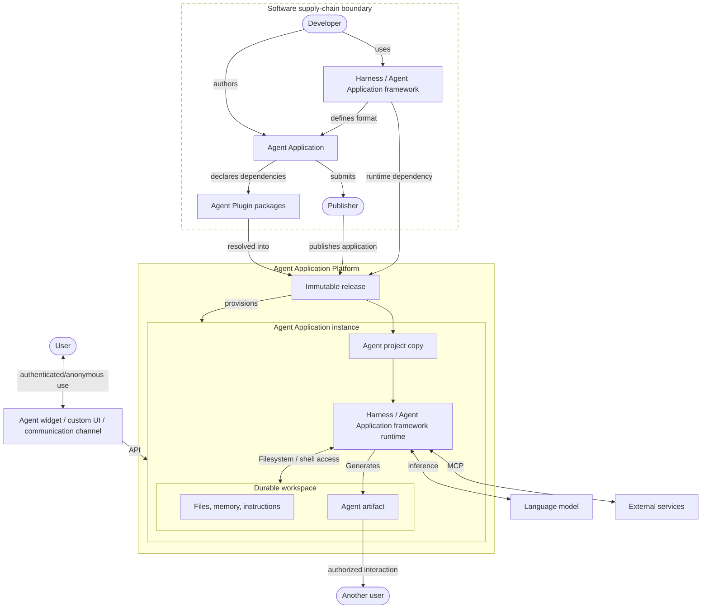

**Working Draft 0.8 · August 2026** · [Plain text](https://agentapplication.io/llms-full.txt) · [Cite](/#cite)

---

## Abstract

ChatGPT, Claude, Gemini, Lovable, Replit Agent, OpenClaw, Lightfield, and
Manus belong to an emerging class of AI products. They use tools, retain context
across sessions, and accumulate work over time. The application sets the
guardrails; the agent inspects the current state and chooses what to do next.
Terms such as *chatbot*, *copilot*, and *agent harness* describe parts of these
products. This paper calls the complete product an **Agent Application**.

An Agent Application uses one or more persistent, tool-using AI agents to
produce work. A request, event, or schedule can start the
work. The agent evaluates the current state, chooses intermediate steps, and
uses tools to carry them out. Examples include a financial advisor that
maintains one person's financial history and retirement plan over time, a
virtual marketing employee that works across a team's campaigns, and a SaaS
copilot that guides a customer from onboarding to a mature program.

Each user of a personal application may receive a separate instance. Team and
enterprise applications may instead assign an instance to a team, customer,
project, ticket, or another ownership and privacy boundary. Every instance has
its own history, authority, and logical workspace, isolated from other
instances. Compute may stop and restart, but the instance and its work persist.

Developers build agent applications with a **harness / Agent Application Framework**.
The framework supplies the agent loop and may also supply project conventions,
development tools, evaluations, packaging, and deployment. An **Agent Application
Platform** turns a tested project into a fixed release, creates long-lived
instances from that release, and provides the services needed to operate them.

Over time, instances may accumulate different knowledge, artifacts, instructions, and
unfinished work. Some applications also let an instance adopt local
instructions or generated code. The instances can therefore **diverge in program
as well as state**. Updating a fleet may require reconciling a new release with
each instance's local changes, preserving its work, and testing the result
against its workspace. Operating costs can vary just as widely across
instances.

The industry is rapidly developing the building blocks for these applications:
the Model Context Protocol (MCP), Agent Skills, Agent Plugins, hooks, agent
loops, and runtime tools for shell access, file operations, code generation,
and code execution. This paper steps back from the individual pieces to
describe the application that takes shape when developers assemble them.

Its goals are to document that application shape; identify framework tooling,
cloud services, and standards that could make Agent Applications easier to
build, deploy, and manage; and give the community a place to refine the model
as agents take on harder work. The paper also introduces **Agent Application
Programming**, the discipline of decomposing a use case across code,
instructions, tools, agents, workflows, state, and policy.

---

*Figure 1. The Agent Application lifecycle.*



---

# Part I: The shape of an Agent Application

## 1. What is an Agent Application?

ChatGPT and Claude use agent widgets. An
[OpenClaw](https://docs.openclaw.ai/concepts/main-session) agent may appear as a
WhatsApp or Telegram contact. [GitHub Copilot's coding
agent](https://docs.github.com/en/copilot/how-tos/use-copilot-agents/cloud-agent/use-cloud-agent-on-github)
and [Cursor Cloud Agents](https://cursor.com/docs/cloud-agent) can start from an
issue or pull request and return their work there. A [Microsoft Copilot Studio
autonomous agent](https://learn.microsoft.com/en-us/microsoft-copilot-studio/authoring-triggers-about)
can wake in response to a business event without presenting a conversational
interface at all.

What do these systems have in common? Each gives a tool-using agent a continuing
scope of work. Later messages or events return to that work, and the results
remain after a run ends. They have different interfaces and jobs, but the same
underlying application shape. We call it an Agent Application.

An **Agent Application** uses one or more persistent, tool-using AI agents to
produce or maintain durable results. A request, schedule, or outside event can
start the work. The application sets the available tools, permissions, policies,
and other guardrails. Within those limits, the agent inspects the current state
and chooses what to do next. Its work can continue across sessions, and the
results outlive the model call that produced them.

Consider a Financial Advisor Agent that works with Maya. She uploads tax
returns, account statements, and retirement plan documents, then authorizes
read access to accounts at her financial institutions. The agent periodically
retrieves new records, reconciles them with the material she uploaded, and
alerts her when it finds a change worth reviewing.

When Maya considers taking a year away from work, she asks how the change could
affect her retirement plan. The agent draws on the financial history in her
workspace, writes code to run cash-flow analyses and retirement simulations,
records its assumptions, and presents the results. Months later, it can show
which records, assumptions, and simulations informed its analysis.

Doing this over years requires more than a model response or transcript. The
application routes Maya's messages, scheduled reviews, and retrieved records
back to the same agent instance. Its workspace preserves uploaded documents,
account snapshots, analysis code, assumptions, reports, and unfinished work.
The harness / Agent Application framework runs the reasoning loop. Tools give
the agent read-only access to financial institutions, and a sandbox executes
its analysis code.

Compute can stop when Maya's instance is idle, but the instance and its work
remain. Its scoped credentials permit read-only retrieval when a request or
schedule wakes it. The application can analyze data, produce reports, and
notify Maya, but it exposes no tools for changing accounts or moving money. An
audit record preserves how it produced each report. New releases can improve
the application without discarding the context it has accumulated with Maya.
Its persistent instance, durable workspace, tool use, scheduled work, and
lasting analyses make it an Agent Application.

---

## 2. From web and mobile applications to Agent Applications

The term *web application* became useful when a web page was no longer enough to
describe what ran in the browser. Gmail and Google Docs were complete software
products delivered through a URL. Their interfaces ran in the browser, their
logic and data were split between client and server, and the developer could
update the product without reinstalling software on every computer. The browser
became a runtime and the web server became a distribution channel.

The term *mobile application* captured a different shift. Software was designed
for a phone or tablet, installed through an app store, and integrated with the
device's operating system. Google Maps could use location; Instagram could use
the camera; Uber could combine both with notifications and a persistent device
identity. A mobile app was more than a web application on a smaller screen. It
had a new runtime, new capabilities, and a new distribution model.

Agent software changes who chooses the intermediate steps. In the usual web or
mobile application, a person navigates the interface and selects operations.
In an Agent Application, the person states a goal and the agent determines how
to pursue it within the application's guardrails.

| Computing era | Application model | Characteristic stack |
|---|---|---|
| Personal computing | Desktop application | Native code, operating systems, GUI toolkits, local files, installers |
| Internet computing | Web application | HTTP, browsers, servers, databases, cloud infrastructure |
| Mobile computing | Mobile application | Mobile SDKs, touch interfaces, sensors, app stores, device identity |
| Agent computing | Agent Application | Models and conventional compute, harnesses / Agent Application frameworks, native projects, Agent Application Platforms, durable instances and workspaces |

New application models initially resemble the software that came before them.
Early commercial websites reproduced brochures and catalogs. Many early mobile
apps were companion versions of desktop or web products. The first wave of AI
products has centered on chat and copilots.

HTTP, HTML, and browsers existed before developers had a mature web application
stack. Mobile operating systems, sensors, and app stores also came before the
modern mobile app. The agent stack is at a similar stage: many of the basic
pieces exist, and frameworks are beginning to assemble them into repeatable
ways to build applications.

---

## 3. The Agent Application stack

An Agent Application spans six layers, from model execution to the surfaces
where people and software use the product. Each layer has a distinct role.

| Layer | Responsibility |
|---|---|
| Model and conventional compute | The model interprets natural-language programs and chooses actions. Conventional processors execute code, tools, and filesystem operations. |
| Harness / Agent Application framework | A harness assembles context, invokes models and tools, and runs the agent loop. As it accumulates project structure, development tools, evaluations, packaging, deployment, and production runtime capabilities, it evolves into a full Agent Application framework. |
| Agent project and release | A framework-native project contains the developer-authored program, configuration, knowledge setup, dependencies, and evaluations. The chosen framework and platform turn it into a fixed, inspectable version for deployment. |
| Agent Application Platform | Packages releases, provisions instances, attaches workspaces and authority, runs sessions, manages fleets and costs, and supports distribution and monetization. |
| Agent instance | A long-lived copy created for one privacy domain such as a user, a team or a ticket. It accumulates its own workspace, history, authority, artifacts, and local program changes. |
| Product surfaces | Agent widgets, APIs, communication channels, and artifact sharing expose the running instances to users and other software. |

An artifact can be shared outside its instance under its own access policy.
That access does not open the workspace that produced it.

The early web produced many frameworks with different ideas about routes,
templates, data access, configuration, and deployment. A smaller set grew into
complete application frameworks. A Next.js application follows Next.js
conventions; a Rails application follows Rails conventions. Both are
first-class web application frameworks.

Claude Code, Codex CLI, Goose, OpenCode, the OpenAI Agents SDK, and LangGraph
all run or support the agent loop. They differ in how much of the development
and operating lifecycle they handle. A harness becomes a full Agent Application
framework when it also provides a coherent way to structure, develop, debug,
test, deploy, and operate the application.

The harness / Agent Application framework choice shapes the application. Each
carries opinions about models, context management, tools, permissions,
delegation, checkpointing, and debugging. Those choices affect portability,
reliability, and task cost.
Directory conventions are part of the programming model. An Agent Application
Platform can support several frameworks by running their native projects and
standardizing the boundaries between layers. It does not need to force every
application into one generic directory structure.

Several boundaries in the stack already have working protocols or products.

| Primitive | What it provides |
|---|---|
| Tool protocol | The [Model Context Protocol](https://modelcontextprotocol.io/specification/2026-07-28/basic) gives agents a common way to discover and call outside capabilities, and to authenticate to protected MCP servers. |
| Natural-language programs | [Agent Skills](https://agentskills.io/specification) and related formats package procedural instructions so a harness can load and execute them. |
| Component packages | [Agent Plugins](https://agent-plugins.org/specification) defines a portable package for Agent Skills and MCP server configurations, with namespaced client extensions. |
| Agent-to-agent protocol | [Agent2Agent (A2A)](https://a2a-protocol.org/latest/specification/) gives independent agents a common way to advertise capabilities, exchange messages and task artifacts, and manage collaborative work. |
| Sandboxed compute | Vercel Sandbox, E2B, containers, and microVMs let agents run code, install dependencies, and manipulate files. |
| Agent harness | Claude Code, Codex CLI, Goose, OpenCode, DeepAgents, and related systems assemble context and tools into a working agent runtime. |
| Agent event protocol | AG-UI carries messages, run status, tool calls, state changes, and other typed events between an agent backend and its frontend. |
| Agent widget | ChatKit, CopilotKit, AI SDK Elements, and similar frontends combine sessions, multimodal input, runtime events, tool rendering, artifacts, and generated UI. |

The boundaries between harnesses, frameworks, and platforms are still moving.
Claude Code and Codex define project conventions and local development. Vercel
Eve adds a prescribed layout, durable execution, sandboxes, approvals,
evaluations, tracing, and delivery across several channels. Karta.sh and Amazon
Bedrock AgentCore provide parts of the production layer.

---

## 4. From human-operated to agent-operated software

Conventional applications treat a person or a predefined workflow as the
operator. The software exposes menus, screens, forms, and APIs. A person chooses
what to do and sequences the operations, or a developer encodes that sequence
in advance.

An Agent Application divides control differently. Developers and operators set
the guardrails: available tools, permissions, budgets, policies, triggers, and
approval rules. When a user request, schedule, or outside event starts a run, the
agent reads the current state and selects the next action. It can plan, define
workflows, invoke tools, create and revise artifacts, delegate work, and
continue until it reaches an outcome or a boundary that requires outside input.

The definition does not require a person to approve every action. A Financial
Advisor Agent may retrieve read-only account data and run scheduled analyses
without asking each time. A backend operations agent may process a low-risk
record without waiting for anyone. In both cases, code defines the allowed
space and the agent chooses a path through it.

| Conventional application | Agent Application |
|---|---|
| A person or fixed workflow selects each operation | The agent selects actions within application guardrails |
| The user or developer specifies the steps | A request, event, or schedule supplies the goal and current state |
| Application behavior changes through releases | Instance behavior also reflects its accumulated workspace and approved local changes |
| State is mostly data | State includes data, memory, programs, tools, and lineage |
| Deployment creates equivalent copies | Instantiation creates diverging descendants |

An agent does not need a particular interface. The same agent may appear as a
full-screen conversation, a copilot inside another product, a phone number, or a
backend worker.

---

## 5. Where people encounter AI agents

### 5.1 The agent widget

The **agent widget** is the most common user interface for Agent Applications.
It fills the main window in ChatGPT, Claude, and Gemini. Lovable and Replit place
it beside the project under construction. Other products open it as a sidebar,
panel, or popup. Here, *widget* means a reusable interface component; it may
occupy any amount of screen space.

| Area | What the widget does |
|---|---|
| Identity and configuration | Signs the user in, connects accounts, and exposes the model, agent, mode, tools, or other options supported by the harness |
| Sessions | Lists, creates, switches, resumes, renames, archives, and deletes multiple sessions; reconnects to work still running |
| Input | Accepts typed or spoken directions, images, documents, and other files |
| Run stream | Renders user and agent messages alongside progress, plans, reasoning summaries, tool calls, tool results, approvals, errors, and status changes |
| Artifacts | Opens, renders, edits, versions, downloads, and shares the documents, code, media, or applications produced by the agent |
| Generated interface | Displays interactive forms, charts, dashboards, viewers, and controls supplied by the agent or one of its tools |

The widget renders an event stream from the agent runtime, not just a message
history. When a user returns to a session, the client must replay those events,
restore the artifacts and interactive controls, and reconnect to any live run.
It must also preserve the identity and permission context behind every approval
and tool action.

[OpenAI ChatKit](https://openai.github.io/chatkit-js/) packages authentication,
threads, attachments, tool visualization, reasoning events, and interactive
widgets. [CopilotKit](https://docs.copilotkit.ai/) supplies chat surfaces,
persistent threads, tool rendering, and several forms of generated UI. [AI SDK
Elements](https://elements.ai-sdk.dev/examples/chatbot) exposes the same pattern
as components for conversations, model selection, attachments, reasoning,
sources, and tools.

[AG-UI](https://docs.ag-ui.com/) standardizes the event connection between the
widget and the agent backend. Its typed stream covers the run lifecycle,
messages, tool calls, and shared state while leaving room for events specific to
one application.

Generated UI can come from application-owned renderers, frontend tools, or a
portable mechanism such as [MCP Apps](https://modelcontextprotocol.io/extensions/apps/overview).
An MCP tool can return an interactive HTML view that the widget renders inside
the conversation. The view can display a form or dashboard, receive live data,
and call tools through the host while remaining isolated from the surrounding
page.

### 5.2 Other surfaces and channels

Other agents appear inside software people already use. Microsoft 365 Copilot
works alongside Word documents, Excel workbooks, Outlook mail, and Teams
conversations. It begins with the item on screen and the host product's
permissions. Canva AI occupies a similar position inside a content creation and
marketing system, where it can use the current brief, brand assets, audience,
approval flow, and publishing destinations to create related formats or schedule
campaign work. The host keeps the resulting material editable.

Claude Code and Codex meet developers in terminals and desktop workspaces.
[GitHub Copilot's cloud
agent](https://docs.github.com/en/copilot/how-tos/use-copilot-agents/cloud-agent/use-cloud-agent-on-github)
can start from an issue or pull request, while [Cursor Cloud
Agents](https://cursor.com/docs/cloud-agent) can also start from Slack, Linear,
or an API. Both work in the background and return changes through branches and
pull requests. Lovable and Replit Agent put a similar relationship inside a
browser-based product builder, where the continuing object is the application
project itself.

Communication channels can become complete agent surfaces. Intercom Fin, for
example, can meet a customer through web chat, email, phone, WhatsApp, SMS,
social messaging, or Slack while the support case continues behind those
channels. To the user, a voice agent may simply be a phone number. With an
OpenClaw personal agent, a Telegram or WhatsApp contact can be the entire
user-facing interface; the gateway, tools, and persistent state stay out of view.

Some agents work mainly in the backend. They wake on schedules, tickets, API
calls, webhooks, queue events, or requests from other agents. [Copilot Studio
autonomous agents](https://learn.microsoft.com/en-us/microsoft-copilot-studio/authoring-triggers-about),
for example, can react to a new SharePoint item, a OneDrive file, a completed
Planner task, or a recurring timer. People encounter the result as an updated
record, report, notification, or approval request. An operations dashboard may
be the only visible surface.

One agent can span several of these surfaces. A copilot can be backed by an Agent
Application; a channel only determines where the person and agent interact.
Section 6 defines the category from the execution model rather than the UI.

---

## 6. Recognizing an Agent Application

The definition in section 1 does not depend on the user interface. Four
properties distinguish an Agent Application from adjacent systems:

| Defining property | What it looks like |
|---|---|
| Persistent agent instance | A new message or event returns to the same agent, privacy domain, and ongoing work |
| Agent-directed control flow | The agent reasons about the current state and chooses its next action rather than following a fully predetermined workflow |
| Durable computational workspace | Files, instructions, memory, code, and other working state remain available to later runs |
| Durable work | Artifacts, workspace state, external records, or continuing processes outlive the event that created them |

The [Hello World Agent Application](https://agentapplication.io/examples/hello-world)
shows the smallest complete example: a notebook agent saves a note, suspends,
and uses that note to update a briefing on a later run.

Different products assign the instance and workspace to different privacy
domains.

| Product | Privacy domain | Durable work |
|---|---|---|
| [ChatGPT](https://help.openai.com/en/articles/20001275-chatgpt-work-and-codex) | A user or project | Project files, instructions, memory, scheduled work, and finished documents or sites |
| [Claude Cowork](https://support.claude.com/en/articles/14116274-organize-your-tasks-with-projects-in-claude-cowork) | A Cowork project | Local files, project memory, scheduled tasks, and persistent artifacts |
| [Lovable](https://docs.lovable.dev/features/agent-mode) | A software project | Source code, project instructions, assets, deployment state, and change history |
| [Replit Agent](https://docs.replit.com/features/version-control/checkpoints-and-rollbacks) | A software project | Code, installed packages, databases, agent memory, and restorable checkpoints |
| [OpenClaw](https://docs.openclaw.ai/start/openclaw) | An OpenClaw agent | Workspace files, memory, skills, schedules, and tool-created results |
| [Lightfield](https://docs.lightfield.app/) | A company | Versioned customer context, customer relationship management (CRM) records, generated analysis, and scheduled automations |
| [Manus Cloud Computer](https://help.manus.im/en/articles/15392111-what-is-the-cloud-computer) | A persistent cloud computer | Files, installed tools, databases, bots, and running processes |

### 6.1 How to decide who gets an agent instance

An agent instance has access to its entire workspace. If a workspace contains information about
several people, customers, or cases, the agent can combine that information in
its reasoning, summaries, and artifacts. Those entities belong in the same
instance only when that mixing is acceptable. Thus, privacy boundary decides
who gets an agent instance.

This boundary limits prompt-injection damage. A user may try to make the agent
ignore its rules and quote or summarize other information in the workspace. If
the workspace contains data that user may not access, the model is being asked
to enforce a privacy boundary after it has already seen the data. Separate
instances keep that data outside the agent's reachable state.

The same boundary extends to data reachable through tools and retrieval systems.
A user-initiated call should not return information that the authenticated user
cannot access.

The Financial Advisor Agent therefore gets one instance per person or household,
depending on who is authorized to share financial records. A human resources
(HR) helper that handles personal employee matters gets one per employee. A
business-to-business (B2B) support agent can keep many tickets for one customer
in the same workspace, and so each customer gets an instance. A
virtual marketing employee can have one instance shared by a whole team because
the team itself is the privacy boundary.

An agent application builder decides the boundary and assigns appropriate
stable instance identifiers. For instance, a Finanical Advisor agent may use
household_id as the agent instance id, thus creating a new instance per household.
All users from one household use the same instance id and thus interact with the
same agent instance and access the same workspace.

### 6.2 A durable computational workspace

The workspace holds the state the agent needs to continue with: instructions, files,
memory, artifacts, code, configuration, and any derived data. The runtime may keep
the state in a database or object store. Alternatively, it may give each session an ephemeral
filesystem, then retain selected file changes and artifacts under that session
so the instance can retrieve them later. Durable workspace can be implemented using
a variety of underlying storage mechanisms.

The canonical design exposes an **isolated persistent virtual filesystem for each
instance**. It can hold arbitrary documents, code, local databases, installed
packages, and work in progress without requiring a schema for every new kind of
state. The platform can restore compute around that filesystem when the agent
wakes, or preserve a complete environment when the application needs one.

A later task must be able to use and change the working state left by an earlier
one. A transcript can remind an agent what it said; a workspace lets the agent
continue the work itself.

A durable workspace can be one of the expensive parts of this model. It is
useful when the work accumulates derived or in-progress computational state that
an external system of record cannot represent. Section 13 draws that boundary.

### 6.3 Durable work

Durable work may be an agent created artifact, a workspace change, a record in an external
system, or a continuing process. The work persists after the session that produced it ends.
It can be accessed in another session or via direct state access APIs.

### 6.4 What is not an Agent Application?

The boundary of what is and isn't an agent application is fuzzy, similar to the boundary
between a webpage and a web application. Many use cases may be appropriately served
without a full agent application, but may be enhanced by conversion to an agent application.

A chat interface does not necessarily indicate an Agent Application. A simple Q&A chatbot
and a Financial Advisor agent both use a conversational chat interface, but the Q&A chatbot
does not retain context of previous sessions, nor it produces durable work that persists. As
a result, the Q&A chatbot is not an agent application. Depending on the use cases, if it is
converted to an agent application, then it can deliver capabilities beyond simple answers,
such as personalization of the answers based on previous interactions with the user.

Several adjacent systems do not qualify as agent applications:

| System | Primary unit | Why it falls outside this category |
|---|---|---|
| Model endpoint | Inference request | The endpoint returns a response but owns no continuing agent or work |
| Stateless or transcript-only chatbot | Request or conversation | No instance carries working state from one session to the next |
| Fixed workflow automation | Predefined workflow and run | The developer fixes the control flow in advance, even if one step calls a model |
| Autonomous task runner | Task run | The worker and its scratch state end with the task. A task runner can become an Agent Application if it gains a persistent instance and durable work. |
| Harness / Agent Application framework | Development and runtime machinery | It can be used to build an Agent Application, but is not itself the application delivered to a user |

A conventional n8n or Zapier flow remains workflow automation when its graph
determines the next step. [Dependabot](https://docs.github.com/en/code-security/concepts/supply-chain-security/about-the-dependabot-yml-file)
is a boundary case: it monitors configured package ecosystems and opens
pull requests according to schedules and update rules. The pull request is
durable, but the configuration determines the control flow. A simple Q&A bot
remains a chatbot when each conversation stands alone. An Agent Application may
contain deterministic workflows and answer questions, but its continuing unit
is a persistent agent that chooses actions from the current state and leaves
durable work behind.

---

## 7. Vocabulary

The word *agent* now refers to products, runtime processes, assistants, and
packaged configurations, sometimes in the same discussion. This paper uses the
following terms consistently.

| Term | Meaning |
|---|---|
| **Agent Application** | Like *web application*, the term may mean the developer-authored application or the complete running product. Its full lifecycle includes the project source, releases, instances, interfaces, artifacts, and operations. |
| **Agent Project** | The native project representation for a harness / Agent Application framework, usually a source directory. It contains the code, natural-language programs, declarations, knowledge, dependencies, and tests used to create releases. |
| **Release** | A fixed version of an Agent Project prepared for deployment using its framework's and platform's native mechanisms. |
| **Privacy Domain** | The people, records, and work that may safely share one workspace. Information that must not mix belongs to a different domain and instance. |
| **Instance** | A persistent copy provisioned from an Agent Application release for one privacy domain, such as a user, customer, team, project, or job, with its own history and lifecycle. |
| **Session** | One period of activity within an instance, started by a request, event, or schedule. |
| **Runtime Agent** | The model-driven actor working inside an instance, alone or with other runtime agents. |
| **Agent** | An intentionally overloaded industry term. It may mean the developer-authored Agent Project or a model-driven actor executing inside an instance. |
| **Agent Workspace** | The durable logical working state available to an instance across sessions, whether implemented as a persistent filesystem, database-backed state, object storage, or retained session state. |
| **Agent Artifact** | A durable, portable work product with its own identity, versions, provenance, permissions, and history. |
| **Agent Lineage** | The history of an instance as it diverges from the release that created it. |
| **Agent Widget** | A rich interactive client for an agent, including sessions, multimodal input, runtime events, tool calls, artifacts, approvals, and generated UI. |
| **Natural-Language Program** | Instructions that change how the application behaves, including skills, procedures, policies, agent roles, and constraints. |
| **Agent Harness** | The runtime around the model that assembles context, calls tools, loads skills and subagents, and runs the agent loop. |
| **Agent Application Framework** | An agent harness that supports the application lifecycle from development through production runtime. It defines the native project model, extension conventions, evaluations, packaging, and deployment model. |
| **Agent Application Platform** | The developer- and publisher-facing service that deploys releases, operates instances and workspaces, manages fleets and costs, and supports distribution and monetization. |
| **Agent Cloud** | Specialized cloud infrastructure for persistent agents, used when contrasting this runtime with ordinary cloud infrastructure. It may sit beneath or inside an Agent Application Platform. |
| **Component** | A named unit that a project or dependency contributes, such as a skill, MCP server, tool, hook, subagent, trigger, renderer, or knowledge source. |
| **Agent Plugin** | An installable extension package that contributes reusable components to an Agent Project or host. A release identifies its exact content by digest and by version when one exists. The plugin does not own the application's product identity, top-level instance, privacy boundary, workspace, or release lifecycle. |
| **Plugin Dependency** | A project declaration that incorporates a plugin subject to a version, source, and compatibility requirement. |
| **Plugin Activation** | The decision to expose selected components from an installed plugin to the application runtime. Activation does not grant credentials or other authority. |
| **Resolved Dependency Graph** | The exact dependency versions and package contents selected for a release, including their sources, integrity digests, components, and host extensions. |

The broad meanings are useful in ordinary discussion. A developer will say, "I
am building an agent," just as a web developer says, "I am building a web app."
When architecture or operations require precision, this paper names the agent
project, release, instance, session, runtime agent, workspace, or interface
directly.

---

# Part II: Building Agent Applications

## 8. A hybrid programming model

An Agent Application combines four kinds of material: **conventional code,
natural-language programs, declarations, and knowledge or assets**. Developers
package this material in the Agent Project. After deployment, an instance may
also acquire code, instructions, knowledge, or assets as local state.

### 8.1 Conventional code

Conventional code remains the right tool for:

- deterministic, repeatable processes;
- hard security boundaries;
- exact data transformations;
- APIs and protocol adapters;
- tool implementations;
- database operations;
- cryptography;
- deterministic validation;
- resource accounting;
- rendering and user interfaces;
- performance-sensitive work.

**Tools and MCP**

Tools connect this code to the model's reasoning loop. In an LLM "tool call,"
the model selects a tool and produces structured arguments. The harness validates
the request, invokes the implementation, and returns the result to the model.
The [Model Context Protocol
(MCP)](https://modelcontextprotocol.io/docs/learn/server-concepts) standardizes
how a server publishes a tool's name, description, and input schema, and how a
client discovers and calls it. A calendar API, database query, or payment action
can then appear to the model through a common interface.

The 2026-07-28 MCP specification is stateless at the protocol layer. Each
request carries the protocol version, client metadata, and client capabilities
needed to process it. There is no initialization handshake or MCP session ID. If
a tool needs state to survive across calls, it returns an explicit handle that
the client passes in later requests. That handle belongs to the tool or
application, not to an MCP session.

When an application reaches external systems through MCP, identity,
authentication, and authorization become part of the tool boundary. Under the
[MCP authorization
specification](https://modelcontextprotocol.io/specification/2026-07-28/basic/authorization),
a protected HTTP MCP server acts as an OAuth 2.1 resource server, while the MCP
client calls it on behalf of a resource owner. The server publishes how to find
its authorization server and which scopes are needed. The client obtains an
access token issued for that MCP server and includes it in the `Authorization`
header of every HTTP request. If the server requires another scope, the client
can ask the user to authorize it and retry the request.

The application still has to bind three identities correctly: the authenticated
user, the agent instance, and the external account. For user-initiated work, the
MCP client uses the user's delegated grant rather than a shared platform
credential. The MCP server validates the token and enforces permission for the
exact tool and resource before returning data or taking action. If it calls an
upstream API, it uses a separate upstream token; the MCP specification forbids
passing the inbound MCP token through. These bindings matter when several users
share one team agent or when the same user has instances with different
authority.

Tool calls also have a lifecycle. A timeout may leave the agent unsure whether a
calendar event was created, and a blind retry could create it twice. Stable call
IDs and idempotency keys let the tool recognize the same logical action. A
long-running operation needs a durable job handle, progress, cancellation, and a
way to collect the result after the agent reconnects; the [MCP Tasks
extension](https://modelcontextprotocol.io/extensions/tasks/overview) defines
one such pattern. Parallel calls introduce ordering and concurrency problems.
Conventional code enforces these guarantees and records each request, approval,
retry, result, and error for audit.

**Runtime code execution**

An Agent Application may make scripts and executables available to the runtime
agent. Some are packaged with the release; the agent may generate others while
working. The agent can invoke this code through a shell, interpreter, or
code-execution tool, and conventional compute runs it in the application's
execution environment.

If the instance retains generated code for later execution, it becomes part of
the workspace and local program state rather than the immutable release.

### 8.2 Natural-language programs

Natural language becomes program material when changing the text changes runtime
behavior. Agent developers already write this material in several common forms:

- Project instruction files such as `AGENTS.md`, Claude Code's
  `CLAUDE.md`, Gemini CLI's `GEMINI.md`, and harness-specific equivalents set
  operating rules for an agent working in a particular environment.
- The [Agent Skills specification](https://agentskills.io/specification)
  packages a reusable procedure in a `SKILL.md` file, with optional scripts,
  references, and assets.
- Subagent definitions describe specialist roles, the tools they may use, and
  the instructions they follow when the main agent delegates work to them.

The harness / Agent Application Framework can load instructions at runtime from
a designated URL, a file on disk, an organization policy store, or a skill
registry. The LLM interprets this text alongside the instructions packaged in
the release. Dynamic loading allows an organization to add a procedure without
rebuilding the application and lets the agent load specialized instructions for
the task at hand. If the instance keeps them, they become local program state;
the instance has diverged from its release, and its lineage records the change.

Loaded instructions carry the authority to steer the agent. An attacker who can
alter the source can change the agent's behavior, and a prompt injection can have
the same effect if the runtime mistakes untrusted content for instructions. The
loading policy identifies which sources may supply instructions, how their
contents are verified and versioned, and what authority they receive. A document
loaded as knowledge remains untrusted reference material unless the release
designates it as an instruction source. Section 19.4 develops these controls.

These instructions can define a dynamic multi-step process. A procedure packaged
with the release or adopted as local program state by an instance might direct
the agent to inspect source material, draft a change, send it to a review
subagent, run tests, and report the result. A research application can generate
a larger graph in which subagents plan parts of a query, gather evidence, review
each other's findings, and assemble a report. The harness / Agent Application
Framework loads the relevant instructions, while the model interprets them
against current state and adjusts the process as work proceeds. Designing these
dynamic workflow graphs, including their participants and transitions, is
sometimes called graph engineering.

Frontier models have become better at following detailed instructions and
chaining tool calls, making longer natural-language procedures practical.
The [Agent Skills
specification](https://agentskills.io/specification) does not define execution
guarantees. Its guidance uses
[evaluations](https://agentskills.io/skill-creation/evaluating-skills) to test
behavior.

A harness can improve reliability by adding structure, execution validation,
and debugging. For example,
[Playbooks](https://www.runplaybooks.ai/#video-intro) compiles structured
Markdown into an intermediate language and provides a debugger with breakpoints,
variables, and a call stack. These mechanisms make natural-language programs
more inspectable and their execution easier to validate. Appendix B records the
prior art and dated sources.

Natural-language programs are versioned, reviewed, and evaluated with the rest
of the application. Their behavior depends on the model, harness, tools, and
runtime context, so behavioral tests establish whether the procedure works.
Section 12.5 explains why text diffs alone cannot settle upgrades.

### 8.3 Project declarations

Project declarations are structured configuration that a framework or its
tooling reads to assemble and run an Agent Project. They name entrypoints and
components, select models and harness features, configure tools and triggers,
declare package dependencies, and state requested permissions or runtime
requirements. An Agent Plugin's `plugin.json` and `mcp.json` files are
declarations contributed by a project dependency.

Some declarations describe deployment requirements and become part of the
release. The platform resolves those requirements when it deploys the release.
Secrets, granted authority, user data, and per-instance settings remain outside
the project and release.

Declarations change application behavior, but a processor does not execute them
as ordinary code and a model does not interpret them as instructions. Version
and review declarations with the source they configure. Validate them against a
schema where one exists, then test the assembled application. A syntactically
valid MCP declaration can expose the wrong server, and a valid dependency range
can resolve to plugin content the application has never evaluated.

### 8.4 Knowledge resources

Knowledge supplies the material the application reasons over:

- product and domain documentation;
- customer files;
- policies and manuals;
- source code;
- research material;
- prior artifacts and templates;
- schemas;
- organizational context.

Knowledge may be packaged in the agent folder or kept in an external location
the agent can access, such as a website, database, a document store, or behind
an API. A release may therefore contain the material itself or the
configuration and credentials needed to reach it.

The source can remain raw. The agent browses, searches, opens, and reads the
material as the work requires. For large collections, a retrieval service can
ingest and index the material for retrieval-augmented generation (RAG), allowing
the agent to find relevant passages before reading further. An application may
use both approaches: direct access to complete and current sources, plus an index
for finding material across a large collection.

The runtime must preserve the boundary between instructions and knowledge. A
policy loaded as executable instruction carries more authority than the same
words retrieved as reference material. External documents may contain hostile
instructions, so the runtime loads them as untrusted data and keeps that label
attached. Section 19.4 develops the security consequences.

### 8.5 Two kinds of execution

An Agent Application uses two kinds of execution. A conventional computer
executes deterministic code, tool implementations, filesystem operations, and
resource limits. A large language model (LLM) interprets natural-language
programs, reasons about the current state, and chooses actions.

The agent harness coordinates both. It assembles the model's context, exposes
tools backed by conventional code, loads the application's instructions and
knowledge, and carries the reasoning loop forward. The same instruction can
behave differently with another model, harness, tool set, or workspace state.

A release therefore records the model and harness versions it was tested
against, along with its conventional runtime dependencies. This does not
guarantee identical answers. It tells an operator which combinations the
developer has checked. Appendix D gives the fuller runtime contract.

### 8.6 Test the whole application

Each part of an Agent Application needs a different test. Developers test code
with ordinary software tests. They test natural-language instructions by giving
the agent representative jobs and judging its behavior. They validate
declarations and dependency resolution, then check knowledge for source,
freshness, and permission.

A tool may work perfectly, yet the agent may choose it at the wrong time or
supply an incorrect argument. Release testing therefore has to run the whole
application, not just its code.

### 8.7 Agent Application Programming

Building an Agent Application requires more than writing prompts or connecting
tools. Someone has to decide which work the model may judge, which behavior
code must guarantee, how agents divide and hand off work, what state persists,
and which outside components the application can trust. This work is **Agent
Application Programming**.

The discipline operates at two scales. At the local scale, a programmer decides
whether a behavior belongs in agent instructions, a skill, a tool, a hook, a
subagent, memory, or the agent loop itself. At the application scale, the
programmer composes those primitives into a product. This includes:

- separating a use case into model judgments and deterministic operations;
- placing each behavior in the primary agent, reusable instructions, skills,
  tools, hooks, specialist agents, or runtime policy;
- applying graph engineering to dynamic workflows and deciding which transitions
  conventional code determines and which the model chooses at runtime;
- selecting external capabilities from plugins, MCP servers, libraries, APIs,
  and other dependencies;
- assigning state to sessions, instances, workspaces, memory, and artifacts;
- designing interfaces, triggers, permissions, evaluations, observability,
  and cost controls around the resulting system.

The placement of each behavior matters as much as its wording. A guarantee
hidden in an instruction can be ignored. A task that needs judgment can become
brittle when forced into a fixed graph. A subagent can protect the main agent's
context, but it also adds cost and another place for coordination to fail. A
plugin can save months of work, but it also expands the application's code,
instructions, dependencies, and authority. Good decomposition is what makes an
Agent Application effective, efficient, and secure.

AI coding agents are likely to become the main practitioners of this craft.
They can inspect an entire project, propose a decomposition, write both code and
natural-language programs, run evaluations, study execution traces and costs,
and revise the design as models and application runtimes change. Humans will
still set the goals, authority, risk limits, and acceptance criteria, and review
consequential choices. Much of the day-to-day work, however, may be agents
programming other agents.

The planned *Programming Agent Applications* companion document will develop
this discipline in detail: its design principles, decomposition methods,
patterns, testing practices, security model, and relationship to harnesses /
Agent Application frameworks. The capability model in the next section provides
the common vocabulary for that work.

---

## 9. The agent project and capability model

An Agent Application is authored as a project for a particular harness / Agent
Application framework. In a code-oriented framework, the project is usually a
source directory. A managed or visual builder may store the same material in
another form. This framework-native representation is the **agent project**. It
contains the code, instructions, knowledge, configuration, and tests used to
build and run the application.

The project stays in the framework's native form. This is similar to how Next.js and Rails both build
web applications, but they use different route files, project conventions, and
release bundles. They interoperate through the web platform and its protocols.
Agent frameworks can likewise support common protocols while keeping their own
project layouts and programming models.

The choice of framework affects the finished application. Its conventions,
defaults and design philosophy about model support,
context strategy, tool system, execution environment, state model, event stream,
and debugging facilities all shape behavior and cost.

### 9.1 A capability model for Agent Applications

Here we collect capabilities found across current Agent Applications. Each
project uses appropriate subset that its job requires. A small application may need only an
agent program, a few tools, an interface, and tests. A long-running business
application may need every row.

| Capability | What the application needs | Usually supplied by |
|---|---|---|
| Agent program | A primary agent, model configuration, instructions, context assembly, tool loop, stop conditions, and structured outputs | harness / Framework |
| Instructions and knowledge | System instructions, reusable procedures, domain knowledge, examples, and other material loaded into context when needed | Project, framework, or reusable package |
| Tools and integrations | Typed functions, APIs, data sources, files, shell or code execution, browsers, and remote tool servers | Project, framework, MCP server, or plugin |
| Agents and workflows | Specialist agents, delegation, deterministic steps, branching, parallel work, and communication with independently deployed agents | Framework, with A2A at a remote boundary |
| State and workspace | Conversation history, memory, durable files, checkpoints, caches, indexes, and a privacy boundary for continuing work | Framework and platform |
| Interfaces and events | User input, streamed progress, tool calls, approvals, errors, generated UI, and machine-facing APIs | Framework, UI library, and platform |
| Artifacts | Durable outputs with identity, versions, provenance, permissions, rendering, and export | Project and platform |
| Triggers and background work | Messages, schedules, webhooks, queues, retries, and long-running jobs that continue without an open chat | Framework and platform runtime |
| Policy and authority | Identity, secrets, tool permissions, network and resource limits, approval gates, audit, retention, and revocation | Framework and platform, enforced outside the model |
| Evaluation and observability | Test cases, trajectory and output checks, security tests, traces, cost measurements, and production feedback | Framework, evaluation service, and platform |
| Application lifecycle | Local development, dependency review, configuration, deployment, releases, instance creation, migration, rollback, metering, export, and deletion | Framework and platform toolchain |

Framework authors can use the table to describe what their frameworks handle.

### 9.2 What a project may contain

A project can group the capabilities like this:

```text
agent-application/
|-- agent-program
|-- instructions-and-knowledge
|-- tools-and-integrations
|-- agents-and-workflows
|-- state-and-workspace
|-- interfaces-and-artifacts
|-- triggers-and-background-work
|-- policy-and-approvals
|-- evaluations-and-observability
`-- application-lifecycle
```

The labels describe parts of the application, not filenames. One framework may
express the whole project in ordinary code. Another may use Markdown
instructions, configuration files, and conventional directories. A managed
platform may keep some operational settings outside the repository. Appendix A
shows one possible layout. Section 24 shows the same model in a native framework
project.

### 9.3 Where existing standards fit

Standards help when independently built systems need to communicate. An
internal interface controlled by one framework can follow that framework's own
design.

| Standard | Boundary it covers | What it does not define |
|---|---|---|
| [MCP](https://modelcontextprotocol.io/specification/2026-07-28/basic) | An agent host connecting to tools, resources, and prompts | The agent loop, project layout, workspace, or application release |
| [Agent Skills](https://agentskills.io/specification) | A reusable instruction package loaded by compatible agents | How an application selects models, stores state, or deploys |
| [Agent Plugins 1.0](https://agent-plugins.org/specification) | A portable extension bundle containing Agent Skills and MCP server configuration | A complete Agent Application, dependency graph, or release format |
| [AG-UI](https://docs.ag-ui.com/) | Events between an agent backend and a user-facing application | The backend framework or frontend component library |
| [A2A](https://a2a-protocol.org/latest/specification/) | Discovery, messages, tasks, and artifacts between independently addressable agents | Internal subagents or a framework's workflow model |
| [MCP Apps](https://modelcontextprotocol.io/extensions/apps/overview) | Interactive UI supplied by a tool and rendered by a host | The application's full user interface or artifact model |

These standards play roles similar to HTTP, HTML, and package formats in web applications. A framework
brings these together to simplify building applications that leverage these standards,
while keeping its own source layout, build process, and deployment model.

### 9.4 How current frameworks expose the capabilities

The table records how five frameworks documented these capabilities as of August
8, 2026. It describes their first-class paths and does not rank product quality
or test conformance. "Application-owned" means that application code or a
separate platform supplies the capability.

| Capability | Documented path in each framework |
|---|---|
| Agent program | **[Claude Agent SDK](https://code.claude.com/docs/en/agent-sdk/overview):** agent loop plus system prompt or project instructions<br />**[Google ADK](https://adk-labs.github.io/adk-docs/get-started/about/):** `LlmAgent` or a workflow agent<br />**[LangGraph](https://docs.langchain.com/oss/python/langgraph/overview):** graph or LangChain agent<br />**[OpenAI Agents SDK](https://openai.github.io/openai-agents-python/):** `Agent` plus `Runner`<br />**[Vercel AI SDK](https://ai-sdk.dev/docs/agents):** `ToolLoopAgent` |
| Reusable instructions | **Claude:** Agent Skills and plugins<br />**Google:** Agent Skills, plugins, and native instructions<br />**LangGraph:** prompts and application code<br />**OpenAI:** agent instructions and prompt templates<br />**Vercel:** agent instructions and application modules |
| Tools and integrations | **Claude:** built-in tools, custom tools, and MCP<br />**Google:** native tools and MCP toolsets<br />**LangGraph:** LangChain tools and an MCP adapter<br />**OpenAI:** function tools and MCP servers<br />**Vercel:** typed tools and an MCP client |
| Agent composition | **Claude:** subagents<br />**Google:** multi-agent and graph workflows<br />**LangGraph:** subgraphs, subagents, handoffs, and routers<br />**OpenAI:** agents as tools and handoffs<br />**Vercel:** subagents invoked as tools |
| State and workspace | **Claude:** resumable sessions, a working directory, and file checkpoints<br />**Google:** session, state, memory, and artifact services<br />**LangGraph:** checkpoints, threads, and stores<br />**OpenAI:** sessions and sandbox-agent workspaces<br />**Vercel:** application-owned message and durable state |
| User-facing events | **Claude:** streamed SDK messages; application-owned UI<br />**Google:** events and a development UI<br />**LangGraph:** typed event streams; application-owned UI<br />**OpenAI:** streaming and realtime agents; application-owned UI<br />**Vercel:** AI SDK UI streams and hooks |
| Evaluation and operations | **Claude:** hooks, OpenTelemetry, usage tracking, and self-hosting guidance<br />**Google:** built-in evaluation, traces, and several deployment targets<br />**LangGraph:** persistence in LangGraph; evaluation, tracing, and deployment through LangSmith<br />**OpenAI:** built-in tracing and evaluation integration; SDK deployment is application-owned<br />**Vercel:** telemetry and development tools; tests and deployment are application-owned |

All five frameworks provide an agent program, tools, agent composition, events,
and some form of state. They differ in how they package instructions, manage
workspaces, run evaluations, connect to user interfaces, and deploy. Those
differences matter when a developer chooses a framework.

### 9.5 Plugins contribute components

An Agent Plugin packages reusable components for an Agent Project. An
application can incorporate plugin-supplied instructions, tools, hooks, and
client extensions into its program. Its state model, authority rules, tests,
and operating lifecycle govern how those components are used.

[Agent Plugins 1.0](https://agent-plugins.org/specification) defines a portable
directory with a root `plugin.json`, Agent Skills under `skills/`, MCP server
configuration in `mcp.json`, and reverse-domain client extensions. The
specification stops at the package format. Frameworks and package managers can
supply registries and dependency resolution, including project dependency files
and transitive plugin dependencies. They can also define installation
permissions and supply-chain verification without changing the plugin format.

---

## 10. Application, release, instance, and session

A running Agent Application has four related lifetimes. The product continues
across releases. Each release can create many instances, and each instance can
run many sessions.

The application is the product identity that a company offers and customers
use. It continues while the publisher ships new releases.

A release is a fixed, deployable version of the native project. Each framework
and platform has its own release format. A production release records the source
revision and resolved dependencies, along with the framework, harness, and model
versions. It also records active components, requested authority, runtime
requirements, evaluations, and migration rules so an operator can inspect and
reproduce the deployment. Operators keep prior releases for inspection and
rollback.

A release records content digests as well as version labels. Semantic versioning
cannot establish behavioral compatibility for a package that changes
natural-language instructions. A plugin update therefore requires evaluation
even when its publisher labels it a minor or patch release.

An instance is the long-lived unit created from a release for one privacy
domain, such as a user, team, customer account, project, or job. Its workspace,
authority grants, history, and billing accumulate independently of other
instances. The user or organization it represents remains responsible even when
the instance acts for months. An operator upgrades an instance by updating its
project files to a new release. Local modifications may require a semantic
merge.

A session is one period of execution or interaction within an instance. A user,
event, or schedule starts it. The session may last one turn or many and need not
have a formal finished state. It uses the release and active local changes
attached to the instance when the session starts.

```text
Agent Application
  |-- Release 1
  |-- Release 2
  `-- Release 3

Agent Application instances
  |-- Instance: Maya, Release 1 unmodified
  |-- Instance: Noor, Release 1 modified
  `-- Instance: Luis, Release 3 unmodified
```

---

## 11. The durable workspace

Each instance has one persistent, isolated logical workspace. It includes every
piece of durable state that the runtime agent can retrieve, even when the
platform stores that state across several systems.

A logical workspace need not be a single filesystem. A platform may keep
structured state in a database and artifacts in object storage. It may also give
each session an ephemeral filesystem, retain selected changes, and record which
session produced them. Later sessions must be able to find, use, and update the
retained state.

The reference design gives each instance an isolated persistent virtual
filesystem. Agents and their tools use ordinary file operations to work with
documents, code, local databases, installed packages, artifacts, and
intermediate results. They can add new forms of state without requiring the
application developer to design a database schema or storage API first.

The filesystem does not require a dedicated machine while the instance is idle.
A platform can snapshot it, restore compute when work arrives, and suspend it
afterward. At scale, the platform can store a shared base image and only the
files each instance has changed. Appendix D describes the storage contract.

### 11.1 What a workspace holds

Current working state changes in place, so its size usually reflects the
application's current work rather than its full history. It may include:

- source material and working files;
- generated code and installed dependencies;
- local databases, indexes, and caches;
- created artifacts;
- downloaded and locally cached files;
- user-uploaded files;
- tool configuration and pending schedules.

Historical state grows as the instance works and includes:

- checkpoints and snapshots;
- run records;
- evaluation results;
- source and change history.

For a long-lived instance, history may cost more to store than the current
working state. A workspace holding fifty megabytes of customer work may also
carry several gigabytes of checkpoints taken before consequential actions over
two years. Retention and compaction policies can keep that history from
dominating the workspace's storage cost.

Raw credentials stay in a managed secret store, while the workspace holds
governed references. An export carries those references and leaves the
credentials behind.

The Agent Plugins specification defines two storage roots. `PLUGIN_ROOT` holds
immutable release content for a plugin packaged with an application.
`PLUGIN_DATA` holds writable state in the instance workspace. A platform scopes
that data by application, instance, and plugin identity, then applies the
workspace's isolation, retention, export, checkpoint, and deletion rules. A
team sharing one instance also shares its plugin data; separate instances never
share it. Secrets stay in the managed secret store rather than either root.
Plugin upgrades that change persistent data include migrations in the release
plan.

### 11.2 The workspace is the privacy boundary

The runtime agent can read the whole workspace. Files, memory, indexes,
summaries, and artifacts may enter its context or affect later work. Folder
names and file permissions within a shared workspace do not create separate
privacy domains.

The boundary covers the logical workspace rather than one filesystem volume. It
includes database rows, objects, session-bound files, and external records
whenever the instance can retrieve them.

The platform enforces privacy between workspaces. It isolates their storage and
compute, controls where their contents can be sent, and restores or deletes one
without touching another. Section 6.1 gives examples of where applications draw
that boundary; section 19 covers the controls that enforce it.

### 11.3 Instance identity and workspace state

The instance identifies the continuing agent: whom it represents, what it may
do, and what it has done. The workspace holds the durable working state and
computational environment that the agent uses. Separating them lets an operator
access, move, or restore the workspace without changing the agent's identity or
permissions. It also keeps per-instance configuration outside the workspace and
out of the runtime agent's reach.

### 11.4 Memory and workspace

A memory system selects facts or past interactions for the model's context.
Persisted memory belongs to the logical workspace whenever the instance can
retrieve it. The memory may live in files, a database, or another service.

---

## 12. How instances change after deployment

A shared application changes when its publisher ships a release. An instance
can also change between releases. It may learn facts, accumulate files, adopt
user preferences, or receive new instructions. Some applications let the
runtime agent write a skill or generate code for later use.

These local changes cause instances in the same fleet to diverge. The platform
tracks the shared release separately from the changes made inside each
instance. For every local change, it records the author, tests, approval rule,
and rollback method.

### 12.1 Who can author a change

| Author | Typical change |
|---|---|
| Developer | A new shared release with better tools or instructions |
| User or organization | Preferences, procedures, knowledge, and local policy |
| The agent itself | A proposed skill, revised instruction, or generated tool |
| Another agent or optimization system | A proposed improvement based on results across many runs |

Authorship does not confer the right to activate a change. An agent may draft a
skill that requires a person's approval. The application may activate a
low-risk change automatically after its tests pass, according to a policy set
in advance.

### 12.2 Risk depends on the change

Adding a customer document changes what the agent knows. Editing a skill changes
how it behaves. Installing a plugin can alter behavior, available capabilities,
or program structure. Granting a credential expands what the installed
components can access. The review process should reflect these differences.

Installation, activation, and authorization remain separate decisions. A plugin
cannot authorize itself, and installing it does not approve future updates. A
behavioral diff must include instructions, descriptions, tool schemas, hooks,
and other declarations as well as executable files.

The source of a change also affects its risk. A support ticket or web page may
contain instructions written by an attacker. If an agent turns that material
into a skill or tool, reviewers must treat the resulting program as influenced
by an untrusted source.

An agent cannot grant itself more authority. Only the person or organization
that controls a resource can approve a new credential, spending limit, or
network destination. Appendix D classifies these changes in more detail.

### 12.3 Keep instance changes local

Changes created inside an instance stay with that instance. They cannot update
the shared Agent Project or publisher release.

An instance may report that a new procedure worked well. A developer can use
that evidence to author and test a release through the publisher's release
process.

The platform quarantines changes influenced by untrusted material until a
trusted reviewer clears them. It also stores change history where the agent
cannot edit it. This prevents a compromised instance from changing the rest of
the fleet.

If policy lets a runtime agent install a plugin, the platform treats the result
as an instance-local change to the program. It records the package and
activation in lineage and evaluates the change in isolation. Promotion to a
publisher release still requires the release process and trusted review,
especially when the plugin came from untrusted content.

### 12.4 Recording instance lineage

Version control records changes to the shared application. Instance lineage
records local history after creation:

- originating release and installed upgrades;
- active local filesystem overlays;
- generated code;
- installed plugins, exact package digests, and active components;
- the author and source of each change;
- tests and approvals;
- artifact history;
- tool and permission changes;
- forks, merges, and rollback points.

### 12.5 Upgrades require semantic merges

A text merge finds edits to the same lines. It cannot detect contradictions
between instructions in different files.

Suppose a publisher raises the threshold for escalating a support case. One
customer's instance has also learned to "handle routine cases without
escalating." A three-way merge may accept both sentences even when their
combined behavior is wrong. It may also report a conflict between two
differently worded instructions that mean the same thing.

When instances can diverge from a release, the platform must upgrade each one
semantically. It applies the publisher's intended behavior, preserves unrelated
local changes, and tests the result against the instance's workspace. If the
test finds a problem, the platform blocks that instance's upgrade and creates a
review task for the fleet manager.

### 12.6 Evaluate releases against instance state

A shared release can pass every test and still fail for one instance whose
workspace contains unusual history. The platform first tests the release on
standard examples, then tests the upgrade against affected instances or
representative checkpoints.

Releases remain fixed and inspectable. When behavior changes, an operator can
compare the release, runtime, policy, and workspace against a stable reference.
Appendix D states this model more formally.

---

## 13. Artifacts and other durable results

An Agent Application may produce a report, a working codebase, an updated
customer record, or a process that it continues to maintain. These results
persist independently of the conversation that produced them.

Durable results fall into four groups:

| Result | Example |
|---|---|
| Agent Artifact | Document, spreadsheet, presentation, interactive report, website, codebase, or Agent Application |
| Workspace state | Research corpus, working tree, case file, accumulated plan |
| External record | CRM update, ticket, pull request, database change, sent message |
| Ongoing process | Monitored account, scheduled operation, maintained queue |

An **Agent Artifact** is a portable, versioned, access-controlled work product.
The platform records its creator, current version, source lineage, and access
rules.

An artifact may be:

- a file, such as a document, spreadsheet, or Markdown file, that a user can
  open on their computer; or
- a hosted work product, such as an interactive report, website, or Agent
  Application, that needs a suitable runtime.

### 13.1 Message versus artifact

A message belongs to the conversation timeline and is usually append-only. An
artifact has a separate identity and lifecycle. A user can open it, revise it,
and compare versions without replaying the conversation that produced it.

### 13.2 Surfaces

Interactive Agent Applications usually expose the agent widget described in
section 5. It presents conversation, session history, artifacts, approvals, and
generated UI in one interface for an instance. An application may also have a
dedicated artifact editor, workspace browser, approval queue, or operations view
for runs, cost, errors, and schedules. APIs connect the application to other
products. Email, messaging, and ticketing systems deliver work through channels
that people already use.

Each surface operates on the same instance and durable state.

---

# Part III: Operating Agent Applications

## 14. Instance execution

### 14.1 Persistence without resident compute

An instance can suspend compute while preserving its identity, workspace,
schedules, and pending work. Suspension stores the instance's state without
keeping a process running. Section 16.2 explains how this affects operating
costs.

### 14.2 Event-driven operation

An instance often works without a user present. It can wake in response to:

- a user request;
- an uploaded file;
- an inbound message or ticket;
- a business-system event;
- a schedule;
- an approval;
- a change to an artifact;
- another application.

GitHub Copilot automations run on repository events or a schedule, while Intercom
Fin wakes when a customer sends a support message.

Events and schedules create fleets with many short wakeups. Ten thousand
accounts, for example, might each run for ninety seconds every night. If resume
is slow or expensive, a platform may keep instances resident and lose the cost
savings of suspension. Resume cost grows with the instance's writable delta,
retained checkpoints, and file count. Retention policies and workspace size caps
limit these costs.

### 14.3 Checkpointed long-running work

Work that runs for hours or months must recover from interruptions, mistakes,
and partial failure. It requires:

- checkpoints;
- pause and resume;
- safe retries that do not repeat a charge, email, or database update;
- timeouts and cancellation;
- a way to repair or offset partially completed actions;
- resource and cost limits;
- escalation;
- clear terminal states.

The application stores its plan, commitments, inputs, outputs, and checkpoints
outside the model's short-term context. On a later run, the agent reads that
record to determine what has happened and what remains.

### 14.4 Multi-agent structure

An instance may contain one principal agent with several subagents, or a set of
peers. Agents inside the same instance share its identity, workspace, and
authority, so the instance remains the unit of accountability. A plugin can
contribute a subagent definition, but the subagent runs under the application's
instance and delegated limits. An A2A peer is independently addressable and may
have its own workspace, identity, and authority boundary. Section 23 identifies
coordination across separate instances as an open problem.

### 14.5 Human authority and approval

Approval rules should reflect how hard an action is to undo. Editing a draft is
easy to reverse, while refunding a charge may require a second transaction.
Sending a private document to the wrong person may be irreversible.

For each action, the policy specifies whether the agent may act silently, act
and report, ask first, or never act.

An approval lets a reviewer stop irreversible work before it occurs. Manual
review becomes less reliable at high volume because a reviewer handling fifty
items an hour may start to rubber-stamp them. Code and policy systems must
enforce hard limits, as section 19.3 requires.

---

## 15. Adoption paths for SaaS companies

An established software company can embed a copilot, export capabilities to
external assistants, or operate its own Agent Application. These approaches can
coexist. A copilot may be the main interface for a first-party application that
also exports tools to other assistants.

### 15.1 Embed a copilot

The company adds AI inside its existing product. A copilot provides the
interface, and the underlying system may be an Agent Application. The existing
product remains the primary work surface and may remain the system of record.
Microsoft 365 Copilot inside Word and Excel, and Canva AI inside its design
editor, are current examples of this approach.

### 15.2 Export capabilities to external assistants

The company publishes APIs, tools, connectors, or protocol servers for another
assistant to call. Assistant-hosted apps built on an Apps SDK follow this
pattern. The company reaches users through their chosen assistant, while the
assistant vendor controls more of the runtime, presentation, and continuing
relationship. Apps inside ChatGPT and connected apps inside Claude use this
approach.

### 15.3 Operate a first-party Agent Application

The company packages what it knows as a persistent application and operates it
directly. It controls the application's behavior, instance lifecycle,
workspaces, compliance, cost, and product surfaces. Direct operation also makes
the company responsible for running the application.

A first-party Agent Application can also export tools to external assistants,
which then act as its clients.

### 15.4 Cost of first-party operation

First-party operation requires:

- per-instance storage, indexes, schedules, snapshots, and deletion;
- isolated execution with credentials, approvals, and audit records;
- behavioral evaluations across releases and representative workspace states;
- migrations for workspaces that outlive several releases;
- monitoring, incident response, and support reproduction;
- model, tool, compute, and human-review budgets.

An Agent Application Platform can provide shared operating services for many
applications, including deployment, instance and fleet management, security
controls, cost tracking, and monetization.

---

## 16. Distribution and economics

The application, release, instance, and session lifetimes from section 10 incur
different costs.

### 16.1 Cost structure

| Cost | Includes |
|---|---|
| Build and release | Development, testing, security review, and packaging |
| Keep an instance | Workspace changes, checkpoints, indexes, keys, and schedules |
| Run it | Model calls, tools, compute, network, and outside services |
| Operate it | Approvals, support, audit, incident response, and recovery |
| Upgrade it | Moving each existing instance and workspace to a new release |

Upgrade cost grows with the installed base. A publisher with a hundred thousand
instances may have to inspect, migrate, or test the change a hundred thousand
times. If the agent must interpret old workspace material during that migration,
the upgrade also incurs model cost.

Platforms can share expensive infrastructure across many instances while
keeping each instance's data and permissions separate. Appendix D gives the
cost model.

### 16.2 An idle instance is mostly storage

An idle instance mainly needs storage. A running instance also needs memory,
CPU, model calls, and tools. Appendix B estimates that keeping compute alive
costs hundreds of times more than storing a suspended workspace.

The platform can share a base image and store only each instance's changed files
and retained history. Large workspaces still take longer to restore, and
background processes still require running compute. Publishers must account for
both when they set workspace limits, background-execution permissions, and
prices.

### 16.3 Pricing and distribution

Publishers can charge per instance, per organization, by usage, or by completed
work. They may also sell the application as a managed service or through a
marketplace.

An abandoned instance continues to incur storage and scheduling costs. A flat
per-instance subscription carries those costs indefinitely unless the publisher
defines dormancy, archival, and deletion policies.

Distribution also needs a trusted publisher identity, signed releases,
permission review, upgrade channels, billing, and an enterprise approval path.

---

## 17. The Agent Application Platform

An **Agent Application Platform** turns a project written for a harness or Agent
Application framework into a product that a publisher can operate. It packages
an immutable release and provisions instances at the application's privacy
boundary. Each instance receives a durable workspace and scoped authority. The
platform runs its sessions and provides the interfaces, fleet controls, cost
controls, and commercial services needed for distribution.

Ordinary cloud infrastructure supplies compute, storage, networking, and
databases. An **Agent Cloud** adds infrastructure designed for persistent
agents: durable workspaces, resumable execution, sandboxed tools, model access,
event streams, checkpoints, and per-instance metering. An Agent Application
Platform may build on that specialized infrastructure, provide it directly, or
assemble the same capabilities from general cloud services. Above this
infrastructure, the platform manages the application lifecycle and the services
used by developers and publishers.

An Agent Application Platform provides these shared lifecycle services:

| Service | What it does |
|---|---|
| Packages and releases | Identifies the publisher, signs releases, checks requirements, and supports rollback |
| Instances and workspaces | Creates the continuing agent, isolates its files, and restores or deletes its state |
| Models and application runtimes | Runs the native application project on a tested combination of model, harness / Agent Application framework, conventional runtime, and tools |
| Scheduling | Wakes agents for messages, events, and recurring work; pauses and retries long jobs |
| Identity and authority | Attaches scoped credentials, enforces platform limits, carries approval decisions, and supports revocation |
| Interfaces and event delivery | Authenticates agent widgets, streams and replays run events, and delivers artifacts and generated UI |
| Artifacts | Stores, versions, shares, renders, and exports durable work products |
| Evaluation and operations | Records what happened, detects failures, tests upgrades, and supports recovery |
| Cost management | Attributes model, tool, compute, storage, and review costs to each run, instance, customer, and release |
| Distribution and monetization | Handles installation, entitlements, usage limits, pricing, billing, and publisher payments |

Amazon Bedrock AgentCore, Karta, Vercel Eve, and Pickaxe each cover part of this list in their public documentation:

| Platform | Documented coverage |
|---|---|
| [Amazon Bedrock AgentCore](https://docs.aws.amazon.com/bedrock-agentcore/latest/devguide/) | A managed harness and runtime, isolated sessions, memory, identity, tools, evaluations, observability, and payments in preview |
| [Karta](https://karta.sh/platform) | Immutable releases, durable per-instance workspaces, native harness execution, embeds and APIs, schedules, fleet controls, metering, and end-user monetization |
| [Vercel Eve](https://vercel.com/blog/introducing-eve) | A filesystem-first framework with durable workflows, sandboxes, approvals, subagents, evaluations, channels, and ordinary Vercel deployment |
| [Pickaxe](https://pickaxe.co/features) | A visual builder, links and embeds, APIs and messaging channels, user access, persistent memory, portals, usage limits, and built-in monetization |

For a fleet, the platform keeps local changes separate from the shared release.
It records each instance's lineage, tests local changes, applies upgrades in
stages, and supports rollback.

An instance moves through four lifecycle states:

| State | What is resident | Relative cost | Resume |
|---|---|---|---|
| Active | Compute, working copy, credentials | Highest, dominated by execution | Immediate |
| Suspended | Writable delta, checkpoints, schedules, secret references | Storage and schedule entries only | Seconds to minutes, full state preserved |
| Archived | Compacted bytes in cold storage | Lowest non-zero | Minutes to hours, may need rehydration |
| Deleted | Tombstone and retained audit record | Audit retention only | Not resumable |

Most instances spend much of their time suspended. They keep their work and
schedules while using storage instead of active compute. Appendix D expands the
service boundaries for platform builders.

---

## 18. Standards, contracts, and portability

Standards cover specific boundaries in the stack: tools, reusable instructions,
component packages, agent events, communication between independent agents, and
commerce. Section 9.3 and Appendix D.4 map these protocols in more detail.

A standard is useful when independent implementations need to exchange
information or commands. Frameworks can keep their own approaches to local
development, evaluation, and deployment. Cloud platforms can likewise choose
how they provide workspaces, identity, scheduling, fleet operations, and cost
controls.

Agent Projects and releases remain framework-native because current frameworks
use different structures. A project written for Claude Agent SDK, Google ADK,
LangGraph, OpenAI Agents SDK, or Vercel AI SDK keeps that framework's source
layout, build process, and release mechanism.

At these boundaries, a frontend can talk to several agent backends through
AG-UI, and a tool can serve several hosts through MCP. An Agent Skill or Agent
Plugin can move between compatible clients. Independently deployed agents can
collaborate through A2A.

Future contracts may cover artifacts, workspace exports, lineage, delegated
authority, and billing records because users and operators may need to move them
between platforms. Work on a contract should begin with two independent
implementations and a specific exchange problem. The contract stays at the
exchange boundary while internal design remains framework-specific.

---

## 19. Security, reliability, and governance

An Agent Application reads untrusted content, executes code, holds credentials,
accumulates private material, and acts over long periods under delegated
authority. A malicious instruction can arrive through a web page, email,
document, support ticket, tool result, or old workspace file. The controls below
limit what compromised or mistaken behavior can affect.

### 19.1 The agent cannot choose its own authority

The developer declares the permissions the application may need. The user,
organization, or resource owner decides what to grant. The agent can use that
authority but cannot expand it. Permissions can expire or be revoked while the
instance is suspended or running.

The platform must also use a narrow execution identity so an agent cannot
inherit broader platform access.

Commerce policies grant search, negotiation, ordering, and payment authority
separately. A commercial grant can limit the merchant, what may be bought,
maximum price, time window, payment instrument, and confirmation rules.
Commerce and payment protocols can carry intent, checkout state, authorization,
payment requirements, and receipts. Policy code enforces the limits and handles
revocation. Appendix D.4 lists the current protocols.

### 19.2 Review the complete plugin

A plugin affects executable software and model behavior. Review and approve its
complete content digest: executable code, natural-language instructions,
component descriptions, tool schemas, declarations, hooks, and client
extensions. A skill can steer an existing tool in a new way even when the
plugin adds no capability. Hooks require extra scrutiny because they can run at
lifecycle points without model selection.

A production release keeps a component inventory analogous to a software bill
of materials. For each plugin it records the source, version, digest, exported
components, executable files, requested capabilities, network destinations, and
active host extensions. Credentials remain governed references scoped to an
instance.
Neither a plugin nor one of its components can grant itself access.

An update shows behavioral and capability changes along with file changes. The
platform reruns affected evaluations before activation and keeps the previous
resolved graph available for rollback.

### 19.3 Put hard limits in code

Policy code authorizes each action proposed by the model. Keep these controls
outside the model's reach:

- authentication and agent-instance identity;
- permission checks on the exact record or resource being read or changed;
- tenant and workspace isolation;
- secret delivery;
- spending and rate limits;
- approval gates;
- allowed network destinations;
- artifact sharing;
- retention and deletion.

A permission such as `crm.write` is too broad by itself. The system that controls
the resource must also check which customer account the agent is changing. A
record-level check prevents a compromised or misled agent from reaching another
account or sending private files to an unapproved server.

Reads need the same control. A database, document connector, search index, or RAG
service must enforce access before returning data to the agent. When that
connector is an MCP server, much of this enforcement belongs in its
authentication and authorization path. For user-initiated work, the safe default
is the intersection of the instance's delegated authority and the authenticated
user's permissions. Loading a broad collection into the model's context and
asking the model to hide unauthorized records defeats this boundary.

Credentials should be short-lived and limited to the current action whenever
possible.

### 19.4 Preserve source labels

The runtime distinguishes developer instructions, organization policy, user
directions, reference material, and outside content. It keeps those source labels
when text is summarized, passed to a subagent, or saved and read later.

Reading an untrusted document may narrow what the current run is allowed to do
or trigger an approval requirement. Prompt injection remains possible, so policy
uses source labels to limit what a misled agent can reach. Instance and workspace
isolation provide the outer boundary. Users with different data rights need
separate workspaces, and scoped tools limit what the agent can reach outside its
workspace. Appendix D describes this mechanism in more detail.

### 19.5 Agent-generated code

During a run, the agent may write a script, execute it, inspect the output, and
use the result to continue working. It may save that script at a known path in
its workspace so later sessions can run or revise it.

The runtime applies the instance's network, resource, and permission limits to
this code. Saving the script makes it part of the instance's local program state.
It does not change the shared application release. If the publisher wants every
instance to receive the script, a developer reviews and tests it before adding
it to a new release.

### 19.6 Evidence and recovery

An audit record identifies the agent, its authority, the sources it used, the
tools it called, and what changed. It must be understandable to someone who was
not present during the run. Keep this compact record for as long as the result
matters. Store detailed model inputs and outputs for a shorter period unless the
use case or law requires more; they are large and often contain sensitive data.
Before a consequential action, keep a workspace checkpoint and record any
outside systems the agent will change.

A checkpoint can restore files but cannot recall an email or a disclosed secret.
For each outside action, the application must record how it can be reversed,
offset, or reported. Appendix D covers replay and recovery techniques; Appendix
B records one current legal retention example.

---

# Part IV: From category to industry

## 20. Design principles

1. Version and test the whole application, including its natural-language
   instructions.
2. Draw the privacy boundary first, then give each domain a stable agent instance
   and durable workspace. Suspend compute when the agent is idle.
3. Keep the shared release separate from local changes made by one instance.
4. Apply fleet updates by meaning and test them against affected workspaces.
5. Enforce identity, permissions, spending limits, network access, and approvals
   in code the agent cannot change.
6. Keep an audit record that explains important actions and supports recovery.
7. Export useful files and state so customers can leave without abandoning the
   work.

---

## 21. How value accumulates across the stack

Many agent products are vertically integrated. One company supplies the model
access, harness, application, runtime, interface, and billing. That arrangement
shortened the path to the first products. It also makes components hard to reuse
and accumulated work hard to move.

Different participants can accumulate different assets at each layer.

| Layer | What accumulates |
|---|---|
| Models and compute | Better reasoning, lower task cost, specialized inference, and safer execution |
| Frameworks and components | Project conventions, tools, skills, connectors, evaluations, debuggers, and reusable artifact renderers |
| Agent Applications | Domain procedures, tested behavior, product brands, application portfolios, customer relationships, and revenue |
| Platforms and distributors | Operating infrastructure, application catalogs, fleet-management experience, billing relationships, and publisher services |
| Agent instances | Context, knowledge, preferences, local instructions, unfinished work, and a history of decisions |
| Users and organizations | Artifacts, completed work, institutional knowledge, and long-running working relationships with agents |

Common contracts allow these assets to connect without forcing one company to
own the whole stack. A framework author can target several platforms. An
application developer can combine third-party tools and skills, distribute the
result through more than one catalog, and maintain a direct customer
relationship. A platform can specialize in operating fleets and commercial
services without dictating how every agent is written.

For users, the accumulated work is the asset that must survive a change of
provider. Files, artifacts, lineage, and authority records need export and
migration paths so competition can happen at the framework, application, and
platform layers without trapping that work.

---

## 22. What the category changes

### For software developers

A release now includes conventional code, natural-language instructions,
declarations, knowledge setup, resolved dependencies, and behavior tests.
Developers must review instruction and dependency changes with the same care as
code changes because each can alter what the application does. Shared component
formats also turn tools, skills, evaluations, and artifact renderers into
reusable components rather than one-off integrations.

### For application publishers

The commercial unit may shift from a seat to a durable instance with its own
storage and running costs. Publishers can sell the work of an agent as a
subscription, usage plan, or outcome, but they need to price model, tool,
compute, storage, and review costs. An upgrade may also require work for every
existing instance rather than one database deployment for all customers.

### For users and organizations

Work accumulates somewhere that belongs to a continuing relationship. Export and
portability become buying requirements. Organizations also delegate authority to
instances that may outlive the employees who created them, so grants need owners,
expiry, and revocation.

### For platform operators and distributors

Many applications need the same services: durable workspaces, instance identity,
scoped authority, artifacts, upgrades, cost controls, billing, and recovery.
Platforms can build those services once. Distributors can build catalogs,
enterprise approval paths, customer relationships, and publisher services while
each application keeps its own behavior and user experience.

---

## 23. Open questions

The category will change as implementations take on work that lasts longer and
carries more responsibility. The questions below mark places where the current
model may need to grow. Implementation experience and counterexamples are
especially useful, including from attempts to build agents that run large
businesses or conduct frontier research.

### 23.1 How should related workspaces share context?

Privacy gives the first rule: information that must remain separate belongs in
separate instances. That split can scatter useful context. A customer's tickets
may live in several workspaces,
and each ticket may also relate to a user, account, and product. The industry
still needs controlled ways to read across those boundaries without copying
private data or losing the source, permissions, and retention rules of each
fact.

### 23.2 How do we test and merge natural-language programs?

Two instructions can conflict even when they edit different files. Platforms
need affordable tests that compare intended behavior before and after a change,
first for the release and then for affected instances.

### 23.3 How do we migrate years of accumulated state?

Databases have schemas and conversion scripts. Workspaces also contain notes,
generated code, installed packages, and local conventions. Some of that material
can only be updated by an agent that reads and interprets it, which makes
migration slower and less predictable.

### 23.4 How much may an agent improve itself?

A platform needs clear limits on which instructions, skills, tools, or subagents
an instance may create and activate. It also needs a way to learn from many
instances without exposing one customer's data to another.

### 23.5 How should trust survive summarization?

A hostile instruction can be copied into a summary, passed to another agent, or
saved for months. The source and trust level must survive those transformations.

### 23.6 What is the smallest useful portability contract?

Customers need to move workspaces, artifacts, lineage, and authority records. A
shared format must carry enough information to resume work without forcing every
application into the same internal design.

### 23.7 How should long-lived instances be priced?

Operators need to connect model, tool, compute, storage, and review costs to an
instance or business result. They also need policies for dormant instances that
still occupy storage and retain schedules.

### 23.8 How do identity, revocation, and deletion work over years?

An agent may outlive the employee who created it. Revoking a grant must reach
suspended instances and future runs. Audit-retention rules may also conflict
with a customer's request to delete personal data.

### 23.9 Who will own the Agent Application framework layer?

Harness developers may expand into it, while model providers and Agent
Application Platforms may absorb other parts. The lifecycle problems remain
because the instance and its work still outlive any one model call.

---

## 24. A typical build-and-operate workflow

This section applies the paper's concepts to a typical project. It is an
illustrative workflow, not a required project or release format. Frameworks and
platforms use different file names and commands, but developers still need to
make the same underlying decisions.

### 24.1 Define the job and the privacy boundary

Start with the work. Name the user, the outcome, the source systems the agent
will read, the actions it may take, the artifacts it will produce, and how long
the work continues. A Financial Advisor Agent, for example, maintains a
financial history and retirement plan, retrieves account data on a schedule,
runs analyses, and sends alerts over many years.

Next decide what one workspace represents. The agent can read its whole
workspace, so information that must remain private from another person or
customer belongs in another instance. The Financial Advisor Agent gets one
instance per person or household whose members have agreed to share financial
data. A team-owned Marketing Agent can have one workspace for the virtual
employee shared by that team. A back-office agent can handle many tickets for
one customer in one workspace. Tickets from different customers go to separate
instances when their data may not be exposed to each other.

This decision becomes the instance-creation rule. The application brief records
the privacy domain, who may use the instance, which systems it can reach, its
retention policy, and the consequential actions that require approval.

### 24.2 Select a harness / Agent Application framework

The harness runs the reasoning loop. Candidates vary in how much of the larger
framework layer they supply, including the programming model, project structure,
evaluations, packaging, and deployment path. Choose according to the workload.
Use the capability model in section 9.1 to identify what the application needs,
then compare the candidates on those details:

- instructions and skills, subagents, hooks, and MCP tools;
- shell, code, browser, file, scheduling, and approval support;
- model choice, context use, task completion cost, concurrency, tracing, and
  local debugging;
- faithful deployment of the same native project on the intended Agent
  Application Platform.

The [Karta harness-selection
series](https://karta.sh/blog/harness-selection-part-5-recommendation) is one
example of this analysis. It compares Claude Code, OpenCode, Codex CLI,
DeepAgents, and Goose by capability, startup tokens, tool-loading behavior,
memory, and cost per completed task. There is no single best harness. The right
choice is the simplest option that can perform the job reliably.

### 24.3 Create a native agent project

Set up the chosen harness / Agent Application framework for local development,
create a version-controlled folder, and get the smallest useful version of the
agent running. Preserve the framework's native layout. A Claude Code project
might begin like this:

```text
financial-advisor-agent/
|-- CLAUDE.md
|-- .claude/
|   |-- settings.json
|   |-- agents/
|   |   |-- data-reviewer.md
|   |   `-- plan-reviewer.md
|   `-- skills/
|       |-- records-review/
|       |   `-- SKILL.md
|       `-- retirement-analysis/
|           `-- SKILL.md
|-- .mcp.json
|-- hooks/
|-- tools/
|-- knowledge/
|-- artifacts/
`-- evals/
```

`CLAUDE.md` supplies the main project instructions. `.claude/skills/` contains
reusable Agent Skills, and `.claude/agents/` defines specialist subagents.
Project permissions and hook declarations live in
`.claude/settings.json`; hook scripts can live under `hooks/`. Project-scoped
MCP servers live in `.mcp.json`. The remaining directories hold
application-specific tool code, knowledge configuration, artifact definitions,
and evaluations. Ordinary package files, source control, and the framework's own
configuration record dependencies and deployment settings. Secrets and user
data stay outside the source folder.

Other harnesses use other names, such as `AGENTS.md`, `.codex/`, `.goose/`,
or `.opencode/`. The [Hello World Agent
Application](https://agentapplication.io/examples/hello-world) shows the
smaller, harness-neutral core: an instruction, a tool, a persistent workspace,
and an artifact that survives the first run.

### 24.4 Develop through the local harness

Run the harness from the project folder and exercise the agent on realistic
work. Use an AI coding assistant to help write and revise the instructions,
skills, tool implementations, subagent definitions, hooks, MCP configuration,
and artifact renderers. In coding-oriented harnesses, the same product may help
author the project and later execute it, but source control still records every
developer-approved change.

Connect development MCP servers and test their authentication, authorization,
error handling, and approval paths. Give the agent representative documents and
workspace state. Ask it to complete the whole job, then inspect its tool calls,
files, plans, artifacts, permission prompts, failures, and behavior after a
restart. This local loop exposes missing tools and unclear instructions before a
fleet exists.

### 24.5 Resolve and review dependencies

Install each plugin the project uses through the mechanism supported by the
chosen framework. Record the source, selected version or revision, and content
digest wherever that system keeps dependency state. Source control, a language
package lock, an Open Container Initiative (OCI) digest, or a framework-specific
plugin record can all serve this purpose. There is no common Agent Application
lockfile.

Review installation, activation, and authorization separately. Inspect the
component inventory and behavioral diff, then activate only the skills, MCP
servers, hooks, or other components the application needs. Grant credentials
and network access under the application's authority policy. A plugin update
must pass evaluation before it enters a release.

### 24.6 Turn the use case into evaluations

An evaluation starts with a known workspace and request, runs the application,
and checks the resulting state and behavior. The suite covers:

- whether the agent completes the intended job and produces a usable artifact;
- whether it uses source material faithfully and calls the right tools;
- whether it preserves privacy, respects permissions, and resists hostile
  instructions;
- whether it can pause, resume, retry, and continue from earlier work;
- whether latency, token use, tool cost, and human-review load remain within
  budget.

Coding assistants can draft fixtures, simulated tools, graders, and test
scripts. The developer and domain expert define the cases and acceptance
thresholds. A production failure that reveals a new class of behavior should
become a regression case.

Run the suite locally against the chosen harness and model combinations. Run it
again on a candidate platform release, where the sandbox, credentials, network,
and event delivery differ from the laptop.

### 24.7 Deploy an immutable release

Choose an Agent Application Platform by matching the application's declared
requirements to the services in section 17: native framework support, durable
workspaces, identity and credentials, schedules, artifacts, evaluation, fleet
upgrades, portability, interfaces, cost management, and monetization.

Deployment may start from a command-line interface (CLI), a web console, or a
continuous integration and delivery (CI/CD) system. For example, a project can
be deployed to [Karta](https://karta.sh) with its CLI.
[Eve](https://vercel.com/blog/introducing-eve) agents are ordinary Vercel
projects and deploy through the Vercel CLI:

```sh
# Karta
karta deploy

# Eve on Vercel
vercel deploy
```

The platform builds the native project with the framework's own dependency and
release mechanisms. It records the source revision, dependency digests, harness
and model versions, active components, tests, and requested authority so an
operator can inspect and reproduce the deployment. Secrets stay outside the
release. The developer provisions a staging instance using the application's
real privacy-boundary rule, attaches test credentials, and runs smoke tests
through the hosted agent widget. The test covers a fresh instance, a resumed
workspace, tool approvals, schedules, plugin data, and artifact rendering.

### 24.8 Deliver the application to users

The Agent Application Platform can expose a hosted URL and agent widget as the
first product surface. The publisher configures authentication, branding, file
uploads, voice, session history, approvals, artifact views, generated UI, and
any model or runtime options that the harness exposes.

A product that needs its own interface uses the platform's API, SDK, and event
stream instead. The product passes the authenticated user and organization
identity; the platform resolves that request to the correct agent instance under
the privacy-boundary rule. The same API can place the agent inside existing
software, while messaging and scheduled triggers reach it through other
channels.

The publisher also configures entitlements, trial rules, usage limits, budgets,
pricing, and who pays. The operating view connects customer count and revenue to
model, tool, compute, storage, and support costs, so the business can see the
margin of the application rather than token spend in isolation.

### 24.9 Operate and upgrade the fleet

A new version returns to the same local loop: edit the native project, resolve
and review dependencies, run the evaluations, publish a candidate, and roll it
out in stages. The platform
keeps in-flight sessions on their current release, evaluates the candidate
against representative instance workspaces, applies semantic updates without
erasing local changes, and preserves rollback points and lineage.

Fleet operations track task success, evaluation regressions, errors, approval
queues, schedule health, latency, token and tool use, compute and storage cost,
workspace growth, and spend by customer and instance. Commercial operations add
active customers, plan conversion, revenue, refunds, cost of service, and
publisher payments. These records show whether a release improved both the
agent's work and the economics of running it.

### 24.10 Deliver and share artifacts

Artifacts in formats such as PDF, Markdown, Word, images, or spreadsheets can
be downloaded and used outside the platform. Their metadata still records the
application instance, release, sources, and version that produced them.

A hosted or executable artifact also needs a runtime and an access surface. The
platform renders it, gives it a stable URL, and exposes controls for sharing,
revocation, export, and version history. A share grant applies to the artifact,
not the agent's entire workspace. Recipients can view or interact with only the
files, data, and actions allowed by that grant, and the platform records their
access.

---

## 25. A reference lifecycle

A company builds the **Financial Advisor Agent** introduced in section 1. Its
agent project contains:

- instructions for reviewing financial records, explaining assumptions, and
  maintaining a retirement plan;
- skills for record intake, account review, and retirement analysis;
- read-only connections to financial institutions, document-processing tools,
  a code-execution environment, and report-generation tools;
- data-review and plan-review subagents;
- renderers for financial summaries and retirement scenarios;
- evaluations for calculation accuracy, faithful use of records, and clear
  disclosure of assumptions;
- policies that limit the agent to reading data, analyzing it, and notifying
  the user.

The company publishes release `1.0`.

Each user gets a separate agent instance and workspace containing uploaded
records, account snapshots, goals, assumptions, analysis code, retirement
plans, scenario reports, and checkpoints.

Maya uploads her records, connects accounts with read-only access, and asks how
taking a year away from work could affect her retirement plan. The agent
refreshes the account data, writes code to simulate several scenarios, records
its assumptions, and produces a report. A later scheduled review retrieves new
data and notifies Maya when it finds a change worth discussing.

The company later publishes `1.1` with a better retirement-analysis skill. It
passes every release evaluation. After a staged rollout, new sessions use it
while existing workspaces stay in place.

Release `1.1` still fails for one instance. Its workspace contains a
`retirement-assumptions.md` file from eighteen months earlier that says the user
plans to retire at 62. A more recent discussion records a plan to retire at 67.
Version `1.1` gives the old file too much weight and produces scenarios around
the wrong retirement date. The test workspaces never contained conflicting
dates. The release improved for most users but made this instance worse.

An authorized reviewer checks the run record and sees that the agent treated the
stale assumption as current. If the record were inconclusive, they could restore
a copy of the earlier workspace checkpoint in an isolated environment and
investigate it there.

Because the publisher's skill is sound, the operator keeps `1.1`. Maya confirms
the newer retirement date, the application marks the old assumption as
superseded, and the operator adds an assumption-freshness check before future
upgrades for this user. The lineage records each change. A global rollback would
remove a useful improvement from the other users.

Maya later requests an export. It contains her uploaded records, account
snapshots, assumptions, analysis code, retirement plans, reports,
configuration, checkpoints, lineage, and authority record. The reports open
without the vendor's runtime. The export carries governed references to her
financial connections but leaves the credentials behind, so Maya must grant
fresh read access on the receiving platform.

---

## 26. Conclusion

The products discussed in this paper are built around a persistent, tool-using
agent rather than a sequence of isolated model calls. The agent returns to the
same work across sessions, chooses actions within application guardrails, and
produces results that last.

Developers build these products as hybrid programs of conventional code,
natural-language instructions, declarations, and knowledge. Agent Plugins can
contribute reusable components across those forms, while the Agent Project owns
the complete application and dependency graph. Agent Application frameworks
provide the project structure and development tools. Agent Application
Platforms turn tested releases into long-lived instances and operate their
workspaces, authority, interfaces, fleets, costs, and monetization.

Those instances do not remain equivalent. Each accumulates its own context,
artifacts, unfinished work, and local instructions, so behavior can diverge
along with data. Operators must update instances by meaning, test changes against
affected workspaces, and preserve each instance's lineage.

MCP, Agent Skills, Agent Plugins, A2A, and commerce protocols already cover
some interfaces in this stack. Frameworks can adopt them while keeping their
own project layouts and release formats. Further portability work belongs at
the places where users and operators need to exchange artifacts, workspace
exports, lineage, identity, authority, or billing records. Contracts at those
boundaries could let developers reuse components and move long-lived work
between platforms without imposing one framework model on everyone.

---

# Appendix A: An illustrative project layout

This example maps the capability model in section 9 to one possible project
layout. It is not a portable package format. A framework may use different
filenames, keep several capabilities in one module, or store operational
configuration outside the repository.

```text
financial-advisor-agent/
|-- src/
|   |-- agent.ts
|   |-- workflows/
|   |   |-- account-review.ts
|   |   `-- retirement-review.ts
|   `-- tools/
|       |-- financial-data.ts
|       `-- analysis.ts
|-- skills/
|   |-- records-review/
|   |   `-- SKILL.md
|   `-- retirement-analysis/
|       `-- SKILL.md
|-- policies/
|   |-- approvals.md
|   `-- data-access.md
|-- knowledge/
|   |-- sources.ts
|   `-- schemas/
|-- triggers/
|   `-- account-review.ts
|-- artifacts/
|   |-- financial-summary.ts
|   `-- retirement-scenario.ts
|-- evals/
|   |-- behavior/
|   |-- security/
|   `-- regression/
|-- migrations/
|-- package.json
`-- <framework-native configuration>
```

`src/agent.ts` is the primary program. The `skills/` directories use the Agent
Skills format, while the tools and workflows use framework-native TypeScript.
The policy files explain data-access and report-sharing rules to developers and
the agent; enforceable limits still live in code and platform configuration.
The project keeps knowledge, artifact definitions, triggers, evaluations, and
migrations near the source that uses them.

Another framework might put the primary instructions in Markdown, define agents
in YAML, register tools with decorators, or keep evaluations in a hosted
service. The filenames would differ, but the same responsibilities would still
exist somewhere in the project or platform.

---

# Appendix B: Dated evidence

This appendix records evidence that may change over time. It is current as of
August 9, 2026. If an entry becomes stale, recheck the cited example; the main
argument should not depend on that example remaining current.

**Web and mobile application comparison.** Common descriptions define a [web
application](https://en.wikipedia.org/wiki/Web_application) by its browser
runtime and web delivery, then explain its client-server architecture,
capabilities, and distribution. The [AWS](https://aws.amazon.com/what-is/web-application/),
[GeeksforGeeks](https://www.geeksforgeeks.org/websites-apps/what-is-web-app/),
and [HubSpot](https://blog.hubspot.com/website/what-is-web-app) explainers follow
that structure. Definitions of a [mobile
application](https://en.wikipedia.org/wiki/Mobile_app) begin with software
designed for a mobile device, then cover operating-system integration, device
capabilities, installation, and app-store distribution. The [AWS mobile
development](https://aws.amazon.com/mobile/mobile-application-development/) and
[TechTarget mobile app](https://www.techtarget.com/whatis/definition/mobile-app)
descriptions use the same frame. Section 2 applies it to Agent Applications while
adding the change in operator and the lifecycle of a persistent instance.

**Idle cost of a resident session.** A leading managed agent runtime bills memory
for the whole session lifetime and CPU only on actual consumption, per second,
with a minimum billed memory allocation and a maximum session lifetime of eight
hours. Under that model an idle but resident session accrues the memory term
alone, on the order of $14 per instance-month at a small allocation and list
prices. Keeping a shared base image plus a few hundred megabytes of writable
delta and metadata per instance in object storage is on the order of $0.02 to
$0.30 per instance-month. The ratio, roughly two to three orders of magnitude,
is the claim in section 16.2. The dollar figures are estimates under
stated assumptions and will change. The storage model follows the same basic
layout documented by [Docker](https://docs.docker.com/engine/storage/drivers/):
read-only image layers shared across containers, with each container's changes
written to its own copy-on-write layer. Linux
[OverlayFS](https://docs.kernel.org/filesystems/overlayfs.html) exposes these as
lower and upper directories.

**Background execution.** The same billing model charges CPU only while CPU is
consumed, so a background process converts an idle session into a consuming one.
This is the cost consequence named in section 16.2.

**Regulatory retention.** The European Union (EU) AI Act sets a six-month floor
on retention of automatically generated logs for high-risk systems, binding
providers under Article 19 and deployers under Article 26(6). The timeline for
Annex III high-risk obligations is in legislative motion. Most examples in this
paper are not high-risk systems.

**Vercel Eve.** Vercel announced [Eve](https://vercel.com/blog/introducing-eve)
on June 17, 2026 as an open-source, filesystem-first TypeScript framework for
durable agents. Its agent directory packages instructions, skills, tools,
subagents, channels, and schedules. The runtime supplies checkpointed durable
sessions, sandboxed compute, approval gates, evaluations, tracing, and channel
adapters. Section 3 uses **Agent Application framework** as this paper's category
label for that combination.

**Agent Plugins.** [Agent Plugins
1.0.0](https://agent-plugins.org/specification) defines an open, vendor-neutral
package with a root `plugin.json`, Agent Skills in `skills/`, MCP server
configuration in `mcp.json`, and reverse-domain client extensions. It also
defines `PLUGIN_ROOT` for installed package content and `PLUGIN_DATA` for
client-managed writable state that persists across updates. The project's
initial steering committee includes maintainers from Amazon, Cursor, Microsoft,
OpenAI, and Vercel. Its [future-considerations
document](https://github.com/agentplugins/agent-plugins-spec/blob/main/FUTURE_CONSIDERATIONS.md)
leaves permissions, provenance, secrets, enterprise controls, audit events,
dependency resolution, and testing outside version 1.0.0. [Codex CLI
0.147.0](https://developers.openai.com/codex/changelog) added portable Agent
Plugin installation and catalog search on August 7, 2026.

The portable standard is smaller than the current host formats. [OpenAI
plugins](https://developers.openai.com/plugins/build/plugins) use a
`.codex-plugin/plugin.json` manifest and may add skills, MCP connections,
assets, and lifecycle hooks. OpenAI asks users to review and trust plugin hooks
before enabling them. [Claude Code
plugins](https://code.claude.com/docs/en/plugins) may include skills, agents,
hooks, MCP servers, LSP servers, monitors, binaries, and default settings. The
paper uses these formats as implementation evidence rather than category
requirements.

**Agent commerce and payment protocols.** Coinbase announced
[x402](https://www.coinbase.com/developer-platform/discover/launches/x402) on May
6, 2025. Google announced the [Agent Payments Protocol
(AP2)](https://cloud.google.com/blog/products/ai-machine-learning/announcing-agents-to-payments-ap2-protocol)
on September 16, 2025. OpenAI and Stripe announced the [Agentic Commerce
Protocol](https://openai.com/index/buy-it-in-chatgpt/) on September 29, 2025.
Google published the [Universal Commerce
Protocol](https://developers.googleblog.com/under-the-hood-universal-commerce-protocol-ucp/)
on January 11, 2026. On April 28, 2026, Google announced that it was
[donating AP2 to the FIDO
Alliance](https://blog.google/products-and-platforms/platforms/google-pay/agent-payments-protocol-fido-alliance/),
and FIDO announced new [agentic authentication and payments standards
work](https://fidoalliance.org/fido-alliance-to-develop-standards-for-trusted-ai-agent-interactions/).
Section 19.1 places commerce and payments at the delegated-authority boundary;
Appendix D.4 maps the current protocols to their narrower roles.

**General-purpose Agent Applications.** [ChatGPT
Work](https://help.openai.com/en/articles/20001275-chatgpt-work-and-codex)
works across connected apps and files, produces finished documents and sites,
and supports scheduled or triggered work. [ChatGPT
Projects](https://help.openai.com/en/articles/10169521-projects-in-chatgpt)
retain project files, instructions, chats, and memory. [Claude Cowork
Projects](https://support.claude.com/en/articles/14116274-organize-your-tasks-with-projects-in-claude-cowork)
have project-scoped files, instructions, memory, and scheduled tasks; [live
artifacts](https://support.claude.com/en/articles/14729249-use-live-artifacts-in-claude-cowork)
persist independently of their creating chat and keep version history. [Gemini
Notebooks](https://support.google.com/gemini/answer/16972047) retain sources,
instructions, and ongoing discussions, while [Gemini
Spark](https://support.google.com/gemini/answer/17094507) manages continuing
tasks, tools, and schedules.

**Embedded and channel-based agents.** [Microsoft 365 Copilot](https://learn.microsoft.com/en-us/office365/servicedescriptions/office-365-platform-service-description/microsoft-365-copilot)
appears inside Word, Excel, Outlook, and Teams. [Canva AI](https://www.canva.com/newsroom/news/canva-create-2026-ai/)
embeds agentic creation, persistent memory, and scheduled campaign work inside
its design and marketing system. [Intercom Fin](https://www.intercom.com/help/en/articles/13377077-choose-channels-to-deploy-fin-ai-agent)
operates across web and mobile messengers, email, phone, WhatsApp, SMS, social
channels, and Slack. [OpenClaw](https://docs.openclaw.ai/channels) routes personal
agents through Telegram, WhatsApp, and other messaging services.

**Agent widgets.** [OpenAI ChatKit](https://openai.github.io/chatkit-js/)
combines authentication, thread and message management, attachments, tool and
reasoning visualization, and interactive widgets. [CopilotKit](https://docs.copilotkit.ai/)
provides chat, persistent threads, tool-call rendering, human approvals, and
generated UI. [AI SDK Elements](https://elements.ai-sdk.dev/examples/chatbot)
provides components for the composer, model selection, attachments,
conversation, reasoning, sources, and tools. [AG-UI](https://docs.ag-ui.com/)
standardizes the typed event stream between an agent and a user-facing
application. [MCP Apps](https://modelcontextprotocol.io/extensions/apps/overview)
lets tools return sandboxed interactive views that render inside compatible
conversation hosts.

**Project-building Agent Applications.** [Lovable Agent
mode](https://docs.lovable.dev/features/agent-mode) reads and changes a persistent
project codebase, while project and workspace knowledge provide instructions
across conversations. [Replit Agent
checkpoints](https://docs.replit.com/features/version-control/checkpoints-and-rollbacks)
preserve project files, installed packages, configuration, agent memory,
conversation context, and connected databases. [Claude
Code](https://docs.anthropic.com/en/docs/claude-code/getting-started),
[Codex](https://help.openai.com/en/articles/20001276/), and [GitHub Copilot's
cloud agent](https://docs.github.com/en/copilot/concepts/agents/cloud-agent/about-cloud-agent)
show other coding-agent forms, including terminal, desktop, issue, pull-request,
and scheduled operation.

**Personal, vertical, and persistent-computer applications.** [OpenClaw's agent
workspace](https://docs.openclaw.ai/concepts/agent-workspace) holds agent files
and private memory, while its scheduler persists recurring jobs. [Lightfield](https://docs.lightfield.app/)
builds versioned customer context and runs CRM agents in chat or through
automations. [Manus Cloud
Computer](https://help.manus.im/en/articles/15392111-what-is-the-cloud-computer)
keeps files, installed tools, and running processes across sessions. These
products organize the continuing instance around a person, a business workspace,
or a computer rather than a software project.

**Frameworks and sandboxes.** The [OpenAI Agents SDK](https://openai.github.io/openai-agents-python/)
provides an agent loop, tools, handoffs, guardrails, sessions, tracing, and
sandbox agents. [LangGraph](https://docs.langchain.com/oss/python/langgraph/overview)
provides durable orchestration for long-running stateful agents. [E2B](https://www.e2b.dev/docs)
and [Vercel Sandbox](https://vercel.com/blog/agent-stack) provide isolated Linux
environments for agent-run code. These are the named examples behind section 3.

**Partial Agent Application Platforms.** The [Karta platform
page](https://karta.sh/platform) documents durable per-user computers, immutable
releases, native harnesses, user-facing surfaces, fleet controls, metering, and
end-user monetization. The [Amazon Bedrock AgentCore
overview](https://docs.aws.amazon.com/bedrock-agentcore/latest/devguide/) and
[runtime guide](https://docs.aws.amazon.com/bedrock-agentcore/latest/devguide/runtime-how-it-works.html)
document its managed harness, runtime, memory, identity, tools, evaluation, and
observability services, while distinguishing ephemeral session files from
long-term memory. The [Vercel Eve
announcement](https://vercel.com/blog/introducing-eve) documents its framework,
durable workflows, sandboxes, approvals, subagents, evaluations, and deployment
model. [Pickaxe's feature page](https://pickaxe.co/features) and [monetization
guide](https://pickaxe.co/learn/monetization) document its builder, distribution
channels, portals, user controls, memory, and payment models. Section 17 compares
their documented coverage, not product quality.

**Builder workflow and native harness layouts.** The [Claude Code
overview](https://code.claude.com/docs/en/overview), [skills
documentation](https://code.claude.com/docs/en/slash-commands), [subagent
documentation](https://code.claude.com/docs/en/sub-agents), [hooks
reference](https://code.claude.com/docs/en/hooks), and [MCP
documentation](https://code.claude.com/docs/en/mcp) establish the project files
used in section 24's concrete example. Karta's [harness-selection
series](https://karta.sh/blog/harness-selection-part-5-recommendation) provides
one workload-based comparison of current harnesses. Its [deployment
quickstart](https://docs.karta.sh/quickstart) and [platform
page](https://karta.sh/platform) document the CLI, hosted surfaces, fleet
operation, metering, and monetization used as platform examples. Section 24
keeps these examples separate from the vendor-neutral workflow.

**Framework capability snapshot.** Section 9.4 records each framework's
documented, first-class support. It does not try to include every integration a
developer could add. The sources are the
[Claude Agent SDK feature guide](https://code.claude.com/docs/en/agent-sdk/claude-code-features),
[Google ADK technical overview](https://adk-labs.github.io/adk-docs/get-started/about/),
[LangGraph overview](https://docs.langchain.com/oss/python/langgraph/overview),
[OpenAI Agents SDK overview](https://openai.github.io/openai-agents-python/),
and [Vercel AI SDK agent guide](https://ai-sdk.dev/docs/agents). Their detailed
documentation supports the entries for state, tools, agent composition, events,
evaluation, and deployment.

**Prior art on the name.** Ge et al., "LLM as OS, Agents as Apps: Envisioning
AIOS, Agents and the AIOS-Agent Ecosystem," arXiv:2312.03815, December 2023,
which coins "Agent Applications (Agents, or AAPs)."

**Natural-language instruction formats.** OpenAI's description of the [Codex
agent loop](https://openai.com/index/unrolling-the-codex-agent-loop/) explains
how it loads hierarchical `AGENTS.md` files. The [Claude Code
overview](https://code.claude.com/docs/en/overview) describes `CLAUDE.md`, and
its [subagent documentation](https://code.claude.com/docs/en/sub-agents)
describes Markdown definitions containing a specialist's prompt, tools, and
permissions. The [Gemini CLI context-file
documentation](https://google-gemini.github.io/gemini-cli/docs/cli/gemini-md.html)
describes the equivalent `GEMINI.md` hierarchy. The [Agent Skills
specification](https://agentskills.io/specification) defines reusable
`SKILL.md` instructions with optional scripts, references, and assets. OpenAI's
[GPT-5 developer release](https://openai.com/index/introducing-gpt-5-for-developers/)
provides one published example of gains in instruction following and long chains
of tool calls across model generations.

**Natural-language programming prior art.** Dijkstra, "On the foolishness of
natural language programming," EWD667, 1978. The [Playbooks
repository](https://github.com/playbooks-ai/playbooks) documents work beginning
in June 2022 on a structured natural-language programming system with a semantic
compiler and intermediate representation (PBAsm). It also documents a VS Code
debugger released in May 2025 with breakpoints, variable inspection, and
call-stack navigation. The [Playbooks
site](https://www.runplaybooks.ai/#video-intro) describes the compiler and
debugger. The project was sunset in April 2026; section 8.2 cites it as early
technical prior art rather than as a current framework recommendation.

**Named systems and formats.** Claims about named systems in sections 1, 5, 6,
9, 17, 18, and 24, as well as Appendix D, come from each vendor's own
documentation as of August 9, 2026 and should be rechecked before citation.

---

# Appendix C: Companion documents

| Document | Purpose |
|---|---|
| The Agent Applications Manifesto | A short public argument for software that does the work |
| Programming Agent Applications | How to decompose a use case across code, natural-language programs, tools, agents, workflows, dependencies, state, policy, and evaluation |
| Persistent Agent Instances: Workspace, Artifacts, and Lineage | Agent projects, instances, durable workspaces, state, overlays, upgrades, and recovery |
| The Agent Application Platform: A Platform Architecture | Production infrastructure and commercial services for long-lived agent instances |

Section 9 of this paper contains the Agent Application capability model. The
other documents remain planned. A proposed contract becomes a candidate for a
specification when independent implementations need to exchange the same
information across a stable boundary. The current status of these documents is
maintained at [agentapplication.io/companion-documents](https://agentapplication.io/companion-documents).

---

# Appendix D: Technical notes

This appendix holds implementation detail that is useful to platform builders
but not required to understand the application model.

## D.1 Runtime behavior and compatibility

An instance's behavior depends on several inputs:

```text
behavior = f(
  release,
  model and harness,
  workspace checkpoint,
  policy,
  current input
)
```

A runtime contract records the model and harness versions, context limits, tool
protocols, filesystem features, execution features, scheduling support, policy
hooks, supported plugin specifications and client extensions, and fallback
routes against which the release was tested. The `release` input includes the
resolved dependency graph and active components, so the equation does not need a
separate plugin term. Compatibility means that the required features exist. It
does not mean that two runtimes will produce identical behavior.

## D.2 Change classes and semantic upgrades

The platform can classify local changes by what they affect and who may activate
them.

| Layer | Examples | Typical activation authority |
|---|---|---|
| Knowledge | Documents, retrieved facts, examples | User or application policy |
| Preferences | Tone, format, defaults | User or organization |
| Behavior | Skills, procedures, planning rules, plugin instructions | Approved author after evaluation |
| Capability | Tools, connectors, generated code, plugin MCP servers | Administrator after review and sandbox testing |
| Structure | New agents, schedules, event loops, plugin hooks | Administrator |
| Authority | Credentials, spending, publication, legal limits | Resource owner; never the agent itself |

Risk rises when a change is derived from untrusted material or can reach more
resources. Approval binds the exact tool definition, including its code,
description, and input schema. Editing any of those parts requires a new review.

A plugin installation can span several rows. The platform classifies the
components it activates rather than assigning one risk class to the package.
Installing content is a local program change; activation changes the running
application, and authorization changes what it may reach. The lineage record
keeps those events separate.

A semantic upgrade has three steps: identify the behavior the publisher intended
to change, apply that change while preserving unrelated local behavior, and run
evaluations against the instance's own checkpoint. Text diffs remain useful for
review, but they cannot decide whether two natural-language instructions agree.

## D.3 Cost model

The full cost can be written as:

```text
total cost = release cost
           + (instances x migration cost per instance)
           + instance carrying cost
           + execution cost
           + oversight cost
```

Platforms share base images, managed indexes, key infrastructure, and provisioned
capacity across the fleet. Each suspended instance carries its writable
workspace changes, checkpoints, metadata, secret references, and schedules.
Retention and compaction policies keep checkpoint history from growing without
bound.

## D.4 Existing formats and protocols

Several current formats cover part of this architecture:

| Existing work | Relevant part |
|---|---|
| [MCP](https://modelcontextprotocol.io/specification/2026-07-28/basic) | Discovery and invocation of tools, resources, and prompts across agent hosts and external servers |
| [Agent Skills](https://agentskills.io/specification) | Portable instructions, scripts, references, and assets |
| [Agent Plugins 1.0](https://agent-plugins.org/specification) | Portable packaging and discovery of Agent Skills and MCP server configurations, plus namespaced client extensions |
| [OpenAI plugin format](https://developers.openai.com/plugins/build/plugins) | OpenAI-specific packaging for skills, MCP connections, hooks, assets, metadata, and distribution |
| [Claude Code plugin format](https://code.claude.com/docs/en/plugins) | Claude-specific skills, agents, hooks, MCP and LSP servers, monitors, binaries, settings, and marketplaces |
| [A2A](https://a2a-protocol.org/latest/specification/) | Agent discovery, messages, collaborative tasks, task artifacts, and protocol security between independent agents |
| [UCP](https://ucp.dev/documentation/core-concepts/) and [ACP](https://www.agenticcommerce.dev/docs) | Commerce capabilities and checkout exchange between agents and businesses |
| [AP2](https://ap2-protocol.org/ap2/specification/) and [Verifiable Intent](https://verifiableintent.dev/spec/) | Signed mandates and delegation chains that bind an agent's purchase and payment actions to user-approved constraints, with receipts that support verification and disputes |
| [Visa Trusted Agent Protocol](https://developer.visa.com/capabilities/trusted-agent-protocol/trusted-agent-protocol-specifications/) | Signed agent identification and commerce-intent signals that merchants can verify over HTTP |
| [Stripe Shared Payment Tokens](https://docs.stripe.com/agentic-commerce/concepts/shared-payment-tokens) | Payment credentials limited to a seller, amount, currency, and expiry without exposing the underlying payment method |
| [x402](https://docs.cdp.coinbase.com/x402/welcome) | Programmatic payment requirements and settlement for HTTP services |
| [FIDO agentic standards work](https://fidoalliance.org/fido-alliance-agentic-ai/) | Agent authentication, verifiable user instructions, and trusted delegation for commerce |
| [Docker Agent](https://github.com/docker/docker-agent) | Agent configuration packaged and shared through OCI registries |
| [Oracle Agent Spec](https://oracle.github.io/agent-spec/) | Declarative representation of agents and workflows across supported frameworks |
| [Letta AgentFile](https://docs.letta.com/guides/core-concepts/agent-file) | Serialized stateful agents for transfer between runtimes |
| [AG-UI](https://docs.ag-ui.com/) | Typed events between an agent backend and a user-facing application |
| [MCP Apps](https://modelcontextprotocol.io/extensions/apps/overview) | Interactive interfaces delivered by tools and rendered inside an agent host |
| OCI and CNAB | Images, dependency packaging, and installable bundles |
| [MCP authorization](https://modelcontextprotocol.io/docs/tutorials/security/authorization) | OAuth-based delegated access, protected-server discovery, resource-bound tokens, and scope enforcement for tools and data |
| [SPIFFE](https://spiffe.io/docs/latest/spiffe/concepts/) | Workload identity |
| C2PA | Content provenance |

No widely adopted format carries the complete framework-native agent project,
resolved dependency graph, workspace requirements, behavior tests, identity and
authority record, communication events, artifacts, and instance lineage
together. A single format for all of them would still need evidence from
independent implementations. New contracts should address the specific
boundaries where those implementations need to interoperate.

## D.5 Authority and source tracking

The authority available to one step is the intersection of four limits:

```text
permitted action
  = platform ceiling
  ∩ customer grant
  ∩ release request
  ∩ current-session restrictions
```

The runtime attaches source and confidentiality labels to developer instructions,
organization policy, user directions, retrieved knowledge, and outside content.
Those labels survive summaries, tool results, subagent calls, and files written
back to the workspace. Policy code can then remove credentials, narrow network
access, or require approval after the agent reads untrusted content.

## D.6 Replay and recovery

Three operations answer different questions:

- Record replay runs deterministic application code against stored model outputs
  to establish what happened.
- Re-execution runs the same release and checkpoint with fresh model calls. The
  result may differ.
- A counterfactual run changes one input, such as removing a document, to test
  whether that input caused the behavior.

Explanation requires the release and local changes, model and harness versions,
assembled context with source labels, model outputs, and ordered tool calls.
Recovery also requires a checkpoint from before the action, identifiers for
outside records, safe-retry keys, and the repair or reversal plan.

## D.7 Migration patterns

Existing distributed systems offer useful patterns. [Microsoft
Orleans](https://learn.microsoft.com/en-us/dotnet/orleans/grains/grain-versioning/grain-versioning)
declares versions and checks compatibility before routing work to a running
object. [Erlang/OTP](https://www.erlang.org/doc/system/release_handling.html)
describes explicit upgrade and downgrade instructions and lets new code transform
old state. Large services also migrate lazily when state is first opened and use
rate-limited background jobs for the rest.

Agent workspaces need all three ideas: a declared workspace version, explicit
conversions where data has a schema, and agent-assisted migration for notes,
generated code, installed packages, and other material that must be interpreted.
